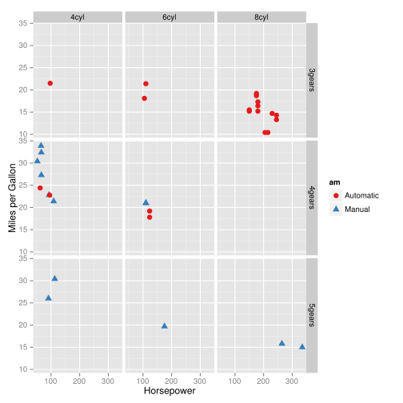
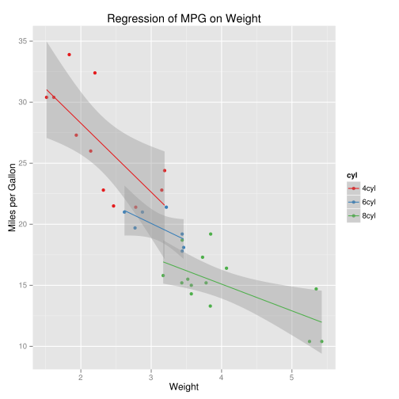
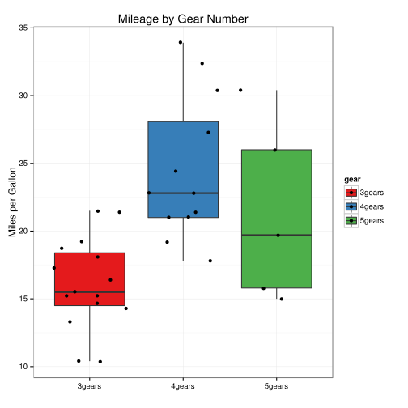

# 2d graphs #
These 2d examples are both from Winsong Chang's excellent [R Graphics Cookbook](http://www.amazon.com/R-Graphics-Cookbook-Winston-Chang/dp/1449316956)
## Correlation Matrix Example ##
### Correlation plot ###

```r
library(corrplot)
corrplot(mcor)
```

 

### Regular R output ###

```r
# for the dataset
library(ggplot2)
rm(mtcars)
mcor <- cor(mtcars)
# Print mcor and round to 2 digits
round(mcor, digits = 2)
```

```
##        mpg   cyl  disp    hp  drat    wt  qsec    vs    am  gear  carb
## mpg   1.00 -0.85 -0.85 -0.78  0.68 -0.87  0.42  0.66  0.60  0.48 -0.55
## cyl  -0.85  1.00  0.90  0.83 -0.70  0.78 -0.59 -0.81 -0.52 -0.49  0.53
## disp -0.85  0.90  1.00  0.79 -0.71  0.89 -0.43 -0.71 -0.59 -0.56  0.39
## hp   -0.78  0.83  0.79  1.00 -0.45  0.66 -0.71 -0.72 -0.24 -0.13  0.75
## drat  0.68 -0.70 -0.71 -0.45  1.00 -0.71  0.09  0.44  0.71  0.70 -0.09
## wt   -0.87  0.78  0.89  0.66 -0.71  1.00 -0.17 -0.55 -0.69 -0.58  0.43
## qsec  0.42 -0.59 -0.43 -0.71  0.09 -0.17  1.00  0.74 -0.23 -0.21 -0.66
## vs    0.66 -0.81 -0.71 -0.72  0.44 -0.55  0.74  1.00  0.17  0.21 -0.57
## am    0.60 -0.52 -0.59 -0.24  0.71 -0.69 -0.23  0.17  1.00  0.79  0.06
## gear  0.48 -0.49 -0.56 -0.13  0.70 -0.58 -0.21  0.21  0.79  1.00  0.27
## carb -0.55  0.53  0.39  0.75 -0.09  0.43 -0.66 -0.57  0.06  0.27  1.00
```

### HTML table using xtable ###

```r
library(xtable)
print(xtable(mcor), type = "html")
```

<!-- html table generated in R 2.15.1 by xtable 1.7-0 package -->
<!-- Thu Mar 28 15:23:18 2013 -->
<TABLE border=1>
<TR> <TH>  </TH> <TH> mpg </TH> <TH> cyl </TH> <TH> disp </TH> <TH> hp </TH> <TH> drat </TH> <TH> wt </TH> <TH> qsec </TH> <TH> vs </TH> <TH> am </TH> <TH> gear </TH> <TH> carb </TH>  </TR>
  <TR> <TD align="right"> mpg </TD> <TD align="right"> 1.00 </TD> <TD align="right"> -0.85 </TD> <TD align="right"> -0.85 </TD> <TD align="right"> -0.78 </TD> <TD align="right"> 0.68 </TD> <TD align="right"> -0.87 </TD> <TD align="right"> 0.42 </TD> <TD align="right"> 0.66 </TD> <TD align="right"> 0.60 </TD> <TD align="right"> 0.48 </TD> <TD align="right"> -0.55 </TD> </TR>
  <TR> <TD align="right"> cyl </TD> <TD align="right"> -0.85 </TD> <TD align="right"> 1.00 </TD> <TD align="right"> 0.90 </TD> <TD align="right"> 0.83 </TD> <TD align="right"> -0.70 </TD> <TD align="right"> 0.78 </TD> <TD align="right"> -0.59 </TD> <TD align="right"> -0.81 </TD> <TD align="right"> -0.52 </TD> <TD align="right"> -0.49 </TD> <TD align="right"> 0.53 </TD> </TR>
  <TR> <TD align="right"> disp </TD> <TD align="right"> -0.85 </TD> <TD align="right"> 0.90 </TD> <TD align="right"> 1.00 </TD> <TD align="right"> 0.79 </TD> <TD align="right"> -0.71 </TD> <TD align="right"> 0.89 </TD> <TD align="right"> -0.43 </TD> <TD align="right"> -0.71 </TD> <TD align="right"> -0.59 </TD> <TD align="right"> -0.56 </TD> <TD align="right"> 0.39 </TD> </TR>
  <TR> <TD align="right"> hp </TD> <TD align="right"> -0.78 </TD> <TD align="right"> 0.83 </TD> <TD align="right"> 0.79 </TD> <TD align="right"> 1.00 </TD> <TD align="right"> -0.45 </TD> <TD align="right"> 0.66 </TD> <TD align="right"> -0.71 </TD> <TD align="right"> -0.72 </TD> <TD align="right"> -0.24 </TD> <TD align="right"> -0.13 </TD> <TD align="right"> 0.75 </TD> </TR>
  <TR> <TD align="right"> drat </TD> <TD align="right"> 0.68 </TD> <TD align="right"> -0.70 </TD> <TD align="right"> -0.71 </TD> <TD align="right"> -0.45 </TD> <TD align="right"> 1.00 </TD> <TD align="right"> -0.71 </TD> <TD align="right"> 0.09 </TD> <TD align="right"> 0.44 </TD> <TD align="right"> 0.71 </TD> <TD align="right"> 0.70 </TD> <TD align="right"> -0.09 </TD> </TR>
  <TR> <TD align="right"> wt </TD> <TD align="right"> -0.87 </TD> <TD align="right"> 0.78 </TD> <TD align="right"> 0.89 </TD> <TD align="right"> 0.66 </TD> <TD align="right"> -0.71 </TD> <TD align="right"> 1.00 </TD> <TD align="right"> -0.17 </TD> <TD align="right"> -0.55 </TD> <TD align="right"> -0.69 </TD> <TD align="right"> -0.58 </TD> <TD align="right"> 0.43 </TD> </TR>
  <TR> <TD align="right"> qsec </TD> <TD align="right"> 0.42 </TD> <TD align="right"> -0.59 </TD> <TD align="right"> -0.43 </TD> <TD align="right"> -0.71 </TD> <TD align="right"> 0.09 </TD> <TD align="right"> -0.17 </TD> <TD align="right"> 1.00 </TD> <TD align="right"> 0.74 </TD> <TD align="right"> -0.23 </TD> <TD align="right"> -0.21 </TD> <TD align="right"> -0.66 </TD> </TR>
  <TR> <TD align="right"> vs </TD> <TD align="right"> 0.66 </TD> <TD align="right"> -0.81 </TD> <TD align="right"> -0.71 </TD> <TD align="right"> -0.72 </TD> <TD align="right"> 0.44 </TD> <TD align="right"> -0.55 </TD> <TD align="right"> 0.74 </TD> <TD align="right"> 1.00 </TD> <TD align="right"> 0.17 </TD> <TD align="right"> 0.21 </TD> <TD align="right"> -0.57 </TD> </TR>
  <TR> <TD align="right"> am </TD> <TD align="right"> 0.60 </TD> <TD align="right"> -0.52 </TD> <TD align="right"> -0.59 </TD> <TD align="right"> -0.24 </TD> <TD align="right"> 0.71 </TD> <TD align="right"> -0.69 </TD> <TD align="right"> -0.23 </TD> <TD align="right"> 0.17 </TD> <TD align="right"> 1.00 </TD> <TD align="right"> 0.79 </TD> <TD align="right"> 0.06 </TD> </TR>
  <TR> <TD align="right"> gear </TD> <TD align="right"> 0.48 </TD> <TD align="right"> -0.49 </TD> <TD align="right"> -0.56 </TD> <TD align="right"> -0.13 </TD> <TD align="right"> 0.70 </TD> <TD align="right"> -0.58 </TD> <TD align="right"> -0.21 </TD> <TD align="right"> 0.21 </TD> <TD align="right"> 0.79 </TD> <TD align="right"> 1.00 </TD> <TD align="right"> 0.27 </TD> </TR>
  <TR> <TD align="right"> carb </TD> <TD align="right"> -0.55 </TD> <TD align="right"> 0.53 </TD> <TD align="right"> 0.39 </TD> <TD align="right"> 0.75 </TD> <TD align="right"> -0.09 </TD> <TD align="right"> 0.43 </TD> <TD align="right"> -0.66 </TD> <TD align="right"> -0.57 </TD> <TD align="right"> 0.06 </TD> <TD align="right"> 0.27 </TD> <TD align="right"> 1.00 </TD> </TR>
   </TABLE>

## Network Graph Example ##

```r
library(igraph)
# Specify edges for a directed graph
gd <- graph(c(1, 2, 2, 3, 2, 4, 1, 4, 5, 5, 3, 6))
plot(gd)
```

 

```r
# For an undirected graph
gu <- graph(c(1, 2, 2, 3, 2, 4, 1, 4, 5, 5, 3, 6), directed = FALSE)
# No labels
plot(gu, vertex.label = NA)
```

 

# 3d graphs #
This example is from [Yihui's response](http://stackoverflow.com/questions/14879210/including-a-interactive-3d-figure-with-knitr) to a stack overflow question.

Need to load the CanvasMatrix library and the hook_webgl code to get 3d graphs to work

```r
knit_hooks$set(webgl = hook_webgl)
```

```{html}
<script src="https://dl.dropbox.com/u/15335397/misc/CanvasMatrix.js"></script>
```
<script src="https://dl.dropbox.com/u/15335397/misc/CanvasMatrix.js"></script>

## point 3d graph ##

```r
library(rgl)
x <- sort(rnorm(1000))
y <- rnorm(1000)
z <- rnorm(1000) + atan2(x, y)
plot3d(x, y, z, col = rainbow(1000))
```

<script src="CanvasMatrix.js" type="text/javascript"></script>
<canvas id="_2d_3d_pointstextureCanvas" style="display: none;" width="256" height="256">
<br>
	Your browser does not support the HTML5 canvas element.</canvas>
<!-- ****** points object 108 ****** -->
<script id="_2d_3d_pointsvshader108" type="x-shader/x-vertex">
	attribute vec3 aPos;
	attribute vec4 aCol;
	uniform mat4 mvMatrix;
	uniform mat4 prMatrix;
	varying vec4 vDiffuse;
	void main(void) {
	  gl_Position = prMatrix * mvMatrix * vec4(aPos, 1.);
	  gl_PointSize = 3.;
	  vDiffuse = aCol;
	}
</script>
<script id="_2d_3d_pointsfshader108" type="x-shader/x-fragment"> 
	#ifdef GL_ES
	precision highp float;
	#endif
	varying vec4 vDiffuse; // carries alpha
	void main(void) {
	  vec4 diffuse;
	  diffuse = vDiffuse;
	  gl_FragColor = diffuse;
	}
</script> 
<!-- ****** text object 110 ****** -->
<script id="_2d_3d_pointsvshader110" type="x-shader/x-vertex">
	attribute vec3 aPos;
	attribute vec4 aCol;
	uniform mat4 mvMatrix;
	uniform mat4 prMatrix;
	varying vec4 vDiffuse;
	attribute vec2 aTexcoord;
	varying vec2 vTexcoord;
	attribute vec2 aOfs;
	void main(void) {
	  vDiffuse = aCol;
	  vTexcoord = aTexcoord;
	  vec4 pos = prMatrix * mvMatrix * vec4(aPos, 1.);
	  pos = pos/pos.w;
	  gl_Position = pos + vec4(aOfs, 0.,0.);
	}
</script>
<script id="_2d_3d_pointsfshader110" type="x-shader/x-fragment"> 
	#ifdef GL_ES
	precision highp float;
	#endif
	varying vec4 vDiffuse; // carries alpha
	varying vec2 vTexcoord;
	uniform sampler2D uSampler;
	void main(void) {
	  vec4 diffuse;
	  diffuse = vDiffuse;
	  vec4 textureColor = diffuse*texture2D(uSampler, vTexcoord);
	  if (textureColor.a < 0.1)
	    discard;
	  else
	    gl_FragColor = textureColor;
	}
</script> 
<!-- ****** text object 111 ****** -->
<script id="_2d_3d_pointsvshader111" type="x-shader/x-vertex">
	attribute vec3 aPos;
	attribute vec4 aCol;
	uniform mat4 mvMatrix;
	uniform mat4 prMatrix;
	varying vec4 vDiffuse;
	attribute vec2 aTexcoord;
	varying vec2 vTexcoord;
	attribute vec2 aOfs;
	void main(void) {
	  vDiffuse = aCol;
	  vTexcoord = aTexcoord;
	  vec4 pos = prMatrix * mvMatrix * vec4(aPos, 1.);
	  pos = pos/pos.w;
	  gl_Position = pos + vec4(aOfs, 0.,0.);
	}
</script>
<script id="_2d_3d_pointsfshader111" type="x-shader/x-fragment"> 
	#ifdef GL_ES
	precision highp float;
	#endif
	varying vec4 vDiffuse; // carries alpha
	varying vec2 vTexcoord;
	uniform sampler2D uSampler;
	void main(void) {
	  vec4 diffuse;
	  diffuse = vDiffuse;
	  vec4 textureColor = diffuse*texture2D(uSampler, vTexcoord);
	  if (textureColor.a < 0.1)
	    discard;
	  else
	    gl_FragColor = textureColor;
	}
</script> 
<!-- ****** text object 112 ****** -->
<script id="_2d_3d_pointsvshader112" type="x-shader/x-vertex">
	attribute vec3 aPos;
	attribute vec4 aCol;
	uniform mat4 mvMatrix;
	uniform mat4 prMatrix;
	varying vec4 vDiffuse;
	attribute vec2 aTexcoord;
	varying vec2 vTexcoord;
	attribute vec2 aOfs;
	void main(void) {
	  vDiffuse = aCol;
	  vTexcoord = aTexcoord;
	  vec4 pos = prMatrix * mvMatrix * vec4(aPos, 1.);
	  pos = pos/pos.w;
	  gl_Position = pos + vec4(aOfs, 0.,0.);
	}
</script>
<script id="_2d_3d_pointsfshader112" type="x-shader/x-fragment"> 
	#ifdef GL_ES
	precision highp float;
	#endif
	varying vec4 vDiffuse; // carries alpha
	varying vec2 vTexcoord;
	uniform sampler2D uSampler;
	void main(void) {
	  vec4 diffuse;
	  diffuse = vDiffuse;
	  vec4 textureColor = diffuse*texture2D(uSampler, vTexcoord);
	  if (textureColor.a < 0.1)
	    discard;
	  else
	    gl_FragColor = textureColor;
	}
</script> 
<!-- ****** lines object 113 ****** -->
<script id="_2d_3d_pointsvshader113" type="x-shader/x-vertex">
	attribute vec3 aPos;
	attribute vec4 aCol;
	uniform mat4 mvMatrix;
	uniform mat4 prMatrix;
	varying vec4 vDiffuse;
	void main(void) {
	  gl_Position = prMatrix * mvMatrix * vec4(aPos, 1.);
	  vDiffuse = aCol;
	}
</script>
<script id="_2d_3d_pointsfshader113" type="x-shader/x-fragment"> 
	#ifdef GL_ES
	precision highp float;
	#endif
	varying vec4 vDiffuse; // carries alpha
	void main(void) {
	  vec4 diffuse;
	  diffuse = vDiffuse;
	  gl_FragColor = diffuse;
	}
</script> 
<!-- ****** text object 114 ****** -->
<script id="_2d_3d_pointsvshader114" type="x-shader/x-vertex">
	attribute vec3 aPos;
	attribute vec4 aCol;
	uniform mat4 mvMatrix;
	uniform mat4 prMatrix;
	varying vec4 vDiffuse;
	attribute vec2 aTexcoord;
	varying vec2 vTexcoord;
	attribute vec2 aOfs;
	void main(void) {
	  vDiffuse = aCol;
	  vTexcoord = aTexcoord;
	  vec4 pos = prMatrix * mvMatrix * vec4(aPos, 1.);
	  pos = pos/pos.w;
	  gl_Position = pos + vec4(aOfs, 0.,0.);
	}
</script>
<script id="_2d_3d_pointsfshader114" type="x-shader/x-fragment"> 
	#ifdef GL_ES
	precision highp float;
	#endif
	varying vec4 vDiffuse; // carries alpha
	varying vec2 vTexcoord;
	uniform sampler2D uSampler;
	void main(void) {
	  vec4 diffuse;
	  diffuse = vDiffuse;
	  vec4 textureColor = diffuse*texture2D(uSampler, vTexcoord);
	  if (textureColor.a < 0.1)
	    discard;
	  else
	    gl_FragColor = textureColor;
	}
</script> 
<!-- ****** lines object 115 ****** -->
<script id="_2d_3d_pointsvshader115" type="x-shader/x-vertex">
	attribute vec3 aPos;
	attribute vec4 aCol;
	uniform mat4 mvMatrix;
	uniform mat4 prMatrix;
	varying vec4 vDiffuse;
	void main(void) {
	  gl_Position = prMatrix * mvMatrix * vec4(aPos, 1.);
	  vDiffuse = aCol;
	}
</script>
<script id="_2d_3d_pointsfshader115" type="x-shader/x-fragment"> 
	#ifdef GL_ES
	precision highp float;
	#endif
	varying vec4 vDiffuse; // carries alpha
	void main(void) {
	  vec4 diffuse;
	  diffuse = vDiffuse;
	  gl_FragColor = diffuse;
	}
</script> 
<!-- ****** text object 116 ****** -->
<script id="_2d_3d_pointsvshader116" type="x-shader/x-vertex">
	attribute vec3 aPos;
	attribute vec4 aCol;
	uniform mat4 mvMatrix;
	uniform mat4 prMatrix;
	varying vec4 vDiffuse;
	attribute vec2 aTexcoord;
	varying vec2 vTexcoord;
	attribute vec2 aOfs;
	void main(void) {
	  vDiffuse = aCol;
	  vTexcoord = aTexcoord;
	  vec4 pos = prMatrix * mvMatrix * vec4(aPos, 1.);
	  pos = pos/pos.w;
	  gl_Position = pos + vec4(aOfs, 0.,0.);
	}
</script>
<script id="_2d_3d_pointsfshader116" type="x-shader/x-fragment"> 
	#ifdef GL_ES
	precision highp float;
	#endif
	varying vec4 vDiffuse; // carries alpha
	varying vec2 vTexcoord;
	uniform sampler2D uSampler;
	void main(void) {
	  vec4 diffuse;
	  diffuse = vDiffuse;
	  vec4 textureColor = diffuse*texture2D(uSampler, vTexcoord);
	  if (textureColor.a < 0.1)
	    discard;
	  else
	    gl_FragColor = textureColor;
	}
</script> 
<!-- ****** lines object 117 ****** -->
<script id="_2d_3d_pointsvshader117" type="x-shader/x-vertex">
	attribute vec3 aPos;
	attribute vec4 aCol;
	uniform mat4 mvMatrix;
	uniform mat4 prMatrix;
	varying vec4 vDiffuse;
	void main(void) {
	  gl_Position = prMatrix * mvMatrix * vec4(aPos, 1.);
	  vDiffuse = aCol;
	}
</script>
<script id="_2d_3d_pointsfshader117" type="x-shader/x-fragment"> 
	#ifdef GL_ES
	precision highp float;
	#endif
	varying vec4 vDiffuse; // carries alpha
	void main(void) {
	  vec4 diffuse;
	  diffuse = vDiffuse;
	  gl_FragColor = diffuse;
	}
</script> 
<!-- ****** text object 118 ****** -->
<script id="_2d_3d_pointsvshader118" type="x-shader/x-vertex">
	attribute vec3 aPos;
	attribute vec4 aCol;
	uniform mat4 mvMatrix;
	uniform mat4 prMatrix;
	varying vec4 vDiffuse;
	attribute vec2 aTexcoord;
	varying vec2 vTexcoord;
	attribute vec2 aOfs;
	void main(void) {
	  vDiffuse = aCol;
	  vTexcoord = aTexcoord;
	  vec4 pos = prMatrix * mvMatrix * vec4(aPos, 1.);
	  pos = pos/pos.w;
	  gl_Position = pos + vec4(aOfs, 0.,0.);
	}
</script>
<script id="_2d_3d_pointsfshader118" type="x-shader/x-fragment"> 
	#ifdef GL_ES
	precision highp float;
	#endif
	varying vec4 vDiffuse; // carries alpha
	varying vec2 vTexcoord;
	uniform sampler2D uSampler;
	void main(void) {
	  vec4 diffuse;
	  diffuse = vDiffuse;
	  vec4 textureColor = diffuse*texture2D(uSampler, vTexcoord);
	  if (textureColor.a < 0.1)
	    discard;
	  else
	    gl_FragColor = textureColor;
	}
</script> 
<!-- ****** lines object 119 ****** -->
<script id="_2d_3d_pointsvshader119" type="x-shader/x-vertex">
	attribute vec3 aPos;
	attribute vec4 aCol;
	uniform mat4 mvMatrix;
	uniform mat4 prMatrix;
	varying vec4 vDiffuse;
	void main(void) {
	  gl_Position = prMatrix * mvMatrix * vec4(aPos, 1.);
	  vDiffuse = aCol;
	}
</script>
<script id="_2d_3d_pointsfshader119" type="x-shader/x-fragment"> 
	#ifdef GL_ES
	precision highp float;
	#endif
	varying vec4 vDiffuse; // carries alpha
	void main(void) {
	  vec4 diffuse;
	  diffuse = vDiffuse;
	  gl_FragColor = diffuse;
	}
</script> 
<script type="text/javascript"> 
	function getShader ( gl, id ){
	   var shaderScript = document.getElementById ( id );
	   var str = "";
	   var k = shaderScript.firstChild;
	   while ( k ){
	     if ( k.nodeType == 3 ) str += k.textContent;
	     k = k.nextSibling;
	   }
	   var shader;
	   if ( shaderScript.type == "x-shader/x-fragment" )
             shader = gl.createShader ( gl.FRAGMENT_SHADER );
	   else if ( shaderScript.type == "x-shader/x-vertex" )
             shader = gl.createShader(gl.VERTEX_SHADER);
	   else return null;
	   gl.shaderSource(shader, str);
	   gl.compileShader(shader);
	   if (gl.getShaderParameter(shader, gl.COMPILE_STATUS) == 0)
	     alert(gl.getShaderInfoLog(shader));
	   return shader;
	}
	var min = Math.min;
	var max = Math.max;
	var sqrt = Math.sqrt;
	var sin = Math.sin;
	var acos = Math.acos;
	var tan = Math.tan;
	var SQRT2 = Math.SQRT2;
	var PI = Math.PI;
	var log = Math.log;
	var exp = Math.exp;
	function _2d_3d_pointswebGLStart() {
	   var debug = function(msg) {
	     document.getElementById("_2d_3d_pointsdebug").innerHTML = msg;
	   }
	   debug("");
	   var canvas = document.getElementById("_2d_3d_pointscanvas");
	   if (!window.WebGLRenderingContext){
	     debug("<br> Your browser does not support WebGL. See <a href=\"http://get.webgl.org\">http://get.webgl.org</a>");
	     return;
	   }
	   var gl;
	   try {
	     // Try to grab the standard context. If it fails, fallback to experimental.
	     gl = canvas.getContext("webgl") 
	       || canvas.getContext("experimental-webgl");
	   }
	   catch(e) {}
	   if ( !gl ) {
	     debug("<br> Your browser appears to support WebGL, but did not create a WebGL context.  See <a href=\"http://get.webgl.org\">http://get.webgl.org</a>");
	     return;
	   }
	   var width = 505;  var height = 505;
	   canvas.width = width;   canvas.height = height;
	   gl.viewport(0, 0, width, height);
	   var prMatrix = new CanvasMatrix4();
	   var mvMatrix = new CanvasMatrix4();
	   var normMatrix = new CanvasMatrix4();
	   var saveMat = new CanvasMatrix4();
	   saveMat.makeIdentity();
	   var distance;
	   var zoom = 1;
	   var fov = 30;
	   var userMatrix = new CanvasMatrix4();
	   userMatrix.load([
	    1, 0, 0, 0,
	    0, 0.3420201, -0.9396926, 0,
	    0, 0.9396926, 0.3420201, 0,
	    0, 0, 0, 1
		]);
	   function getPowerOfTwo(value) {
	     var pow = 1;
	     while(pow<value) {
	       pow *= 2;
	     }
	     return pow;
	   }
	   function handleLoadedTexture(texture, textureCanvas) {
	     gl.pixelStorei(gl.UNPACK_FLIP_Y_WEBGL, true);
	     gl.bindTexture(gl.TEXTURE_2D, texture);
	     gl.texImage2D(gl.TEXTURE_2D, 0, gl.RGBA, gl.RGBA, gl.UNSIGNED_BYTE, textureCanvas);
	     gl.texParameteri(gl.TEXTURE_2D, gl.TEXTURE_MAG_FILTER, gl.LINEAR);
	     gl.texParameteri(gl.TEXTURE_2D, gl.TEXTURE_MIN_FILTER, gl.LINEAR_MIPMAP_NEAREST);
	     gl.generateMipmap(gl.TEXTURE_2D);
	     gl.bindTexture(gl.TEXTURE_2D, null);
	   }
	   function loadImageToTexture(filename, texture) {   
	     var canvas = document.getElementById("_2d_3d_pointstextureCanvas");
	     var ctx = canvas.getContext("2d");
	     var image = new Image();
	     image.onload = function() {
	       var w = image.width;
	       var h = image.height;
	       var canvasX = getPowerOfTwo(w);
	       var canvasY = getPowerOfTwo(h);
	       canvas.width = canvasX;
	       canvas.height = canvasY;
	       ctx.imageSmoothingEnabled = true;
	       ctx.drawImage(image, 0, 0, canvasX, canvasY);
	       handleLoadedTexture(texture, canvas);
   	       drawScene();
	     }
	     image.src = filename;
	   }  	   
	   function drawTextToCanvas(text, cex) {
	     var canvasX, canvasY;
	     var textX, textY;
	     var textHeight = 20 * cex;
	     var textColour = "white";
	     var fontFamily = "Arial";
	     var backgroundColour = "rgba(0,0,0,0)";
	     var canvas = document.getElementById("_2d_3d_pointstextureCanvas");
	     var ctx = canvas.getContext("2d");
	     ctx.font = textHeight+"px "+fontFamily;
             canvasX = 1;
             var widths = [];
	     for (var i = 0; i < text.length; i++)  {
	       widths[i] = ctx.measureText(text[i]).width;
	       canvasX = (widths[i] > canvasX) ? widths[i] : canvasX;
	     }	  
	     canvasX = getPowerOfTwo(canvasX);
	     var offset = 2*textHeight; // offset to first baseline
	     var skip = 2*textHeight;   // skip between baselines	  
	     canvasY = getPowerOfTwo(offset + text.length*skip);
	     canvas.width = canvasX;
	     canvas.height = canvasY;
	     ctx.fillStyle = backgroundColour;
	     ctx.fillRect(0, 0, ctx.canvas.width, ctx.canvas.height);
	     ctx.fillStyle = textColour;
	     ctx.textAlign = "left";
	     ctx.textBaseline = "alphabetic";
	     ctx.font = textHeight+"px "+fontFamily;
	     for(var i = 0; i < text.length; i++) {
	       textY = i*skip + offset;
	       ctx.fillText(text[i], 0,  textY);
	     }
	     return {canvasX:canvasX, canvasY:canvasY,
	             widths:widths, textHeight:textHeight,
	             offset:offset, skip:skip};
	   }
	   // ****** points object 108 ******
	   var prog108  = gl.createProgram();
	   gl.attachShader(prog108, getShader( gl, "_2d_3d_pointsvshader108" ));
	   gl.attachShader(prog108, getShader( gl, "_2d_3d_pointsfshader108" ));
	   gl.linkProgram(prog108);
	   var v=new Float32Array([
	    -3.41055, 0.749983, -2.384063, 1, 0, 0, 1,
	    -2.76574, 0.9802076, -0.3418638, 1, 0.007843138, 0, 1,
	    -2.661276, 0.2478111, -1.348195, 1, 0.01176471, 0, 1,
	    -2.613857, 0.1377314, -2.123114, 1, 0.01960784, 0, 1,
	    -2.580206, 1.246964, -2.318002, 1, 0.02352941, 0, 1,
	    -2.449764, -0.4929224, -0.9124671, 1, 0.03137255, 0, 1,
	    -2.414535, 0.8977503, -0.9330127, 1, 0.03529412, 0, 1,
	    -2.383876, 0.9875389, -3.038747, 1, 0.04313726, 0, 1,
	    -2.339029, 0.6820325, -1.512274, 1, 0.04705882, 0, 1,
	    -2.292389, -0.04559722, -2.758393, 1, 0.05490196, 0, 1,
	    -2.271831, -0.5726117, -1.727593, 1, 0.05882353, 0, 1,
	    -2.232205, 0.3530817, 0.7701226, 1, 0.06666667, 0, 1,
	    -2.194757, 1.312399, -0.6346919, 1, 0.07058824, 0, 1,
	    -2.16467, 1.951596, -1.172404, 1, 0.07843138, 0, 1,
	    -2.086287, 0.09979805, -1.936254, 1, 0.08235294, 0, 1,
	    -2.077886, -1.830452, -3.009326, 1, 0.09019608, 0, 1,
	    -2.068067, 0.1742657, -1.76179, 1, 0.09411765, 0, 1,
	    -2.064984, 0.7962536, -2.506614, 1, 0.1019608, 0, 1,
	    -2.02835, -0.4141717, -0.6839146, 1, 0.1098039, 0, 1,
	    -2.023475, 1.42046, -3.790189, 1, 0.1137255, 0, 1,
	    -2.018369, -0.8372462, -0.8770196, 1, 0.1215686, 0, 1,
	    -1.888952, -0.5924674, -2.82728, 1, 0.1254902, 0, 1,
	    -1.856744, -2.777534, -2.514228, 1, 0.1333333, 0, 1,
	    -1.847102, 0.2671959, -0.9575878, 1, 0.1372549, 0, 1,
	    -1.836429, 1.388405, 0.7817433, 1, 0.145098, 0, 1,
	    -1.825258, 0.5100767, -1.173141, 1, 0.1490196, 0, 1,
	    -1.824659, -1.042204, -2.892919, 1, 0.1568628, 0, 1,
	    -1.801643, 0.7230918, -2.045303, 1, 0.1607843, 0, 1,
	    -1.79391, -0.9346564, -2.687523, 1, 0.1686275, 0, 1,
	    -1.756855, -0.7001119, -2.059994, 1, 0.172549, 0, 1,
	    -1.750823, 1.675888, -0.1157995, 1, 0.1803922, 0, 1,
	    -1.745568, 0.4775874, -1.515786, 1, 0.1843137, 0, 1,
	    -1.741717, 0.2830683, -2.134081, 1, 0.1921569, 0, 1,
	    -1.719604, 1.963545, -1.564113, 1, 0.1960784, 0, 1,
	    -1.692193, 0.004254906, -2.426759, 1, 0.2039216, 0, 1,
	    -1.690861, -1.893544, -2.792192, 1, 0.2117647, 0, 1,
	    -1.662938, -0.5420237, -0.9085842, 1, 0.2156863, 0, 1,
	    -1.620263, -0.8709189, -2.228792, 1, 0.2235294, 0, 1,
	    -1.619498, 0.4980528, -1.382531, 1, 0.227451, 0, 1,
	    -1.605167, -0.5966572, -1.924505, 1, 0.2352941, 0, 1,
	    -1.593326, 0.221825, -1.29372, 1, 0.2392157, 0, 1,
	    -1.588714, 1.566363, -0.13435, 1, 0.2470588, 0, 1,
	    -1.579323, 1.893859, -1.593818, 1, 0.2509804, 0, 1,
	    -1.564794, -0.2025653, -2.242955, 1, 0.2588235, 0, 1,
	    -1.564082, -1.211293, -3.022494, 1, 0.2627451, 0, 1,
	    -1.560022, 1.099808, -2.31343, 1, 0.2705882, 0, 1,
	    -1.554143, -0.2842178, -0.7153413, 1, 0.2745098, 0, 1,
	    -1.553253, -0.971633, -1.655581, 1, 0.282353, 0, 1,
	    -1.544076, -0.3029348, -3.323444, 1, 0.2862745, 0, 1,
	    -1.536597, 0.8299423, -0.9642584, 1, 0.2941177, 0, 1,
	    -1.501809, -0.3887912, -3.651969, 1, 0.3019608, 0, 1,
	    -1.481155, -0.5684509, -2.3962, 1, 0.3058824, 0, 1,
	    -1.479447, -0.3361931, -1.17019, 1, 0.3137255, 0, 1,
	    -1.477137, 1.013187, 0.5485677, 1, 0.3176471, 0, 1,
	    -1.466841, -0.7561342, -0.8452985, 1, 0.3254902, 0, 1,
	    -1.460214, -0.8506675, -1.396873, 1, 0.3294118, 0, 1,
	    -1.458537, 1.668013, -0.2356027, 1, 0.3372549, 0, 1,
	    -1.457526, -0.1702306, -2.440151, 1, 0.3411765, 0, 1,
	    -1.452747, 0.6090487, 2.121984, 1, 0.3490196, 0, 1,
	    -1.440118, 0.2884361, -1.006917, 1, 0.3529412, 0, 1,
	    -1.439882, 1.416991, -0.5770913, 1, 0.3607843, 0, 1,
	    -1.424679, -0.6043676, -2.497398, 1, 0.3647059, 0, 1,
	    -1.424431, -0.05303655, -2.546259, 1, 0.372549, 0, 1,
	    -1.418528, 1.706874, -0.3877469, 1, 0.3764706, 0, 1,
	    -1.411643, -0.4329585, -4.237978, 1, 0.3843137, 0, 1,
	    -1.411, 0.2598675, -0.4007229, 1, 0.3882353, 0, 1,
	    -1.408478, 0.7778404, -2.316124, 1, 0.3960784, 0, 1,
	    -1.407981, -1.700632, -3.016136, 1, 0.4039216, 0, 1,
	    -1.400874, 0.1899248, -2.040422, 1, 0.4078431, 0, 1,
	    -1.37538, -1.258528, -1.52832, 1, 0.4156863, 0, 1,
	    -1.375229, -0.9951953, -3.652845, 1, 0.4196078, 0, 1,
	    -1.371147, -0.07749204, -0.4936547, 1, 0.427451, 0, 1,
	    -1.365292, 1.745939, -2.273105, 1, 0.4313726, 0, 1,
	    -1.337705, 0.7158144, -2.80185, 1, 0.4392157, 0, 1,
	    -1.336929, -0.6574202, -2.952401, 1, 0.4431373, 0, 1,
	    -1.333853, 0.6963814, -0.4105836, 1, 0.4509804, 0, 1,
	    -1.333256, 0.4460446, -4.168439, 1, 0.454902, 0, 1,
	    -1.332844, -0.05590913, -0.7458495, 1, 0.4627451, 0, 1,
	    -1.331281, -1.18856, -1.592199, 1, 0.4666667, 0, 1,
	    -1.330011, 0.6437095, -0.3111659, 1, 0.4745098, 0, 1,
	    -1.325881, -1.069593, -2.599191, 1, 0.4784314, 0, 1,
	    -1.297477, 0.1279009, -0.6190487, 1, 0.4862745, 0, 1,
	    -1.291828, 0.1050048, -1.16819, 1, 0.4901961, 0, 1,
	    -1.281097, 0.6695015, -0.2258372, 1, 0.4980392, 0, 1,
	    -1.276175, -0.7368422, -4.940274, 1, 0.5058824, 0, 1,
	    -1.260206, -0.3721063, -1.110418, 1, 0.509804, 0, 1,
	    -1.257608, 0.05019836, -2.889185, 1, 0.5176471, 0, 1,
	    -1.249536, -0.6975791, -1.075383, 1, 0.5215687, 0, 1,
	    -1.24731, 0.9150473, -1.023505, 1, 0.5294118, 0, 1,
	    -1.242646, -0.1498285, -1.526723, 1, 0.5333334, 0, 1,
	    -1.230778, -0.1015276, -2.773777, 1, 0.5411765, 0, 1,
	    -1.220276, -1.78537, -2.517417, 1, 0.5450981, 0, 1,
	    -1.216951, 0.8385206, -0.6077687, 1, 0.5529412, 0, 1,
	    -1.213558, 1.851902, 0.6171991, 1, 0.5568628, 0, 1,
	    -1.21066, 0.7927321, -0.7572243, 1, 0.5647059, 0, 1,
	    -1.207126, -0.091138, -1.956468, 1, 0.5686275, 0, 1,
	    -1.205556, 0.378494, -1.56083, 1, 0.5764706, 0, 1,
	    -1.202574, -0.7071155, -2.25138, 1, 0.5803922, 0, 1,
	    -1.193853, 0.5673221, -3.324413, 1, 0.5882353, 0, 1,
	    -1.19138, -0.5295226, -0.6939975, 1, 0.5921569, 0, 1,
	    -1.187099, 0.1936999, -0.5485609, 1, 0.6, 0, 1,
	    -1.186464, 0.9061886, -0.1305017, 1, 0.6078432, 0, 1,
	    -1.185362, 0.8255956, -2.701035, 1, 0.6117647, 0, 1,
	    -1.174689, 1.983859, -1.368085, 1, 0.6196079, 0, 1,
	    -1.167137, -2.723137, -4.371042, 1, 0.6235294, 0, 1,
	    -1.164856, -0.1926523, -2.220708, 1, 0.6313726, 0, 1,
	    -1.155494, -1.96787, -2.49995, 1, 0.6352941, 0, 1,
	    -1.152021, -0.2252753, -3.431328, 1, 0.6431373, 0, 1,
	    -1.139718, 1.487055, 1.25982, 1, 0.6470588, 0, 1,
	    -1.138123, -0.1723062, -2.082412, 1, 0.654902, 0, 1,
	    -1.135468, -0.9603918, -0.2666043, 1, 0.6588235, 0, 1,
	    -1.123437, 0.6770766, 0.1315987, 1, 0.6666667, 0, 1,
	    -1.122533, 0.1501156, -2.559269, 1, 0.6705883, 0, 1,
	    -1.115571, 0.8044046, -1.479772, 1, 0.6784314, 0, 1,
	    -1.115048, 1.491166, -1.110864, 1, 0.682353, 0, 1,
	    -1.109835, -0.3294829, -2.960396, 1, 0.6901961, 0, 1,
	    -1.108274, 0.7396699, -2.257868, 1, 0.6941177, 0, 1,
	    -1.107019, 0.2415617, -1.703517, 1, 0.7019608, 0, 1,
	    -1.10608, 1.006509, -2.073945, 1, 0.7098039, 0, 1,
	    -1.105854, 1.607584, -0.09659045, 1, 0.7137255, 0, 1,
	    -1.102426, 1.120814, -0.8467544, 1, 0.7215686, 0, 1,
	    -1.101838, 0.1050625, -1.389269, 1, 0.7254902, 0, 1,
	    -1.093153, -1.662536, -3.977756, 1, 0.7333333, 0, 1,
	    -1.093143, 0.08960609, -2.042544, 1, 0.7372549, 0, 1,
	    -1.092557, -0.6929718, -3.280311, 1, 0.7450981, 0, 1,
	    -1.080557, 0.8314393, -1.753924, 1, 0.7490196, 0, 1,
	    -1.076657, -1.402805, -1.904377, 1, 0.7568628, 0, 1,
	    -1.075105, 0.3697321, 0.5234075, 1, 0.7607843, 0, 1,
	    -1.071284, -1.266914, -1.972443, 1, 0.7686275, 0, 1,
	    -1.070319, -0.5127439, -2.434844, 1, 0.772549, 0, 1,
	    -1.069124, -0.6338533, -1.677916, 1, 0.7803922, 0, 1,
	    -1.047001, 0.9572927, -3.167064, 1, 0.7843137, 0, 1,
	    -1.04096, 0.8648099, -1.59842, 1, 0.7921569, 0, 1,
	    -1.039395, -0.08300497, -3.254725, 1, 0.7960784, 0, 1,
	    -1.038605, 1.137951, -1.947794, 1, 0.8039216, 0, 1,
	    -1.037153, 0.8917297, -0.9349306, 1, 0.8117647, 0, 1,
	    -1.030207, 0.06735715, -1.41456, 1, 0.8156863, 0, 1,
	    -1.027545, 0.1430539, -2.301901, 1, 0.8235294, 0, 1,
	    -1.024307, -1.382078, -1.590694, 1, 0.827451, 0, 1,
	    -1.021919, 0.1895965, -0.6202884, 1, 0.8352941, 0, 1,
	    -1.020928, -0.1795186, -1.315344, 1, 0.8392157, 0, 1,
	    -1.017905, -0.5862014, -2.606407, 1, 0.8470588, 0, 1,
	    -1.015308, -0.3371238, -3.473661, 1, 0.8509804, 0, 1,
	    -1.013602, -0.4175397, -2.889814, 1, 0.8588235, 0, 1,
	    -1.007197, 0.8525781, -0.387643, 1, 0.8627451, 0, 1,
	    -1.004194, 0.6024053, -1.285024, 1, 0.8705882, 0, 1,
	    -1.001812, 1.737312, 0.6175549, 1, 0.8745098, 0, 1,
	    -1.000618, -0.087055, -2.449781, 1, 0.8823529, 0, 1,
	    -0.9928344, -0.4278892, -2.189765, 1, 0.8862745, 0, 1,
	    -0.9923425, -1.024064, -3.022042, 1, 0.8941177, 0, 1,
	    -0.9897326, 0.3962596, -1.343771, 1, 0.8980392, 0, 1,
	    -0.9887738, -1.161826, -0.9968492, 1, 0.9058824, 0, 1,
	    -0.9884647, -0.1435234, 0.654753, 1, 0.9137255, 0, 1,
	    -0.9825202, 1.334468, -1.471845, 1, 0.9176471, 0, 1,
	    -0.9774809, -0.7720618, -2.536664, 1, 0.9254902, 0, 1,
	    -0.9634152, 0.5715681, -0.2139244, 1, 0.9294118, 0, 1,
	    -0.9575128, -0.7798156, -3.52231, 1, 0.9372549, 0, 1,
	    -0.9567842, -0.8447022, -2.704961, 1, 0.9411765, 0, 1,
	    -0.9561166, 1.069738, 0.05676724, 1, 0.9490196, 0, 1,
	    -0.9543468, -0.553194, -2.852099, 1, 0.9529412, 0, 1,
	    -0.9537608, 3.025109, 0.001829857, 1, 0.9607843, 0, 1,
	    -0.9485043, -0.3345179, -1.487728, 1, 0.9647059, 0, 1,
	    -0.9482272, -1.57732, -3.375557, 1, 0.972549, 0, 1,
	    -0.9460577, 0.5782417, -0.1270029, 1, 0.9764706, 0, 1,
	    -0.9459586, 1.307842, 0.1864065, 1, 0.9843137, 0, 1,
	    -0.9432485, 1.120171, -1.209695, 1, 0.9882353, 0, 1,
	    -0.9391623, -1.622384, -2.133336, 1, 0.9960784, 0, 1,
	    -0.9304054, 0.1898474, -1.633078, 0.9960784, 1, 0, 1,
	    -0.9293022, -0.03965206, -2.984511, 0.9921569, 1, 0, 1,
	    -0.9270976, 0.2533188, -0.6013972, 0.9843137, 1, 0, 1,
	    -0.9264843, 2.519711, -0.05855162, 0.9803922, 1, 0, 1,
	    -0.9260879, -1.045299, -2.353494, 0.972549, 1, 0, 1,
	    -0.9203957, -1.279841, -4.349047, 0.9686275, 1, 0, 1,
	    -0.9115845, -1.220202, -1.986159, 0.9607843, 1, 0, 1,
	    -0.9096709, 0.3067113, -1.821751, 0.9568627, 1, 0, 1,
	    -0.9096056, 1.618101, -1.785283, 0.9490196, 1, 0, 1,
	    -0.9085385, -0.4791721, -1.600303, 0.945098, 1, 0, 1,
	    -0.8946647, -0.07549535, -1.936833, 0.9372549, 1, 0, 1,
	    -0.893091, 0.520152, -0.5425184, 0.9333333, 1, 0, 1,
	    -0.8848759, -1.188515, -0.6383352, 0.9254902, 1, 0, 1,
	    -0.8847607, 1.11522, -0.7160323, 0.9215686, 1, 0, 1,
	    -0.8828917, -0.3525678, -1.996904, 0.9137255, 1, 0, 1,
	    -0.8807235, -0.8808722, -3.964163, 0.9098039, 1, 0, 1,
	    -0.8803354, 0.2356987, -2.498877, 0.9019608, 1, 0, 1,
	    -0.8728967, -0.5434907, -1.760045, 0.8941177, 1, 0, 1,
	    -0.8703412, -0.4466869, -2.693801, 0.8901961, 1, 0, 1,
	    -0.8678406, -0.1462347, -3.051472, 0.8823529, 1, 0, 1,
	    -0.8633028, -0.09778272, 0.5104331, 0.8784314, 1, 0, 1,
	    -0.857727, 1.390579, -0.7248641, 0.8705882, 1, 0, 1,
	    -0.855149, 0.7185521, 1.204474, 0.8666667, 1, 0, 1,
	    -0.8339435, -0.1538849, -1.799429, 0.8588235, 1, 0, 1,
	    -0.832893, 0.4063006, -1.228479, 0.854902, 1, 0, 1,
	    -0.824598, 1.221416, 0.004968523, 0.8470588, 1, 0, 1,
	    -0.8104047, 1.45423, -1.420788, 0.8431373, 1, 0, 1,
	    -0.8060412, 1.358178, -0.9776219, 0.8352941, 1, 0, 1,
	    -0.7989473, 0.9584771, -0.4982352, 0.8313726, 1, 0, 1,
	    -0.7985594, -0.9336402, -1.647101, 0.8235294, 1, 0, 1,
	    -0.7945396, -0.7427389, -3.599664, 0.8196079, 1, 0, 1,
	    -0.7917663, 0.7727617, -0.9517648, 0.8117647, 1, 0, 1,
	    -0.7766617, 0.6461812, 1.206663, 0.8078431, 1, 0, 1,
	    -0.7747786, -0.5122025, -2.249011, 0.8, 1, 0, 1,
	    -0.7744564, 0.8275681, -0.7915152, 0.7921569, 1, 0, 1,
	    -0.7734438, 0.745514, -0.1227861, 0.7882353, 1, 0, 1,
	    -0.7688488, -0.8485979, -2.529701, 0.7803922, 1, 0, 1,
	    -0.7626333, -0.03027591, -1.464926, 0.7764706, 1, 0, 1,
	    -0.7612261, 1.615119, -1.307599, 0.7686275, 1, 0, 1,
	    -0.7538361, 2.995162, -0.4511849, 0.7647059, 1, 0, 1,
	    -0.7507257, 0.5434333, -2.933886, 0.7568628, 1, 0, 1,
	    -0.7479624, -0.3179657, -1.62128, 0.7529412, 1, 0, 1,
	    -0.7392089, -1.717913, -2.263568, 0.7450981, 1, 0, 1,
	    -0.7387419, -0.009591141, -1.911385, 0.7411765, 1, 0, 1,
	    -0.7364423, 1.19004, -0.2506749, 0.7333333, 1, 0, 1,
	    -0.7357647, -1.713329, -3.703005, 0.7294118, 1, 0, 1,
	    -0.7341873, -0.880528, -1.459281, 0.7215686, 1, 0, 1,
	    -0.7280738, 2.005254, -0.1866269, 0.7176471, 1, 0, 1,
	    -0.7279508, 0.4904136, -0.7776943, 0.7098039, 1, 0, 1,
	    -0.7270684, -0.4593931, -2.187397, 0.7058824, 1, 0, 1,
	    -0.724247, 0.8714012, -2.213749, 0.6980392, 1, 0, 1,
	    -0.7238553, -0.348582, -3.895858, 0.6901961, 1, 0, 1,
	    -0.7236645, 0.2827632, -2.337059, 0.6862745, 1, 0, 1,
	    -0.7212043, -0.3368505, -0.5166891, 0.6784314, 1, 0, 1,
	    -0.7103641, -0.1900929, -1.642875, 0.6745098, 1, 0, 1,
	    -0.7093671, 0.3288506, -0.5751013, 0.6666667, 1, 0, 1,
	    -0.7059495, 0.5698994, 0.1939624, 0.6627451, 1, 0, 1,
	    -0.7048953, 2.394987, 1.89889, 0.654902, 1, 0, 1,
	    -0.7041575, 1.02685, 1.48231, 0.6509804, 1, 0, 1,
	    -0.7004649, -0.8534748, -1.741988, 0.6431373, 1, 0, 1,
	    -0.6949912, -1.029025, -2.81008, 0.6392157, 1, 0, 1,
	    -0.6938174, -0.96958, -1.074851, 0.6313726, 1, 0, 1,
	    -0.6927198, 1.117032, -0.1106887, 0.627451, 1, 0, 1,
	    -0.692078, 0.2570593, -0.8061879, 0.6196079, 1, 0, 1,
	    -0.6903648, -0.05402876, -0.482714, 0.6156863, 1, 0, 1,
	    -0.6862662, -1.201232, -2.682194, 0.6078432, 1, 0, 1,
	    -0.6790875, 1.078186, -0.001524667, 0.6039216, 1, 0, 1,
	    -0.67834, 0.8769486, -1.221115, 0.5960785, 1, 0, 1,
	    -0.6671157, 0.1723604, -2.018619, 0.5882353, 1, 0, 1,
	    -0.6607941, 0.4505331, -0.9788801, 0.5843138, 1, 0, 1,
	    -0.6572469, 0.1131726, -0.5742299, 0.5764706, 1, 0, 1,
	    -0.6561396, -0.7283635, -3.163105, 0.572549, 1, 0, 1,
	    -0.6519833, 1.070083, 0.6169068, 0.5647059, 1, 0, 1,
	    -0.6456455, -0.8092182, -2.187395, 0.5607843, 1, 0, 1,
	    -0.6419086, 0.8064902, -3.488171, 0.5529412, 1, 0, 1,
	    -0.6401244, -2.599092, -0.8496867, 0.5490196, 1, 0, 1,
	    -0.6384317, -0.8014401, -2.758638, 0.5411765, 1, 0, 1,
	    -0.6328413, -0.1032183, -1.58147, 0.5372549, 1, 0, 1,
	    -0.6286568, -0.2233771, -0.6824778, 0.5294118, 1, 0, 1,
	    -0.6243198, -1.240376, -2.219947, 0.5254902, 1, 0, 1,
	    -0.6241561, 0.7680558, -1.995044, 0.5176471, 1, 0, 1,
	    -0.623068, -0.1357479, -1.576169, 0.5137255, 1, 0, 1,
	    -0.6215699, -1.158578, -3.249512, 0.5058824, 1, 0, 1,
	    -0.6116555, -1.169887, -3.593633, 0.5019608, 1, 0, 1,
	    -0.6112543, -0.9796858, -3.214303, 0.4941176, 1, 0, 1,
	    -0.6052834, 0.1757291, -1.338677, 0.4862745, 1, 0, 1,
	    -0.5986708, -0.910639, -3.685991, 0.4823529, 1, 0, 1,
	    -0.5879983, 0.8892754, -1.511274, 0.4745098, 1, 0, 1,
	    -0.5873336, 0.821452, -0.5980379, 0.4705882, 1, 0, 1,
	    -0.5750802, -0.8555327, -1.985027, 0.4627451, 1, 0, 1,
	    -0.5710418, 1.731744, 1.084349, 0.4588235, 1, 0, 1,
	    -0.5695145, 0.586556, -0.810141, 0.4509804, 1, 0, 1,
	    -0.5692214, -1.0413, -1.468767, 0.4470588, 1, 0, 1,
	    -0.5679235, -0.3747657, -1.336761, 0.4392157, 1, 0, 1,
	    -0.5656255, 0.3482805, -2.712876, 0.4352941, 1, 0, 1,
	    -0.5647697, -0.6710541, -1.316507, 0.427451, 1, 0, 1,
	    -0.5619312, -0.5389009, 0.3029394, 0.4235294, 1, 0, 1,
	    -0.5617115, 0.3349645, -1.09463, 0.4156863, 1, 0, 1,
	    -0.561494, -1.104198, -3.388658, 0.4117647, 1, 0, 1,
	    -0.559576, 0.04793553, -1.118466, 0.4039216, 1, 0, 1,
	    -0.5589765, -0.705989, -4.365328, 0.3960784, 1, 0, 1,
	    -0.5562276, 1.050688, -1.009406, 0.3921569, 1, 0, 1,
	    -0.5447724, 0.8029521, -0.8413209, 0.3843137, 1, 0, 1,
	    -0.5424434, 0.8828396, 1.358497, 0.3803922, 1, 0, 1,
	    -0.5422482, -0.1348246, -3.119347, 0.372549, 1, 0, 1,
	    -0.5383251, -0.5495137, -2.914546, 0.3686275, 1, 0, 1,
	    -0.5365537, -0.665684, -1.034787, 0.3607843, 1, 0, 1,
	    -0.5358148, 0.08840829, -0.5177217, 0.3568628, 1, 0, 1,
	    -0.5345685, 0.6257033, -0.4234606, 0.3490196, 1, 0, 1,
	    -0.5332138, -0.03719436, -0.4803065, 0.345098, 1, 0, 1,
	    -0.5279174, -1.569992, -2.171244, 0.3372549, 1, 0, 1,
	    -0.5275344, -0.2924019, -1.824762, 0.3333333, 1, 0, 1,
	    -0.5233385, -0.5005323, -2.019675, 0.3254902, 1, 0, 1,
	    -0.5215758, -1.706012, -2.683166, 0.3215686, 1, 0, 1,
	    -0.5148482, 1.324831, -0.673506, 0.3137255, 1, 0, 1,
	    -0.5132354, 1.029097, -0.9375352, 0.3098039, 1, 0, 1,
	    -0.5114985, -1.070685, -2.994117, 0.3019608, 1, 0, 1,
	    -0.5067526, 1.157636, 1.370843, 0.2941177, 1, 0, 1,
	    -0.506511, -1.432723, -4.392924, 0.2901961, 1, 0, 1,
	    -0.5062541, -1.918709, -1.179206, 0.282353, 1, 0, 1,
	    -0.5061554, 0.3304023, -0.1799504, 0.2784314, 1, 0, 1,
	    -0.5057597, -1.25765, -2.215339, 0.2705882, 1, 0, 1,
	    -0.5032035, 1.144932, 0.5134527, 0.2666667, 1, 0, 1,
	    -0.5006388, -1.04198, -2.35421, 0.2588235, 1, 0, 1,
	    -0.4984795, -1.42388, -2.09719, 0.254902, 1, 0, 1,
	    -0.4978982, -0.8659672, -2.055431, 0.2470588, 1, 0, 1,
	    -0.4957218, -1.903786, -4.343289, 0.2431373, 1, 0, 1,
	    -0.4942228, -1.127368, -2.332957, 0.2352941, 1, 0, 1,
	    -0.4941705, -0.6167745, -1.93455, 0.2313726, 1, 0, 1,
	    -0.493773, 2.123288, -0.8462008, 0.2235294, 1, 0, 1,
	    -0.4914531, -0.3215284, -1.875509, 0.2196078, 1, 0, 1,
	    -0.4895572, 0.02544164, 0.1180115, 0.2117647, 1, 0, 1,
	    -0.4878009, -0.2537324, -1.71637, 0.2078431, 1, 0, 1,
	    -0.4839992, -0.4375366, -1.973196, 0.2, 1, 0, 1,
	    -0.4819297, 0.3529856, -1.603375, 0.1921569, 1, 0, 1,
	    -0.481161, 1.073528, 0.4776543, 0.1882353, 1, 0, 1,
	    -0.4794272, 0.3155919, -2.023958, 0.1803922, 1, 0, 1,
	    -0.4769628, 0.2079148, -1.552437, 0.1764706, 1, 0, 1,
	    -0.4767846, 0.1094967, -1.181045, 0.1686275, 1, 0, 1,
	    -0.4721868, -0.0371701, -2.133323, 0.1647059, 1, 0, 1,
	    -0.4680203, -0.2677754, -2.836455, 0.1568628, 1, 0, 1,
	    -0.4657601, -0.5831919, -1.812681, 0.1529412, 1, 0, 1,
	    -0.4634458, 0.5186089, -0.07127642, 0.145098, 1, 0, 1,
	    -0.4600665, -0.08510372, -3.030005, 0.1411765, 1, 0, 1,
	    -0.4535062, 0.1800406, -1.736995, 0.1333333, 1, 0, 1,
	    -0.4521693, -0.08763538, -2.290121, 0.1294118, 1, 0, 1,
	    -0.4452733, 3.18029, -1.008667, 0.1215686, 1, 0, 1,
	    -0.4444532, -0.4502373, -2.189478, 0.1176471, 1, 0, 1,
	    -0.4337722, -0.3007445, -2.727328, 0.1098039, 1, 0, 1,
	    -0.4317196, -0.2555102, -2.383992, 0.1058824, 1, 0, 1,
	    -0.4283147, 0.4100655, 1.050684, 0.09803922, 1, 0, 1,
	    -0.4268891, -0.3315967, -3.417829, 0.09019608, 1, 0, 1,
	    -0.4251641, 0.3185843, -1.026266, 0.08627451, 1, 0, 1,
	    -0.423786, -1.104423, -1.587796, 0.07843138, 1, 0, 1,
	    -0.4236794, -0.2473456, -3.913642, 0.07450981, 1, 0, 1,
	    -0.421946, -0.9692125, 0.6130879, 0.06666667, 1, 0, 1,
	    -0.4212835, -1.297253, -3.167897, 0.0627451, 1, 0, 1,
	    -0.4202338, -1.849833, -4.815759, 0.05490196, 1, 0, 1,
	    -0.4072224, -0.8563445, -1.408327, 0.05098039, 1, 0, 1,
	    -0.4050918, -2.054041, -4.028996, 0.04313726, 1, 0, 1,
	    -0.4048159, -0.4360215, -4.229276, 0.03921569, 1, 0, 1,
	    -0.4038179, 1.484073, -0.1008198, 0.03137255, 1, 0, 1,
	    -0.403632, -1.522851, -3.252898, 0.02745098, 1, 0, 1,
	    -0.4023291, -0.1706268, -1.661284, 0.01960784, 1, 0, 1,
	    -0.3996055, -1.34063, -2.018508, 0.01568628, 1, 0, 1,
	    -0.3979538, -0.09524155, -0.4606664, 0.007843138, 1, 0, 1,
	    -0.390402, 1.474769, 0.5831103, 0.003921569, 1, 0, 1,
	    -0.3822025, 1.149722, -0.7230324, 0, 1, 0.003921569, 1,
	    -0.3812284, -0.06658643, -2.561301, 0, 1, 0.01176471, 1,
	    -0.380682, 0.0847341, 0.4519758, 0, 1, 0.01568628, 1,
	    -0.3805037, 1.701413, -1.31775, 0, 1, 0.02352941, 1,
	    -0.3750816, -0.01151733, -1.484573, 0, 1, 0.02745098, 1,
	    -0.3749542, -0.6235161, -3.8612, 0, 1, 0.03529412, 1,
	    -0.374878, 1.000654, 2.126291, 0, 1, 0.03921569, 1,
	    -0.3590269, -0.7173663, -2.153735, 0, 1, 0.04705882, 1,
	    -0.3587864, 0.9316357, -1.451188, 0, 1, 0.05098039, 1,
	    -0.3540688, -1.00735, -2.563532, 0, 1, 0.05882353, 1,
	    -0.3522897, 0.2827579, -0.9663824, 0, 1, 0.0627451, 1,
	    -0.3487023, -0.541965, -2.446056, 0, 1, 0.07058824, 1,
	    -0.3439984, -0.06726325, -1.775035, 0, 1, 0.07450981, 1,
	    -0.3421308, 0.004469777, -0.6388989, 0, 1, 0.08235294, 1,
	    -0.3396539, 1.435074, -0.65503, 0, 1, 0.08627451, 1,
	    -0.332137, 0.6388915, -0.5830038, 0, 1, 0.09411765, 1,
	    -0.3286778, -0.857921, -3.695531, 0, 1, 0.1019608, 1,
	    -0.3121317, -0.05453904, -1.317263, 0, 1, 0.1058824, 1,
	    -0.311559, 0.6075423, -0.221533, 0, 1, 0.1137255, 1,
	    -0.3110822, -0.8873648, -2.537109, 0, 1, 0.1176471, 1,
	    -0.30934, -0.4260486, -2.922547, 0, 1, 0.1254902, 1,
	    -0.3087958, -0.03172728, -1.723992, 0, 1, 0.1294118, 1,
	    -0.307882, -0.9198532, -3.907408, 0, 1, 0.1372549, 1,
	    -0.3051693, -1.672715, -3.063841, 0, 1, 0.1411765, 1,
	    -0.3008445, 0.8311214, -1.414322, 0, 1, 0.1490196, 1,
	    -0.3007873, 1.259496, -1.164934, 0, 1, 0.1529412, 1,
	    -0.296443, -0.9471224, -3.372498, 0, 1, 0.1607843, 1,
	    -0.2925943, 1.795152, -1.173838, 0, 1, 0.1647059, 1,
	    -0.291827, -0.8373075, -2.325793, 0, 1, 0.172549, 1,
	    -0.2912633, 1.851574, -1.331761, 0, 1, 0.1764706, 1,
	    -0.2911665, 0.2328262, 0.3530499, 0, 1, 0.1843137, 1,
	    -0.2886291, -1.730877, -1.258186, 0, 1, 0.1882353, 1,
	    -0.2831995, -0.9532043, -2.628173, 0, 1, 0.1960784, 1,
	    -0.2828592, 0.4741603, -1.415878, 0, 1, 0.2039216, 1,
	    -0.2820488, -0.6426758, -2.688459, 0, 1, 0.2078431, 1,
	    -0.278059, 0.1988108, -1.013121, 0, 1, 0.2156863, 1,
	    -0.2758624, -0.3914165, -2.831811, 0, 1, 0.2196078, 1,
	    -0.2726889, 0.5613231, 0.6954021, 0, 1, 0.227451, 1,
	    -0.2682169, -2.084121, -3.280009, 0, 1, 0.2313726, 1,
	    -0.2676956, 1.124843, 0.169366, 0, 1, 0.2392157, 1,
	    -0.2676211, -0.7227538, -2.281356, 0, 1, 0.2431373, 1,
	    -0.2622687, 1.690351, -0.09754952, 0, 1, 0.2509804, 1,
	    -0.2610064, -0.7184423, -3.377368, 0, 1, 0.254902, 1,
	    -0.2605421, 1.10839, 0.3426135, 0, 1, 0.2627451, 1,
	    -0.2599891, 0.8719373, 0.3043942, 0, 1, 0.2666667, 1,
	    -0.2598987, 0.8015323, -0.875652, 0, 1, 0.2745098, 1,
	    -0.2588902, -1.062944, -2.430183, 0, 1, 0.2784314, 1,
	    -0.2570921, 0.8262745, -0.0738833, 0, 1, 0.2862745, 1,
	    -0.2551634, 0.2193218, -2.108392, 0, 1, 0.2901961, 1,
	    -0.2550939, 0.2521417, -1.046251, 0, 1, 0.2980392, 1,
	    -0.2536536, 0.7273169, -0.7479716, 0, 1, 0.3058824, 1,
	    -0.2519099, 0.1909042, 0.695248, 0, 1, 0.3098039, 1,
	    -0.2510146, 0.2378685, -0.891753, 0, 1, 0.3176471, 1,
	    -0.2464885, -2.128128, -2.456563, 0, 1, 0.3215686, 1,
	    -0.2460677, -1.421368, -3.548458, 0, 1, 0.3294118, 1,
	    -0.2437133, -1.437163, -2.021845, 0, 1, 0.3333333, 1,
	    -0.2425071, 0.06810564, -2.237826, 0, 1, 0.3411765, 1,
	    -0.2421294, 0.9820852, -2.59674, 0, 1, 0.345098, 1,
	    -0.2418888, -0.1247497, -1.211207, 0, 1, 0.3529412, 1,
	    -0.2392463, -0.4748372, -1.465677, 0, 1, 0.3568628, 1,
	    -0.2380634, -0.06060806, -1.609769, 0, 1, 0.3647059, 1,
	    -0.2379202, 0.6275001, 0.3443332, 0, 1, 0.3686275, 1,
	    -0.2360263, -0.3028809, -1.537666, 0, 1, 0.3764706, 1,
	    -0.2324626, -0.3927631, -3.459482, 0, 1, 0.3803922, 1,
	    -0.2320008, -0.2945846, -2.507282, 0, 1, 0.3882353, 1,
	    -0.2234985, 0.851296, -2.516232, 0, 1, 0.3921569, 1,
	    -0.2234955, -0.7913371, -0.9694628, 0, 1, 0.4, 1,
	    -0.2178162, 0.9082115, -1.549703, 0, 1, 0.4078431, 1,
	    -0.2147933, 0.10985, 1.481035, 0, 1, 0.4117647, 1,
	    -0.2114351, -1.486882, -3.871917, 0, 1, 0.4196078, 1,
	    -0.2114074, 0.73594, 0.7749352, 0, 1, 0.4235294, 1,
	    -0.2104648, -0.9652147, -3.676946, 0, 1, 0.4313726, 1,
	    -0.204109, -1.957772, -2.840336, 0, 1, 0.4352941, 1,
	    -0.2028432, 2.427917, -0.3253945, 0, 1, 0.4431373, 1,
	    -0.2015339, -2.178594, -4.340273, 0, 1, 0.4470588, 1,
	    -0.2006762, 0.8863117, -1.209589, 0, 1, 0.454902, 1,
	    -0.197393, 1.190941, 0.8914277, 0, 1, 0.4588235, 1,
	    -0.1965004, -0.1561418, -0.7554334, 0, 1, 0.4666667, 1,
	    -0.1918936, 0.2351858, 0.07164079, 0, 1, 0.4705882, 1,
	    -0.1913136, -0.1428357, -2.863592, 0, 1, 0.4784314, 1,
	    -0.1891604, -0.1687418, -1.625422, 0, 1, 0.4823529, 1,
	    -0.1885346, -1.924248, -2.693871, 0, 1, 0.4901961, 1,
	    -0.1868452, -0.8355389, -2.562309, 0, 1, 0.4941176, 1,
	    -0.1863853, 0.2171289, 0.3925515, 0, 1, 0.5019608, 1,
	    -0.1853167, -0.5267069, -3.437785, 0, 1, 0.509804, 1,
	    -0.1844559, -0.1024877, -1.554598, 0, 1, 0.5137255, 1,
	    -0.1833755, 0.1631389, -0.3158679, 0, 1, 0.5215687, 1,
	    -0.1826424, 0.7445045, -2.536196, 0, 1, 0.5254902, 1,
	    -0.1824651, 0.201416, -1.422294, 0, 1, 0.5333334, 1,
	    -0.1820588, -0.05599746, -0.7335267, 0, 1, 0.5372549, 1,
	    -0.1779025, 0.8728355, 0.3973571, 0, 1, 0.5450981, 1,
	    -0.170145, 0.2104086, -0.5936097, 0, 1, 0.5490196, 1,
	    -0.1701353, -0.5347981, -4.241201, 0, 1, 0.5568628, 1,
	    -0.1656501, -0.184555, -2.13711, 0, 1, 0.5607843, 1,
	    -0.1621779, -0.2415845, -0.5439713, 0, 1, 0.5686275, 1,
	    -0.1598383, -0.2673631, -1.778023, 0, 1, 0.572549, 1,
	    -0.1582495, 2.231901, 0.2818345, 0, 1, 0.5803922, 1,
	    -0.1559608, 0.1503462, -1.172927, 0, 1, 0.5843138, 1,
	    -0.1478427, 0.6815164, -0.9887153, 0, 1, 0.5921569, 1,
	    -0.1459148, -0.2362089, -3.229671, 0, 1, 0.5960785, 1,
	    -0.1442934, 1.207305, -1.237679, 0, 1, 0.6039216, 1,
	    -0.1383108, 0.6376944, -0.8793055, 0, 1, 0.6117647, 1,
	    -0.1352224, 0.1292208, -3.101349, 0, 1, 0.6156863, 1,
	    -0.1334691, -0.02676148, -0.4262357, 0, 1, 0.6235294, 1,
	    -0.1330223, -0.2011708, -0.1518393, 0, 1, 0.627451, 1,
	    -0.132671, -1.56439, -4.373303, 0, 1, 0.6352941, 1,
	    -0.1178367, -0.4138389, -3.842772, 0, 1, 0.6392157, 1,
	    -0.1161751, -1.970919, -3.990115, 0, 1, 0.6470588, 1,
	    -0.115617, -0.2497262, -2.985378, 0, 1, 0.6509804, 1,
	    -0.1142575, 0.7681418, 0.9170741, 0, 1, 0.6588235, 1,
	    -0.1131267, 0.9339572, 0.2295388, 0, 1, 0.6627451, 1,
	    -0.110763, 0.1283766, -0.4738399, 0, 1, 0.6705883, 1,
	    -0.0988408, 1.846009, -0.1577876, 0, 1, 0.6745098, 1,
	    -0.09732362, 0.991854, 0.4553881, 0, 1, 0.682353, 1,
	    -0.09722598, -3.101254, -1.324668, 0, 1, 0.6862745, 1,
	    -0.09504635, -0.2508735, -4.844872, 0, 1, 0.6941177, 1,
	    -0.0928231, 0.6368959, -0.8444723, 0, 1, 0.7019608, 1,
	    -0.089125, -1.029887, -2.127423, 0, 1, 0.7058824, 1,
	    -0.08788623, 1.682741, -0.05249619, 0, 1, 0.7137255, 1,
	    -0.08650161, 1.56822, 0.5213278, 0, 1, 0.7176471, 1,
	    -0.08614327, 0.6195383, -0.412197, 0, 1, 0.7254902, 1,
	    -0.08332198, 0.8830363, -0.1934989, 0, 1, 0.7294118, 1,
	    -0.08257748, 0.01237406, -2.626998, 0, 1, 0.7372549, 1,
	    -0.07888822, -0.8960286, -4.640986, 0, 1, 0.7411765, 1,
	    -0.07736424, -0.7990983, -2.433994, 0, 1, 0.7490196, 1,
	    -0.07692873, 1.621669, -0.7251213, 0, 1, 0.7529412, 1,
	    -0.07223662, -1.859207, -2.369393, 0, 1, 0.7607843, 1,
	    -0.06809469, 0.6146779, 0.5110224, 0, 1, 0.7647059, 1,
	    -0.06343805, 0.1922355, -1.448566, 0, 1, 0.772549, 1,
	    -0.06232428, 0.1291111, -2.116837, 0, 1, 0.7764706, 1,
	    -0.05354907, 0.1019746, 0.5692871, 0, 1, 0.7843137, 1,
	    -0.05261663, -0.215266, -3.913412, 0, 1, 0.7882353, 1,
	    -0.05014896, -0.856618, -5.261139, 0, 1, 0.7960784, 1,
	    -0.04189261, -0.7235348, -2.438771, 0, 1, 0.8039216, 1,
	    -0.04095643, -0.1261431, -3.460773, 0, 1, 0.8078431, 1,
	    -0.03742416, 0.6992613, -1.110018, 0, 1, 0.8156863, 1,
	    -0.03706565, 0.5535882, -1.106784, 0, 1, 0.8196079, 1,
	    -0.02621773, -1.213652, -2.45792, 0, 1, 0.827451, 1,
	    -0.02388397, 1.655614, 0.3853369, 0, 1, 0.8313726, 1,
	    -0.02227303, 0.6968457, -0.5298404, 0, 1, 0.8392157, 1,
	    -0.01925914, 0.7879442, 0.6952187, 0, 1, 0.8431373, 1,
	    -0.01552793, 0.1739392, 0.3179258, 0, 1, 0.8509804, 1,
	    -0.01420211, 0.8100833, -1.053977, 0, 1, 0.854902, 1,
	    -0.0140886, -0.2703815, -5.703725, 0, 1, 0.8627451, 1,
	    -0.01125455, -0.7381254, -1.999155, 0, 1, 0.8666667, 1,
	    -0.00926738, 1.037317, -0.3211433, 0, 1, 0.8745098, 1,
	    -0.006560306, -1.845981, -3.121955, 0, 1, 0.8784314, 1,
	    -0.006287682, 0.3908477, 0.271161, 0, 1, 0.8862745, 1,
	    -0.005324808, -0.332703, -4.098917, 0, 1, 0.8901961, 1,
	    -0.005013683, -0.3827241, -2.717071, 0, 1, 0.8980392, 1,
	    -0.002739096, -1.061182, -0.8113527, 0, 1, 0.9058824, 1,
	    -0.00265882, -1.918193, -3.44555, 0, 1, 0.9098039, 1,
	    -0.0005508077, 2.471057, -0.9955299, 0, 1, 0.9176471, 1,
	    0.005192528, 0.801962, 1.386557, 0, 1, 0.9215686, 1,
	    0.005304929, -0.1506558, 2.874502, 0, 1, 0.9294118, 1,
	    0.005532076, 0.4650089, 1.453022, 0, 1, 0.9333333, 1,
	    0.00727966, 1.424302, 1.768018, 0, 1, 0.9411765, 1,
	    0.008105716, 0.4422468, 0.2953931, 0, 1, 0.945098, 1,
	    0.009070339, -0.4711775, 2.548978, 0, 1, 0.9529412, 1,
	    0.009783984, -1.414933, 4.608451, 0, 1, 0.9568627, 1,
	    0.01016158, -1.40471, 2.457787, 0, 1, 0.9647059, 1,
	    0.01359148, 0.9057226, -2.223352, 0, 1, 0.9686275, 1,
	    0.01450099, 1.445872, 0.7011908, 0, 1, 0.9764706, 1,
	    0.01503889, -0.4717034, 2.491196, 0, 1, 0.9803922, 1,
	    0.01991816, 0.3578265, 0.4106485, 0, 1, 0.9882353, 1,
	    0.02139129, 1.101427, 0.9864114, 0, 1, 0.9921569, 1,
	    0.02201452, -0.07974704, 3.995471, 0, 1, 1, 1,
	    0.02287604, -0.2055063, 1.610363, 0, 0.9921569, 1, 1,
	    0.02335971, -0.4306669, 4.592682, 0, 0.9882353, 1, 1,
	    0.0235608, 0.1750296, 0.1530741, 0, 0.9803922, 1, 1,
	    0.02455924, -0.254667, 2.750979, 0, 0.9764706, 1, 1,
	    0.02809838, -0.5558739, 4.884639, 0, 0.9686275, 1, 1,
	    0.03422247, -0.3666299, 2.904051, 0, 0.9647059, 1, 1,
	    0.04010194, -0.05067393, 2.34494, 0, 0.9568627, 1, 1,
	    0.0417725, -1.658205, 1.08498, 0, 0.9529412, 1, 1,
	    0.04756868, -0.633271, 3.594275, 0, 0.945098, 1, 1,
	    0.04776303, -0.2476106, 1.466213, 0, 0.9411765, 1, 1,
	    0.05095734, -1.082448, 1.245235, 0, 0.9333333, 1, 1,
	    0.05579303, -0.4166863, 3.587777, 0, 0.9294118, 1, 1,
	    0.05624317, 0.5888141, 0.2146486, 0, 0.9215686, 1, 1,
	    0.05790994, -0.9144655, 3.136015, 0, 0.9176471, 1, 1,
	    0.05832347, 2.041004, 0.7085776, 0, 0.9098039, 1, 1,
	    0.06266593, -1.022204, 3.014195, 0, 0.9058824, 1, 1,
	    0.06598485, 0.3178555, -1.324688, 0, 0.8980392, 1, 1,
	    0.06652072, 0.4949282, 0.8197951, 0, 0.8901961, 1, 1,
	    0.06809837, -0.2286158, 1.327191, 0, 0.8862745, 1, 1,
	    0.06979521, -1.512118, 2.349397, 0, 0.8784314, 1, 1,
	    0.07028495, -0.7371265, 2.110906, 0, 0.8745098, 1, 1,
	    0.07262315, -0.09370106, 3.369873, 0, 0.8666667, 1, 1,
	    0.07463734, 0.9819393, -0.03559817, 0, 0.8627451, 1, 1,
	    0.0806093, -2.714248, 2.500124, 0, 0.854902, 1, 1,
	    0.08111502, -0.3392999, 2.404278, 0, 0.8509804, 1, 1,
	    0.08348655, 0.3507334, -1.30125, 0, 0.8431373, 1, 1,
	    0.08362722, -0.4681331, 3.986224, 0, 0.8392157, 1, 1,
	    0.08579347, 0.2930819, -1.304755, 0, 0.8313726, 1, 1,
	    0.09056949, -0.7441671, 2.954522, 0, 0.827451, 1, 1,
	    0.09086768, -1.271697, -0.3457325, 0, 0.8196079, 1, 1,
	    0.106584, 0.7281674, 1.401973, 0, 0.8156863, 1, 1,
	    0.1100416, -0.5496975, 3.23064, 0, 0.8078431, 1, 1,
	    0.110805, 0.06678811, 3.848504, 0, 0.8039216, 1, 1,
	    0.114715, 1.903209, -1.171223, 0, 0.7960784, 1, 1,
	    0.1204995, 0.5219235, -1.040934, 0, 0.7882353, 1, 1,
	    0.1262469, 1.326254, 0.7090148, 0, 0.7843137, 1, 1,
	    0.1268379, 0.05039872, 1.704411, 0, 0.7764706, 1, 1,
	    0.1308715, 1.115007, -1.573156, 0, 0.772549, 1, 1,
	    0.1311473, 0.339323, -0.2873905, 0, 0.7647059, 1, 1,
	    0.1333354, 0.1266137, -1.047315, 0, 0.7607843, 1, 1,
	    0.1340602, -1.115973, 5.143965, 0, 0.7529412, 1, 1,
	    0.135249, -0.6344144, 3.581505, 0, 0.7490196, 1, 1,
	    0.1431457, 0.3380484, -0.1711548, 0, 0.7411765, 1, 1,
	    0.1463055, 0.6070224, -1.088225, 0, 0.7372549, 1, 1,
	    0.1482621, -1.141423, 5.362576, 0, 0.7294118, 1, 1,
	    0.1502011, 0.1969212, 0.05838137, 0, 0.7254902, 1, 1,
	    0.1504953, 0.2588973, 1.374928, 0, 0.7176471, 1, 1,
	    0.1536514, -0.518795, 3.476195, 0, 0.7137255, 1, 1,
	    0.1605081, -1.238415, 4.22353, 0, 0.7058824, 1, 1,
	    0.1618684, -2.236107, 3.672773, 0, 0.6980392, 1, 1,
	    0.1618916, -0.7219242, 3.198591, 0, 0.6941177, 1, 1,
	    0.1620713, -0.255953, 2.934529, 0, 0.6862745, 1, 1,
	    0.1630859, -0.3628717, 1.495173, 0, 0.682353, 1, 1,
	    0.1669742, -0.432958, 4.48471, 0, 0.6745098, 1, 1,
	    0.1690892, -0.4418087, 1.594893, 0, 0.6705883, 1, 1,
	    0.1693523, -0.8376094, 4.277709, 0, 0.6627451, 1, 1,
	    0.1696165, -2.84667, 2.854901, 0, 0.6588235, 1, 1,
	    0.1720636, -0.3956857, 3.065597, 0, 0.6509804, 1, 1,
	    0.1742067, -0.3843371, 1.919174, 0, 0.6470588, 1, 1,
	    0.1783333, -1.83625, 1.679375, 0, 0.6392157, 1, 1,
	    0.1808267, -0.5769246, 1.20056, 0, 0.6352941, 1, 1,
	    0.1821054, -0.1811643, 2.665176, 0, 0.627451, 1, 1,
	    0.184963, -0.9930177, 3.17647, 0, 0.6235294, 1, 1,
	    0.1852304, -0.6448946, 3.090564, 0, 0.6156863, 1, 1,
	    0.1866865, 0.2188776, 1.511802, 0, 0.6117647, 1, 1,
	    0.1872995, 1.407602, 0.2388961, 0, 0.6039216, 1, 1,
	    0.1893326, 0.4932297, 1.60781, 0, 0.5960785, 1, 1,
	    0.1913811, 1.895851, -0.7208207, 0, 0.5921569, 1, 1,
	    0.196968, -0.9581317, 4.724723, 0, 0.5843138, 1, 1,
	    0.1971576, 0.1391319, 1.959834, 0, 0.5803922, 1, 1,
	    0.2005337, 0.1715901, 0.435701, 0, 0.572549, 1, 1,
	    0.2034589, -1.40326, 1.26769, 0, 0.5686275, 1, 1,
	    0.2092685, 2.896317, -0.4248035, 0, 0.5607843, 1, 1,
	    0.2108424, -0.1408917, 3.04964, 0, 0.5568628, 1, 1,
	    0.2146103, 0.2213817, -0.2864734, 0, 0.5490196, 1, 1,
	    0.2202332, 0.4504547, 0.8545094, 0, 0.5450981, 1, 1,
	    0.2218873, 0.3520012, -0.5212976, 0, 0.5372549, 1, 1,
	    0.2229721, 1.257565, 0.1753443, 0, 0.5333334, 1, 1,
	    0.2246015, 0.173621, 0.4199457, 0, 0.5254902, 1, 1,
	    0.2255326, -1.060847, 4.41231, 0, 0.5215687, 1, 1,
	    0.2341436, -2.453076, 2.527994, 0, 0.5137255, 1, 1,
	    0.2342492, 0.1696297, 1.6002, 0, 0.509804, 1, 1,
	    0.2396318, -1.326494, 2.449844, 0, 0.5019608, 1, 1,
	    0.2400474, -0.5732989, 1.89841, 0, 0.4941176, 1, 1,
	    0.2405614, 0.8150384, 0.2248254, 0, 0.4901961, 1, 1,
	    0.2432185, -0.5798317, 2.322507, 0, 0.4823529, 1, 1,
	    0.2438218, -0.01744599, 2.050977, 0, 0.4784314, 1, 1,
	    0.2483307, 1.580025, -0.9602982, 0, 0.4705882, 1, 1,
	    0.2619027, -0.7334871, 3.991293, 0, 0.4666667, 1, 1,
	    0.2742355, 0.7276258, 1.626294, 0, 0.4588235, 1, 1,
	    0.2909637, -1.368543, 2.335605, 0, 0.454902, 1, 1,
	    0.2942206, -0.2497851, 2.451809, 0, 0.4470588, 1, 1,
	    0.2993245, 0.187538, 0.2800817, 0, 0.4431373, 1, 1,
	    0.3041011, 1.155771, -0.2928108, 0, 0.4352941, 1, 1,
	    0.304504, -1.699064, 1.172441, 0, 0.4313726, 1, 1,
	    0.3060538, 0.6409265, -0.6592722, 0, 0.4235294, 1, 1,
	    0.3060629, -1.192466, 3.197143, 0, 0.4196078, 1, 1,
	    0.3067595, -1.00347, 2.598453, 0, 0.4117647, 1, 1,
	    0.3115142, -0.743872, 3.060317, 0, 0.4078431, 1, 1,
	    0.3117293, 0.5125209, -0.09331404, 0, 0.4, 1, 1,
	    0.3129795, 0.3284894, -0.3137102, 0, 0.3921569, 1, 1,
	    0.3149208, -0.3359068, 4.104853, 0, 0.3882353, 1, 1,
	    0.3168559, 1.484886, 0.5337722, 0, 0.3803922, 1, 1,
	    0.318051, 1.611592, -1.084032, 0, 0.3764706, 1, 1,
	    0.3246849, 0.2642954, 2.167881, 0, 0.3686275, 1, 1,
	    0.3279312, 1.157545, -0.6303639, 0, 0.3647059, 1, 1,
	    0.3282923, -0.247927, 1.184498, 0, 0.3568628, 1, 1,
	    0.3336257, 0.5091271, 1.914287, 0, 0.3529412, 1, 1,
	    0.3337672, 0.9089049, 0.3875042, 0, 0.345098, 1, 1,
	    0.3353548, 0.453345, 1.906007, 0, 0.3411765, 1, 1,
	    0.3366459, 0.2903419, 2.10064, 0, 0.3333333, 1, 1,
	    0.3380941, 1.24003, -0.2997211, 0, 0.3294118, 1, 1,
	    0.3399229, 0.7290539, 0.282755, 0, 0.3215686, 1, 1,
	    0.3424602, 1.219049, 0.02172324, 0, 0.3176471, 1, 1,
	    0.3439986, -0.5537204, 2.421313, 0, 0.3098039, 1, 1,
	    0.3480141, 1.267134, -0.4638853, 0, 0.3058824, 1, 1,
	    0.3514017, -1.449808, 3.595216, 0, 0.2980392, 1, 1,
	    0.3538633, 0.1955132, 1.157367, 0, 0.2901961, 1, 1,
	    0.361192, -0.08592535, 0.9689505, 0, 0.2862745, 1, 1,
	    0.3626901, 3.2681, 0.7097173, 0, 0.2784314, 1, 1,
	    0.3634864, 1.112315, -0.5865461, 0, 0.2745098, 1, 1,
	    0.370223, -0.2131512, 2.847491, 0, 0.2666667, 1, 1,
	    0.3720904, 2.69957, -1.104804, 0, 0.2627451, 1, 1,
	    0.3732462, 1.711133, 2.484406, 0, 0.254902, 1, 1,
	    0.3739029, -0.0718045, 2.17636, 0, 0.2509804, 1, 1,
	    0.3746618, 0.1859178, 3.068386, 0, 0.2431373, 1, 1,
	    0.375137, 0.1845135, 1.872472, 0, 0.2392157, 1, 1,
	    0.3754202, 1.189158, 0.8040454, 0, 0.2313726, 1, 1,
	    0.3774179, 0.08293463, 2.75805, 0, 0.227451, 1, 1,
	    0.3776782, 1.1426, -0.4339314, 0, 0.2196078, 1, 1,
	    0.3808514, 3.58337, 1.631886, 0, 0.2156863, 1, 1,
	    0.382925, 1.189313, -0.8017291, 0, 0.2078431, 1, 1,
	    0.3844152, 1.055527, 1.686864, 0, 0.2039216, 1, 1,
	    0.3852624, -1.638889, 4.489252, 0, 0.1960784, 1, 1,
	    0.3875907, 0.6672848, 0.2973083, 0, 0.1882353, 1, 1,
	    0.3892126, -0.116962, 1.386278, 0, 0.1843137, 1, 1,
	    0.4014211, 0.1328651, 1.099064, 0, 0.1764706, 1, 1,
	    0.4029352, 2.520969, -0.2183727, 0, 0.172549, 1, 1,
	    0.4031672, -0.3320166, 4.047414, 0, 0.1647059, 1, 1,
	    0.4038447, 0.2910317, 0.4919871, 0, 0.1607843, 1, 1,
	    0.40413, -0.3358988, 2.888267, 0, 0.1529412, 1, 1,
	    0.4041442, 1.741706, 0.9024246, 0, 0.1490196, 1, 1,
	    0.4083043, -1.139724, 2.486955, 0, 0.1411765, 1, 1,
	    0.4083275, -0.1889008, 2.189132, 0, 0.1372549, 1, 1,
	    0.4089567, 1.572572, 0.7387412, 0, 0.1294118, 1, 1,
	    0.4099384, 1.633607, 0.07210825, 0, 0.1254902, 1, 1,
	    0.4175439, 0.6194831, 1.471194, 0, 0.1176471, 1, 1,
	    0.430644, -0.6715866, 2.680223, 0, 0.1137255, 1, 1,
	    0.43167, 0.7127727, 0.2849207, 0, 0.1058824, 1, 1,
	    0.4362172, 0.4371313, -0.1604782, 0, 0.09803922, 1, 1,
	    0.4367987, 1.688422, -1.870143, 0, 0.09411765, 1, 1,
	    0.4390641, 0.2248788, 0.7640876, 0, 0.08627451, 1, 1,
	    0.4447216, 0.9286639, 1.264941, 0, 0.08235294, 1, 1,
	    0.4519587, -0.5709205, 3.312413, 0, 0.07450981, 1, 1,
	    0.4527067, 1.536302, 1.670465, 0, 0.07058824, 1, 1,
	    0.4549484, -0.5792614, 2.821589, 0, 0.0627451, 1, 1,
	    0.4645728, 0.5919911, 0.5618228, 0, 0.05882353, 1, 1,
	    0.4646576, -0.9346442, 1.912231, 0, 0.05098039, 1, 1,
	    0.4649794, -0.5879508, 1.734635, 0, 0.04705882, 1, 1,
	    0.4659534, -0.1207611, 1.396119, 0, 0.03921569, 1, 1,
	    0.4714644, -2.133471, 4.023499, 0, 0.03529412, 1, 1,
	    0.4718031, 0.399863, 1.909614, 0, 0.02745098, 1, 1,
	    0.4747273, 0.8068627, 1.76179, 0, 0.02352941, 1, 1,
	    0.4751069, 0.7929798, -0.3447391, 0, 0.01568628, 1, 1,
	    0.4784402, -1.214025, 3.118937, 0, 0.01176471, 1, 1,
	    0.4785968, 1.007187, -0.9900035, 0, 0.003921569, 1, 1,
	    0.4795739, 1.028367, -0.3019212, 0.003921569, 0, 1, 1,
	    0.4803254, -1.260929, 2.587565, 0.007843138, 0, 1, 1,
	    0.4813092, 1.439755, 1.091273, 0.01568628, 0, 1, 1,
	    0.482627, 0.8349136, 1.747059, 0.01960784, 0, 1, 1,
	    0.4836283, -1.327354, 2.763847, 0.02745098, 0, 1, 1,
	    0.4847094, 0.1039215, 2.330097, 0.03137255, 0, 1, 1,
	    0.4857618, -0.4821373, 4.072607, 0.03921569, 0, 1, 1,
	    0.4936695, 1.407717, 0.7204288, 0.04313726, 0, 1, 1,
	    0.5041626, -0.0943931, 1.158826, 0.05098039, 0, 1, 1,
	    0.5071676, 0.9489338, 0.6192839, 0.05490196, 0, 1, 1,
	    0.5147107, 1.019561, -1.66648, 0.0627451, 0, 1, 1,
	    0.5159928, 0.1524372, -0.8095072, 0.06666667, 0, 1, 1,
	    0.5176133, 1.091653, 1.448213, 0.07450981, 0, 1, 1,
	    0.5258473, -1.439285, 3.032904, 0.07843138, 0, 1, 1,
	    0.5261344, 1.258961, 2.748965, 0.08627451, 0, 1, 1,
	    0.5267685, -1.313397, 4.319257, 0.09019608, 0, 1, 1,
	    0.5301633, 1.892259, 0.1371381, 0.09803922, 0, 1, 1,
	    0.5315224, -0.2567452, 2.232289, 0.1058824, 0, 1, 1,
	    0.5343189, -1.205771, 2.663543, 0.1098039, 0, 1, 1,
	    0.5353586, -0.7606682, 3.536727, 0.1176471, 0, 1, 1,
	    0.5361016, 0.06032356, 2.170095, 0.1215686, 0, 1, 1,
	    0.5377373, 0.3179668, 2.344171, 0.1294118, 0, 1, 1,
	    0.5390092, 0.1460495, 2.030133, 0.1333333, 0, 1, 1,
	    0.5420417, 0.2689146, 2.445901, 0.1411765, 0, 1, 1,
	    0.5421396, -0.686805, 3.583329, 0.145098, 0, 1, 1,
	    0.5426273, -1.028876, 2.391613, 0.1529412, 0, 1, 1,
	    0.5428382, -0.4737337, 4.928372, 0.1568628, 0, 1, 1,
	    0.5428874, -1.125068, 0.725611, 0.1647059, 0, 1, 1,
	    0.5468044, -0.9010437, 2.462807, 0.1686275, 0, 1, 1,
	    0.5488972, 0.01287125, 0.7858732, 0.1764706, 0, 1, 1,
	    0.5496254, -1.206938, 3.431148, 0.1803922, 0, 1, 1,
	    0.5512531, -0.6769981, 2.50139, 0.1882353, 0, 1, 1,
	    0.5515221, 0.448891, 0.002304057, 0.1921569, 0, 1, 1,
	    0.5567672, 1.379033, -0.5177847, 0.2, 0, 1, 1,
	    0.5624734, 0.6254801, 1.503425, 0.2078431, 0, 1, 1,
	    0.5637932, 0.8003021, 0.9140327, 0.2117647, 0, 1, 1,
	    0.565758, 0.3567585, 0.9713964, 0.2196078, 0, 1, 1,
	    0.5663404, -0.8677693, 2.759809, 0.2235294, 0, 1, 1,
	    0.5666257, 0.1730338, -0.6209377, 0.2313726, 0, 1, 1,
	    0.5753594, -0.5815411, 1.283241, 0.2352941, 0, 1, 1,
	    0.5754466, -0.5210615, 2.057006, 0.2431373, 0, 1, 1,
	    0.5761545, 0.1638287, 0.7992941, 0.2470588, 0, 1, 1,
	    0.5767696, 0.3222228, -1.831563, 0.254902, 0, 1, 1,
	    0.582428, 0.5080009, 0.8939725, 0.2588235, 0, 1, 1,
	    0.5829395, -0.9090244, 2.79834, 0.2666667, 0, 1, 1,
	    0.597186, -1.964129, 2.068589, 0.2705882, 0, 1, 1,
	    0.5975497, 1.483202, -0.6407049, 0.2784314, 0, 1, 1,
	    0.6001363, 0.9634441, -1.138797, 0.282353, 0, 1, 1,
	    0.6011368, -0.2898811, 1.592945, 0.2901961, 0, 1, 1,
	    0.6014215, -0.1318035, 1.271915, 0.2941177, 0, 1, 1,
	    0.6043488, 1.131304, 0.2966742, 0.3019608, 0, 1, 1,
	    0.6076556, -1.062548, 1.419013, 0.3098039, 0, 1, 1,
	    0.6111807, 0.6795521, 0.5911449, 0.3137255, 0, 1, 1,
	    0.6125848, 0.4233908, -0.3149687, 0.3215686, 0, 1, 1,
	    0.6126692, 2.949801, 1.514479, 0.3254902, 0, 1, 1,
	    0.6164567, -1.975492, 2.100192, 0.3333333, 0, 1, 1,
	    0.6180797, 0.203069, -0.5738242, 0.3372549, 0, 1, 1,
	    0.6241723, -0.7141312, 3.237738, 0.345098, 0, 1, 1,
	    0.629742, 0.658751, 1.640845, 0.3490196, 0, 1, 1,
	    0.6340945, 0.7397186, -0.3349124, 0.3568628, 0, 1, 1,
	    0.6345613, 1.463563, 1.392514, 0.3607843, 0, 1, 1,
	    0.6382428, 0.2937145, 0.2669534, 0.3686275, 0, 1, 1,
	    0.6430514, 0.9405722, 0.477227, 0.372549, 0, 1, 1,
	    0.6432338, -1.09136, 2.704962, 0.3803922, 0, 1, 1,
	    0.6495649, -0.8839852, 2.451005, 0.3843137, 0, 1, 1,
	    0.6498848, -0.7790909, 1.871119, 0.3921569, 0, 1, 1,
	    0.6517071, 0.7266204, 1.67745, 0.3960784, 0, 1, 1,
	    0.6529332, 0.6125891, 0.6878811, 0.4039216, 0, 1, 1,
	    0.6591209, -2.414995, 2.667368, 0.4117647, 0, 1, 1,
	    0.6607875, 0.5961569, 0.921818, 0.4156863, 0, 1, 1,
	    0.66445, 1.019497, -0.01352678, 0.4235294, 0, 1, 1,
	    0.6646018, 0.04358175, 0.6335874, 0.427451, 0, 1, 1,
	    0.6670372, -0.1396955, 2.897546, 0.4352941, 0, 1, 1,
	    0.6673096, -0.4352051, 1.37285, 0.4392157, 0, 1, 1,
	    0.6675481, -0.08265258, 1.189947, 0.4470588, 0, 1, 1,
	    0.6695486, 0.8015381, 0.3695132, 0.4509804, 0, 1, 1,
	    0.6702356, -0.9337308, 4.137582, 0.4588235, 0, 1, 1,
	    0.6761775, -0.3109703, 2.030057, 0.4627451, 0, 1, 1,
	    0.6787261, -0.7749242, 2.920072, 0.4705882, 0, 1, 1,
	    0.6809239, 0.5252132, -1.177782, 0.4745098, 0, 1, 1,
	    0.6831745, 0.04091937, 0.8407815, 0.4823529, 0, 1, 1,
	    0.6913841, -1.093887, 2.053435, 0.4862745, 0, 1, 1,
	    0.6964613, -0.8861653, 0.5450279, 0.4941176, 0, 1, 1,
	    0.6982382, -1.277358, 1.71992, 0.5019608, 0, 1, 1,
	    0.7007406, -0.04141334, 1.754671, 0.5058824, 0, 1, 1,
	    0.706881, 0.3571113, 1.858564, 0.5137255, 0, 1, 1,
	    0.7158281, -1.003259, 2.557034, 0.5176471, 0, 1, 1,
	    0.7170041, 0.3425039, 0.9478452, 0.5254902, 0, 1, 1,
	    0.7170212, 1.086451, 0.3063598, 0.5294118, 0, 1, 1,
	    0.7186355, -0.363527, 2.33379, 0.5372549, 0, 1, 1,
	    0.7211682, -0.9017529, 2.281702, 0.5411765, 0, 1, 1,
	    0.7273768, -0.976002, 1.941272, 0.5490196, 0, 1, 1,
	    0.7283354, 0.6003411, 0.2920218, 0.5529412, 0, 1, 1,
	    0.7293007, -0.9330618, 2.298451, 0.5607843, 0, 1, 1,
	    0.7304057, -1.652489, 3.694811, 0.5647059, 0, 1, 1,
	    0.7398655, 1.223646, 0.9682451, 0.572549, 0, 1, 1,
	    0.740501, -0.2726989, 2.977614, 0.5764706, 0, 1, 1,
	    0.7406284, 0.6439431, 0.6895356, 0.5843138, 0, 1, 1,
	    0.7415861, -0.597332, 1.433152, 0.5882353, 0, 1, 1,
	    0.7479798, 0.4702846, 1.267812, 0.5960785, 0, 1, 1,
	    0.7482883, 0.3941845, 1.128603, 0.6039216, 0, 1, 1,
	    0.7486382, 0.3737956, -0.9023887, 0.6078432, 0, 1, 1,
	    0.750057, -0.714896, 2.107473, 0.6156863, 0, 1, 1,
	    0.7533835, -0.4900651, 1.005303, 0.6196079, 0, 1, 1,
	    0.7654642, 0.3611026, 2.233318, 0.627451, 0, 1, 1,
	    0.7662657, 1.429872, 1.52429, 0.6313726, 0, 1, 1,
	    0.7744187, 0.07264517, 3.215356, 0.6392157, 0, 1, 1,
	    0.7771018, 1.527406, -1.914351, 0.6431373, 0, 1, 1,
	    0.7781925, 0.3082959, -0.2022935, 0.6509804, 0, 1, 1,
	    0.7821742, 0.7416031, 1.412603, 0.654902, 0, 1, 1,
	    0.7839707, -0.5890573, 2.161314, 0.6627451, 0, 1, 1,
	    0.7883324, 0.3036956, 0.8323784, 0.6666667, 0, 1, 1,
	    0.7908466, 0.7290527, 1.616068, 0.6745098, 0, 1, 1,
	    0.792007, -0.2866783, 1.387987, 0.6784314, 0, 1, 1,
	    0.7946806, -0.4743618, 1.51076, 0.6862745, 0, 1, 1,
	    0.7954023, 0.1685118, 0.1625232, 0.6901961, 0, 1, 1,
	    0.7970957, 0.3853326, 0.7119586, 0.6980392, 0, 1, 1,
	    0.8033975, -1.826347, 3.501707, 0.7058824, 0, 1, 1,
	    0.8038334, -1.209863, 1.780414, 0.7098039, 0, 1, 1,
	    0.8048608, -1.294079, 1.19286, 0.7176471, 0, 1, 1,
	    0.8059116, 0.2853981, 0.9402359, 0.7215686, 0, 1, 1,
	    0.8140495, 0.6586128, 1.874151, 0.7294118, 0, 1, 1,
	    0.814412, -1.433727, 1.772818, 0.7333333, 0, 1, 1,
	    0.8144855, 2.707661, 1.963539, 0.7411765, 0, 1, 1,
	    0.8150389, -0.9193969, 1.301632, 0.7450981, 0, 1, 1,
	    0.8213787, 1.602369, -0.08484562, 0.7529412, 0, 1, 1,
	    0.8228397, -0.1008364, 1.027458, 0.7568628, 0, 1, 1,
	    0.8265612, 0.9954675, 0.4733396, 0.7647059, 0, 1, 1,
	    0.8271592, 0.2420672, 2.126187, 0.7686275, 0, 1, 1,
	    0.8278329, 0.4991813, 0.7284107, 0.7764706, 0, 1, 1,
	    0.8282676, -0.005608668, 2.529348, 0.7803922, 0, 1, 1,
	    0.8289679, -0.5819207, 1.118683, 0.7882353, 0, 1, 1,
	    0.8321681, 0.7873771, 0.2428441, 0.7921569, 0, 1, 1,
	    0.8376439, -0.7390421, 2.77559, 0.8, 0, 1, 1,
	    0.8441831, 1.082648, 2.028836, 0.8078431, 0, 1, 1,
	    0.8480543, -1.105837, 0.8853073, 0.8117647, 0, 1, 1,
	    0.8489971, 0.03816032, 0.6433213, 0.8196079, 0, 1, 1,
	    0.8539349, -0.1632368, 2.251909, 0.8235294, 0, 1, 1,
	    0.854275, -0.8312334, 1.124413, 0.8313726, 0, 1, 1,
	    0.8575454, -0.4354402, 2.661426, 0.8352941, 0, 1, 1,
	    0.8633554, -0.9109106, 0.6161743, 0.8431373, 0, 1, 1,
	    0.8841155, 0.9775321, 0.4968205, 0.8470588, 0, 1, 1,
	    0.8887407, 0.9376935, 2.849016, 0.854902, 0, 1, 1,
	    0.8904201, 1.242089, 0.4061229, 0.8588235, 0, 1, 1,
	    0.8906222, -1.251703, 1.092008, 0.8666667, 0, 1, 1,
	    0.9024279, 0.3408013, 2.411658, 0.8705882, 0, 1, 1,
	    0.9183853, -2.455896, 2.778993, 0.8784314, 0, 1, 1,
	    0.9232269, -0.5849964, 2.96512, 0.8823529, 0, 1, 1,
	    0.924046, -1.355298, 2.126686, 0.8901961, 0, 1, 1,
	    0.9359865, -2.113244, 3.154143, 0.8941177, 0, 1, 1,
	    0.9365717, 1.207339, 0.5526382, 0.9019608, 0, 1, 1,
	    0.940155, -0.2060099, 1.329535, 0.9098039, 0, 1, 1,
	    0.9407499, 0.3233574, 1.304026, 0.9137255, 0, 1, 1,
	    0.9448919, 0.3810085, 1.486412, 0.9215686, 0, 1, 1,
	    0.9539379, 1.888644, 0.8516521, 0.9254902, 0, 1, 1,
	    0.9565061, 0.8146404, 0.9785885, 0.9333333, 0, 1, 1,
	    0.9605118, 0.9685352, 1.750138, 0.9372549, 0, 1, 1,
	    0.9618423, 0.3592016, 1.486284, 0.945098, 0, 1, 1,
	    0.9660939, -0.08855552, 0.6523424, 0.9490196, 0, 1, 1,
	    0.9714568, -0.3483283, 1.254903, 0.9568627, 0, 1, 1,
	    0.9716788, -1.726502, 2.614613, 0.9607843, 0, 1, 1,
	    0.9802319, 1.270223, 1.31544, 0.9686275, 0, 1, 1,
	    0.983172, 0.08459813, 3.622851, 0.972549, 0, 1, 1,
	    0.9833128, 0.9940695, 0.7077021, 0.9803922, 0, 1, 1,
	    0.9838144, -0.5868056, 1.606107, 0.9843137, 0, 1, 1,
	    0.9885169, -1.435264, 2.847662, 0.9921569, 0, 1, 1,
	    1.001407, -1.098162, 3.350068, 0.9960784, 0, 1, 1,
	    1.002238, 0.9503123, 1.851766, 1, 0, 0.9960784, 1,
	    1.002801, -0.1641428, 2.385436, 1, 0, 0.9882353, 1,
	    1.008513, 1.926303, 1.13385, 1, 0, 0.9843137, 1,
	    1.012478, -1.12188, 1.57131, 1, 0, 0.9764706, 1,
	    1.031003, -0.6895493, 2.949821, 1, 0, 0.972549, 1,
	    1.034333, 1.003018, 1.47153, 1, 0, 0.9647059, 1,
	    1.040739, 0.9957603, 1.596553, 1, 0, 0.9607843, 1,
	    1.042605, -0.8883383, 3.297986, 1, 0, 0.9529412, 1,
	    1.059215, 0.3605555, 1.151258, 1, 0, 0.9490196, 1,
	    1.064584, 1.443091, -0.009681524, 1, 0, 0.9411765, 1,
	    1.066024, -0.7812172, 1.231259, 1, 0, 0.9372549, 1,
	    1.071181, -0.8851853, 3.80187, 1, 0, 0.9294118, 1,
	    1.077523, 1.927384, 0.6799788, 1, 0, 0.9254902, 1,
	    1.077612, 0.7271212, 1.4867, 1, 0, 0.9176471, 1,
	    1.077653, -0.5721345, 2.717056, 1, 0, 0.9137255, 1,
	    1.080243, -1.114673, 3.804362, 1, 0, 0.9058824, 1,
	    1.080423, 1.422433, 0.4168866, 1, 0, 0.9019608, 1,
	    1.08056, -0.1457642, 2.425183, 1, 0, 0.8941177, 1,
	    1.082495, 0.5853971, 1.512864, 1, 0, 0.8862745, 1,
	    1.085201, -1.875409, 2.854697, 1, 0, 0.8823529, 1,
	    1.085568, 0.1912223, 0.1130575, 1, 0, 0.8745098, 1,
	    1.092002, -1.051983, 1.982308, 1, 0, 0.8705882, 1,
	    1.102976, 0.5391509, 2.028535, 1, 0, 0.8627451, 1,
	    1.105071, 0.2378882, 1.044822, 1, 0, 0.8588235, 1,
	    1.116997, -0.1724657, 2.289773, 1, 0, 0.8509804, 1,
	    1.119507, -0.3546804, 4.339665, 1, 0, 0.8470588, 1,
	    1.125725, 0.9039276, 2.229214, 1, 0, 0.8392157, 1,
	    1.136592, -0.9365804, 2.397514, 1, 0, 0.8352941, 1,
	    1.139531, 0.9673784, 1.67045, 1, 0, 0.827451, 1,
	    1.141418, -0.271016, 2.290529, 1, 0, 0.8235294, 1,
	    1.15059, -1.972421, 2.170112, 1, 0, 0.8156863, 1,
	    1.150743, -0.4756132, 2.294296, 1, 0, 0.8117647, 1,
	    1.160006, -0.7270696, 2.78417, 1, 0, 0.8039216, 1,
	    1.162352, 1.260245, 2.03783, 1, 0, 0.7960784, 1,
	    1.164556, 0.1855238, 1.232084, 1, 0, 0.7921569, 1,
	    1.166397, -0.9760404, 0.8596394, 1, 0, 0.7843137, 1,
	    1.180088, -0.1795849, 2.783816, 1, 0, 0.7803922, 1,
	    1.18126, 1.250692, 0.9669541, 1, 0, 0.772549, 1,
	    1.192363, -0.9451536, 2.553231, 1, 0, 0.7686275, 1,
	    1.201391, 0.3117346, 1.675446, 1, 0, 0.7607843, 1,
	    1.201534, -0.01777165, 2.247985, 1, 0, 0.7568628, 1,
	    1.204592, 0.8254488, 1.67221, 1, 0, 0.7490196, 1,
	    1.204751, 0.8736404, 0.7625514, 1, 0, 0.7450981, 1,
	    1.204924, -1.401577, 2.035655, 1, 0, 0.7372549, 1,
	    1.209935, 0.8636039, -0.7865947, 1, 0, 0.7333333, 1,
	    1.219055, 0.09984134, 0.885933, 1, 0, 0.7254902, 1,
	    1.228801, -0.7529904, 3.245722, 1, 0, 0.7215686, 1,
	    1.240291, 0.8882478, 0.1540959, 1, 0, 0.7137255, 1,
	    1.241541, -0.3484255, 2.020071, 1, 0, 0.7098039, 1,
	    1.242226, -0.4331706, 2.706226, 1, 0, 0.7019608, 1,
	    1.247494, -0.9445385, 2.25066, 1, 0, 0.6941177, 1,
	    1.252592, 0.003585804, 1.437264, 1, 0, 0.6901961, 1,
	    1.257035, 1.848561, 1.153173, 1, 0, 0.682353, 1,
	    1.263634, 0.7487513, 3.206547, 1, 0, 0.6784314, 1,
	    1.264369, 0.461157, 2.192484, 1, 0, 0.6705883, 1,
	    1.270582, 0.3052584, 0.7811783, 1, 0, 0.6666667, 1,
	    1.278853, -1.381347, 1.311607, 1, 0, 0.6588235, 1,
	    1.284124, -1.158416, 2.036084, 1, 0, 0.654902, 1,
	    1.287555, -0.9030135, 1.881587, 1, 0, 0.6470588, 1,
	    1.299792, 0.3569022, 1.118198, 1, 0, 0.6431373, 1,
	    1.301039, -0.5020265, 1.51815, 1, 0, 0.6352941, 1,
	    1.309547, 0.6430144, 0.5538539, 1, 0, 0.6313726, 1,
	    1.325882, 2.724916, 1.284102, 1, 0, 0.6235294, 1,
	    1.335009, 0.6540759, 0.1212636, 1, 0, 0.6196079, 1,
	    1.335124, 0.5102069, 2.312108, 1, 0, 0.6117647, 1,
	    1.338866, -0.2269473, 0.4362058, 1, 0, 0.6078432, 1,
	    1.340625, -0.9503415, 2.583089, 1, 0, 0.6, 1,
	    1.346285, -0.1705468, 3.283568, 1, 0, 0.5921569, 1,
	    1.346779, -0.2256552, 1.748637, 1, 0, 0.5882353, 1,
	    1.355267, -0.704275, 1.921623, 1, 0, 0.5803922, 1,
	    1.372918, -0.9486246, 1.287991, 1, 0, 0.5764706, 1,
	    1.37525, 0.7660755, -0.2759813, 1, 0, 0.5686275, 1,
	    1.376514, -0.6600609, 5.963227, 1, 0, 0.5647059, 1,
	    1.377172, 0.2111679, 2.977351, 1, 0, 0.5568628, 1,
	    1.379284, -1.020858, 3.227319, 1, 0, 0.5529412, 1,
	    1.379993, 0.6606944, 1.602469, 1, 0, 0.5450981, 1,
	    1.384984, -1.124167, 1.939352, 1, 0, 0.5411765, 1,
	    1.393588, 0.555564, 1.513025, 1, 0, 0.5333334, 1,
	    1.396371, 0.3375714, 1.555455, 1, 0, 0.5294118, 1,
	    1.399792, 0.4375948, 1.970013, 1, 0, 0.5215687, 1,
	    1.400871, -1.0157, 1.749892, 1, 0, 0.5176471, 1,
	    1.401524, 0.7806948, -0.235107, 1, 0, 0.509804, 1,
	    1.413326, -1.15024, 3.393373, 1, 0, 0.5058824, 1,
	    1.414367, -0.7860221, 2.940577, 1, 0, 0.4980392, 1,
	    1.417678, 0.711158, 0.2561327, 1, 0, 0.4901961, 1,
	    1.42309, -0.9114763, 2.156898, 1, 0, 0.4862745, 1,
	    1.423899, 0.3586383, -0.2192605, 1, 0, 0.4784314, 1,
	    1.42467, -0.00824127, 2.194288, 1, 0, 0.4745098, 1,
	    1.42721, -1.147155, 1.950712, 1, 0, 0.4666667, 1,
	    1.446028, 0.6100501, 2.254649, 1, 0, 0.4627451, 1,
	    1.450447, 0.5287684, 1.197509, 1, 0, 0.454902, 1,
	    1.469105, 2.403625, 1.261045, 1, 0, 0.4509804, 1,
	    1.471933, 0.8812282, 0.17443, 1, 0, 0.4431373, 1,
	    1.492006, 1.242345, 1.049833, 1, 0, 0.4392157, 1,
	    1.501149, -1.18514, 3.634982, 1, 0, 0.4313726, 1,
	    1.518206, 0.8457992, 0.5242671, 1, 0, 0.427451, 1,
	    1.533962, -1.366344, 2.400426, 1, 0, 0.4196078, 1,
	    1.538641, 0.4952773, 3.313637, 1, 0, 0.4156863, 1,
	    1.544045, -0.2557675, 1.656039, 1, 0, 0.4078431, 1,
	    1.553879, 2.018653, 3.96369, 1, 0, 0.4039216, 1,
	    1.55416, -0.4844693, 1.325331, 1, 0, 0.3960784, 1,
	    1.561845, -0.6087719, 0.8212327, 1, 0, 0.3882353, 1,
	    1.565823, 0.1506412, 0.8524666, 1, 0, 0.3843137, 1,
	    1.577443, -0.5061333, 0.6614867, 1, 0, 0.3764706, 1,
	    1.592382, -0.6557162, 3.823601, 1, 0, 0.372549, 1,
	    1.596615, -0.8213275, 1.785959, 1, 0, 0.3647059, 1,
	    1.598728, 0.4212986, 2.167108, 1, 0, 0.3607843, 1,
	    1.613026, 0.5771509, 2.042364, 1, 0, 0.3529412, 1,
	    1.615175, -1.533574, 2.703384, 1, 0, 0.3490196, 1,
	    1.620292, -1.105839, 2.316724, 1, 0, 0.3411765, 1,
	    1.637219, -0.6055475, 1.809856, 1, 0, 0.3372549, 1,
	    1.659418, -0.4854489, 2.181021, 1, 0, 0.3294118, 1,
	    1.660287, -0.5182729, 1.77022, 1, 0, 0.3254902, 1,
	    1.666261, -1.925673, 3.92625, 1, 0, 0.3176471, 1,
	    1.67054, -0.1344211, 2.362738, 1, 0, 0.3137255, 1,
	    1.674633, 0.2361035, 2.352752, 1, 0, 0.3058824, 1,
	    1.684697, 1.206656, 0.1898139, 1, 0, 0.2980392, 1,
	    1.695778, -0.3769885, 1.693197, 1, 0, 0.2941177, 1,
	    1.711045, 0.758429, 2.513123, 1, 0, 0.2862745, 1,
	    1.714798, 1.227397, 1.076396, 1, 0, 0.282353, 1,
	    1.716071, -0.2027516, 2.230257, 1, 0, 0.2745098, 1,
	    1.721372, 0.4425271, 1.162763, 1, 0, 0.2705882, 1,
	    1.747915, -0.8916704, 2.253725, 1, 0, 0.2627451, 1,
	    1.766469, 0.2242082, 1.86708, 1, 0, 0.2588235, 1,
	    1.794667, -0.2750759, 1.993225, 1, 0, 0.2509804, 1,
	    1.802916, 1.076627, 1.431527, 1, 0, 0.2470588, 1,
	    1.808333, -0.1171377, 1.251265, 1, 0, 0.2392157, 1,
	    1.821011, 1.248055, -1.5566, 1, 0, 0.2352941, 1,
	    1.83455, -1.346915, 3.96525, 1, 0, 0.227451, 1,
	    1.847599, -0.5805441, 2.004026, 1, 0, 0.2235294, 1,
	    1.856025, -0.857188, 3.628129, 1, 0, 0.2156863, 1,
	    1.871226, -0.3236059, 3.310042, 1, 0, 0.2117647, 1,
	    1.891419, -1.759581, 3.842972, 1, 0, 0.2039216, 1,
	    1.900318, -1.960535, -0.7016563, 1, 0, 0.1960784, 1,
	    1.944605, 0.0008059578, 1.761657, 1, 0, 0.1921569, 1,
	    1.945277, -0.1588745, 0.8262067, 1, 0, 0.1843137, 1,
	    1.957234, 0.3759802, 2.145859, 1, 0, 0.1803922, 1,
	    1.959267, -0.7421505, 2.585264, 1, 0, 0.172549, 1,
	    1.967145, -1.946003, 2.786177, 1, 0, 0.1686275, 1,
	    1.967831, -0.2923356, 1.237076, 1, 0, 0.1607843, 1,
	    1.969085, 0.6867188, 2.505279, 1, 0, 0.1568628, 1,
	    1.970325, -1.034745, 1.705992, 1, 0, 0.1490196, 1,
	    1.979632, 0.7715281, 1.993992, 1, 0, 0.145098, 1,
	    1.984974, -1.03497, 3.11845, 1, 0, 0.1372549, 1,
	    2.010884, 0.06128433, 1.987095, 1, 0, 0.1333333, 1,
	    2.02216, -0.1494236, 3.018231, 1, 0, 0.1254902, 1,
	    2.024885, 0.4319098, 1.786641, 1, 0, 0.1215686, 1,
	    2.036319, -0.6406757, 0.9984061, 1, 0, 0.1137255, 1,
	    2.044176, -1.543853, 2.17566, 1, 0, 0.1098039, 1,
	    2.089902, -0.2622253, 1.384423, 1, 0, 0.1019608, 1,
	    2.096534, 1.03608, 2.555914, 1, 0, 0.09411765, 1,
	    2.11243, 1.194082, 1.334895, 1, 0, 0.09019608, 1,
	    2.117439, -1.113464, 1.493382, 1, 0, 0.08235294, 1,
	    2.195528, -2.121927, 0.5179719, 1, 0, 0.07843138, 1,
	    2.198161, -1.739311, 3.54138, 1, 0, 0.07058824, 1,
	    2.254328, -1.620944, 1.898657, 1, 0, 0.06666667, 1,
	    2.279135, -1.224939, 1.771342, 1, 0, 0.05882353, 1,
	    2.294334, 0.8471715, 2.917088, 1, 0, 0.05490196, 1,
	    2.377313, 2.176003, 1.343872, 1, 0, 0.04705882, 1,
	    2.393167, 0.2297925, 0.7301963, 1, 0, 0.04313726, 1,
	    2.444056, 0.2520494, 0.03846495, 1, 0, 0.03529412, 1,
	    2.510009, -0.8948839, 0.4876229, 1, 0, 0.03137255, 1,
	    2.639644, 1.948393, -0.3322192, 1, 0, 0.02352941, 1,
	    2.681174, 2.78713, 0.7297824, 1, 0, 0.01960784, 1,
	    2.898216, -0.9838732, 0.2691605, 1, 0, 0.01176471, 1,
	    3.116678, -2.221895, 2.655311, 1, 0, 0.007843138, 1
	   ]);
	   var posLoc108 = gl.getAttribLocation(prog108, "aPos");
	   var colLoc108 = gl.getAttribLocation(prog108, "aCol");
	   var buf108 = gl.createBuffer();
	   gl.bindBuffer(gl.ARRAY_BUFFER, buf108);
	   gl.bufferData(gl.ARRAY_BUFFER, v, gl.STATIC_DRAW);
	   var mvMatLoc108 = gl.getUniformLocation(prog108,"mvMatrix");
	   var prMatLoc108 = gl.getUniformLocation(prog108,"prMatrix");
	   // ****** text object 110 ******
	   var prog110  = gl.createProgram();
	   gl.attachShader(prog110, getShader( gl, "_2d_3d_pointsvshader110" ));
	   gl.attachShader(prog110, getShader( gl, "_2d_3d_pointsfshader110" ));
	   gl.linkProgram(prog110);
	   var texts = [
	    "x"
	   ];
	   var texinfo = drawTextToCanvas(texts, 1);	 
	   var canvasX110 = texinfo.canvasX;
	   var canvasY110 = texinfo.canvasY;
	   var ofsLoc110 = gl.getAttribLocation(prog110, "aOfs");
	   var texture110 = gl.createTexture();
	   var texLoc110 = gl.getAttribLocation(prog110, "aTexcoord");
	   var sampler110 = gl.getUniformLocation(prog110,"uSampler");
    	   handleLoadedTexture(texture110, document.getElementById("_2d_3d_pointstextureCanvas"));
	   var v=new Float32Array([
	    -0.1469363, -4.234298, -7.681273, 0, -0.5, 0.5, 0.5,
	    -0.1469363, -4.234298, -7.681273, 1, -0.5, 0.5, 0.5,
	    -0.1469363, -4.234298, -7.681273, 1, 1.5, 0.5, 0.5,
	    -0.1469363, -4.234298, -7.681273, 0, 1.5, 0.5, 0.5
	   ]);
	   for (var i=0; i<1; i++) 
	     for (var j=0; j<4; j++) {
	         ind = 7*(4*i + j) + 3;
	         v[ind+2] = 2*(v[ind]-v[ind+2])*texinfo.widths[i]/width;
	         v[ind+3] = 2*(v[ind+1]-v[ind+3])*texinfo.textHeight/height;
	         v[ind] *= texinfo.widths[i]/texinfo.canvasX;
	         v[ind+1] = 1.0-(texinfo.offset + i*texinfo.skip 
	           - v[ind+1]*texinfo.textHeight)/texinfo.canvasY;
	     }
	   var posLoc110 = gl.getAttribLocation(prog110, "aPos");
	   var colLoc110 = gl.getAttribLocation(prog110, "aCol");
	   var f=new Uint16Array([
	    0, 1, 2, 0, 2, 3
	   ]);
	   var buf110 = gl.createBuffer();
	   gl.bindBuffer(gl.ARRAY_BUFFER, buf110);
	   gl.bufferData(gl.ARRAY_BUFFER, v, gl.STATIC_DRAW);
	   var ibuf110 = gl.createBuffer();
	   gl.bindBuffer(gl.ELEMENT_ARRAY_BUFFER, ibuf110);
	   gl.bufferData(gl.ELEMENT_ARRAY_BUFFER, f, gl.STATIC_DRAW);
	   var mvMatLoc110 = gl.getUniformLocation(prog110,"mvMatrix");
	   var prMatLoc110 = gl.getUniformLocation(prog110,"prMatrix");
	   // ****** text object 111 ******
	   var prog111  = gl.createProgram();
	   gl.attachShader(prog111, getShader( gl, "_2d_3d_pointsvshader111" ));
	   gl.attachShader(prog111, getShader( gl, "_2d_3d_pointsfshader111" ));
	   gl.linkProgram(prog111);
	   var texts = [
	    "y"
	   ];
	   var texinfo = drawTextToCanvas(texts, 1);	 
	   var canvasX111 = texinfo.canvasX;
	   var canvasY111 = texinfo.canvasY;
	   var ofsLoc111 = gl.getAttribLocation(prog111, "aOfs");
	   var texture111 = gl.createTexture();
	   var texLoc111 = gl.getAttribLocation(prog111, "aTexcoord");
	   var sampler111 = gl.getUniformLocation(prog111,"uSampler");
    	   handleLoadedTexture(texture111, document.getElementById("_2d_3d_pointstextureCanvas"));
	   var v=new Float32Array([
	    -4.516915, 0.2410576, -7.681273, 0, -0.5, 0.5, 0.5,
	    -4.516915, 0.2410576, -7.681273, 1, -0.5, 0.5, 0.5,
	    -4.516915, 0.2410576, -7.681273, 1, 1.5, 0.5, 0.5,
	    -4.516915, 0.2410576, -7.681273, 0, 1.5, 0.5, 0.5
	   ]);
	   for (var i=0; i<1; i++) 
	     for (var j=0; j<4; j++) {
	         ind = 7*(4*i + j) + 3;
	         v[ind+2] = 2*(v[ind]-v[ind+2])*texinfo.widths[i]/width;
	         v[ind+3] = 2*(v[ind+1]-v[ind+3])*texinfo.textHeight/height;
	         v[ind] *= texinfo.widths[i]/texinfo.canvasX;
	         v[ind+1] = 1.0-(texinfo.offset + i*texinfo.skip 
	           - v[ind+1]*texinfo.textHeight)/texinfo.canvasY;
	     }
	   var posLoc111 = gl.getAttribLocation(prog111, "aPos");
	   var colLoc111 = gl.getAttribLocation(prog111, "aCol");
	   var f=new Uint16Array([
	    0, 1, 2, 0, 2, 3
	   ]);
	   var buf111 = gl.createBuffer();
	   gl.bindBuffer(gl.ARRAY_BUFFER, buf111);
	   gl.bufferData(gl.ARRAY_BUFFER, v, gl.STATIC_DRAW);
	   var ibuf111 = gl.createBuffer();
	   gl.bindBuffer(gl.ELEMENT_ARRAY_BUFFER, ibuf111);
	   gl.bufferData(gl.ELEMENT_ARRAY_BUFFER, f, gl.STATIC_DRAW);
	   var mvMatLoc111 = gl.getUniformLocation(prog111,"mvMatrix");
	   var prMatLoc111 = gl.getUniformLocation(prog111,"prMatrix");
	   // ****** text object 112 ******
	   var prog112  = gl.createProgram();
	   gl.attachShader(prog112, getShader( gl, "_2d_3d_pointsvshader112" ));
	   gl.attachShader(prog112, getShader( gl, "_2d_3d_pointsfshader112" ));
	   gl.linkProgram(prog112);
	   var texts = [
	    "z"
	   ];
	   var texinfo = drawTextToCanvas(texts, 1);	 
	   var canvasX112 = texinfo.canvasX;
	   var canvasY112 = texinfo.canvasY;
	   var ofsLoc112 = gl.getAttribLocation(prog112, "aOfs");
	   var texture112 = gl.createTexture();
	   var texLoc112 = gl.getAttribLocation(prog112, "aTexcoord");
	   var sampler112 = gl.getUniformLocation(prog112,"uSampler");
    	   handleLoadedTexture(texture112, document.getElementById("_2d_3d_pointstextureCanvas"));
	   var v=new Float32Array([
	    -4.516915, -4.234298, 0.1297512, 0, -0.5, 0.5, 0.5,
	    -4.516915, -4.234298, 0.1297512, 1, -0.5, 0.5, 0.5,
	    -4.516915, -4.234298, 0.1297512, 1, 1.5, 0.5, 0.5,
	    -4.516915, -4.234298, 0.1297512, 0, 1.5, 0.5, 0.5
	   ]);
	   for (var i=0; i<1; i++) 
	     for (var j=0; j<4; j++) {
	         ind = 7*(4*i + j) + 3;
	         v[ind+2] = 2*(v[ind]-v[ind+2])*texinfo.widths[i]/width;
	         v[ind+3] = 2*(v[ind+1]-v[ind+3])*texinfo.textHeight/height;
	         v[ind] *= texinfo.widths[i]/texinfo.canvasX;
	         v[ind+1] = 1.0-(texinfo.offset + i*texinfo.skip 
	           - v[ind+1]*texinfo.textHeight)/texinfo.canvasY;
	     }
	   var posLoc112 = gl.getAttribLocation(prog112, "aPos");
	   var colLoc112 = gl.getAttribLocation(prog112, "aCol");
	   var f=new Uint16Array([
	    0, 1, 2, 0, 2, 3
	   ]);
	   var buf112 = gl.createBuffer();
	   gl.bindBuffer(gl.ARRAY_BUFFER, buf112);
	   gl.bufferData(gl.ARRAY_BUFFER, v, gl.STATIC_DRAW);
	   var ibuf112 = gl.createBuffer();
	   gl.bindBuffer(gl.ELEMENT_ARRAY_BUFFER, ibuf112);
	   gl.bufferData(gl.ELEMENT_ARRAY_BUFFER, f, gl.STATIC_DRAW);
	   var mvMatLoc112 = gl.getUniformLocation(prog112,"mvMatrix");
	   var prMatLoc112 = gl.getUniformLocation(prog112,"prMatrix");
	   // ****** lines object 113 ******
	   var prog113  = gl.createProgram();
	   gl.attachShader(prog113, getShader( gl, "_2d_3d_pointsvshader113" ));
	   gl.attachShader(prog113, getShader( gl, "_2d_3d_pointsfshader113" ));
	   gl.linkProgram(prog113);
	   var v=new Float32Array([
	    -3, -3.201524, -5.878729,
	    3, -3.201524, -5.878729,
	    -3, -3.201524, -5.878729,
	    -3, -3.373653, -6.179153,
	    -2, -3.201524, -5.878729,
	    -2, -3.373653, -6.179153,
	    -1, -3.201524, -5.878729,
	    -1, -3.373653, -6.179153,
	    0, -3.201524, -5.878729,
	    0, -3.373653, -6.179153,
	    1, -3.201524, -5.878729,
	    1, -3.373653, -6.179153,
	    2, -3.201524, -5.878729,
	    2, -3.373653, -6.179153,
	    3, -3.201524, -5.878729,
	    3, -3.373653, -6.179153
	   ]);
	   var posLoc113 = gl.getAttribLocation(prog113, "aPos");
	   var colLoc113 = gl.getAttribLocation(prog113, "aCol");
	   var buf113 = gl.createBuffer();
	   gl.bindBuffer(gl.ARRAY_BUFFER, buf113);
	   gl.bufferData(gl.ARRAY_BUFFER, v, gl.STATIC_DRAW);
	   var mvMatLoc113 = gl.getUniformLocation(prog113,"mvMatrix");
	   var prMatLoc113 = gl.getUniformLocation(prog113,"prMatrix");
	   // ****** text object 114 ******
	   var prog114  = gl.createProgram();
	   gl.attachShader(prog114, getShader( gl, "_2d_3d_pointsvshader114" ));
	   gl.attachShader(prog114, getShader( gl, "_2d_3d_pointsfshader114" ));
	   gl.linkProgram(prog114);
	   var texts = [
	    "-3",
	    "-2",
	    "-1",
	    "0",
	    "1",
	    "2",
	    "3"
	   ];
	   var texinfo = drawTextToCanvas(texts, 1);	 
	   var canvasX114 = texinfo.canvasX;
	   var canvasY114 = texinfo.canvasY;
	   var ofsLoc114 = gl.getAttribLocation(prog114, "aOfs");
	   var texture114 = gl.createTexture();
	   var texLoc114 = gl.getAttribLocation(prog114, "aTexcoord");
	   var sampler114 = gl.getUniformLocation(prog114,"uSampler");
    	   handleLoadedTexture(texture114, document.getElementById("_2d_3d_pointstextureCanvas"));
	   var v=new Float32Array([
	    -3, -3.717911, -6.780001, 0, -0.5, 0.5, 0.5,
	    -3, -3.717911, -6.780001, 1, -0.5, 0.5, 0.5,
	    -3, -3.717911, -6.780001, 1, 1.5, 0.5, 0.5,
	    -3, -3.717911, -6.780001, 0, 1.5, 0.5, 0.5,
	    -2, -3.717911, -6.780001, 0, -0.5, 0.5, 0.5,
	    -2, -3.717911, -6.780001, 1, -0.5, 0.5, 0.5,
	    -2, -3.717911, -6.780001, 1, 1.5, 0.5, 0.5,
	    -2, -3.717911, -6.780001, 0, 1.5, 0.5, 0.5,
	    -1, -3.717911, -6.780001, 0, -0.5, 0.5, 0.5,
	    -1, -3.717911, -6.780001, 1, -0.5, 0.5, 0.5,
	    -1, -3.717911, -6.780001, 1, 1.5, 0.5, 0.5,
	    -1, -3.717911, -6.780001, 0, 1.5, 0.5, 0.5,
	    0, -3.717911, -6.780001, 0, -0.5, 0.5, 0.5,
	    0, -3.717911, -6.780001, 1, -0.5, 0.5, 0.5,
	    0, -3.717911, -6.780001, 1, 1.5, 0.5, 0.5,
	    0, -3.717911, -6.780001, 0, 1.5, 0.5, 0.5,
	    1, -3.717911, -6.780001, 0, -0.5, 0.5, 0.5,
	    1, -3.717911, -6.780001, 1, -0.5, 0.5, 0.5,
	    1, -3.717911, -6.780001, 1, 1.5, 0.5, 0.5,
	    1, -3.717911, -6.780001, 0, 1.5, 0.5, 0.5,
	    2, -3.717911, -6.780001, 0, -0.5, 0.5, 0.5,
	    2, -3.717911, -6.780001, 1, -0.5, 0.5, 0.5,
	    2, -3.717911, -6.780001, 1, 1.5, 0.5, 0.5,
	    2, -3.717911, -6.780001, 0, 1.5, 0.5, 0.5,
	    3, -3.717911, -6.780001, 0, -0.5, 0.5, 0.5,
	    3, -3.717911, -6.780001, 1, -0.5, 0.5, 0.5,
	    3, -3.717911, -6.780001, 1, 1.5, 0.5, 0.5,
	    3, -3.717911, -6.780001, 0, 1.5, 0.5, 0.5
	   ]);
	   for (var i=0; i<7; i++) 
	     for (var j=0; j<4; j++) {
	         ind = 7*(4*i + j) + 3;
	         v[ind+2] = 2*(v[ind]-v[ind+2])*texinfo.widths[i]/width;
	         v[ind+3] = 2*(v[ind+1]-v[ind+3])*texinfo.textHeight/height;
	         v[ind] *= texinfo.widths[i]/texinfo.canvasX;
	         v[ind+1] = 1.0-(texinfo.offset + i*texinfo.skip 
	           - v[ind+1]*texinfo.textHeight)/texinfo.canvasY;
	     }
	   var posLoc114 = gl.getAttribLocation(prog114, "aPos");
	   var colLoc114 = gl.getAttribLocation(prog114, "aCol");
	   var f=new Uint16Array([
	    0, 1, 2, 0, 2, 3,
	    4, 5, 6, 4, 6, 7,
	    8, 9, 10, 8, 10, 11,
	    12, 13, 14, 12, 14, 15,
	    16, 17, 18, 16, 18, 19,
	    20, 21, 22, 20, 22, 23,
	    24, 25, 26, 24, 26, 27
	   ]);
	   var buf114 = gl.createBuffer();
	   gl.bindBuffer(gl.ARRAY_BUFFER, buf114);
	   gl.bufferData(gl.ARRAY_BUFFER, v, gl.STATIC_DRAW);
	   var ibuf114 = gl.createBuffer();
	   gl.bindBuffer(gl.ELEMENT_ARRAY_BUFFER, ibuf114);
	   gl.bufferData(gl.ELEMENT_ARRAY_BUFFER, f, gl.STATIC_DRAW);
	   var mvMatLoc114 = gl.getUniformLocation(prog114,"mvMatrix");
	   var prMatLoc114 = gl.getUniformLocation(prog114,"prMatrix");
	   // ****** lines object 115 ******
	   var prog115  = gl.createProgram();
	   gl.attachShader(prog115, getShader( gl, "_2d_3d_pointsvshader115" ));
	   gl.attachShader(prog115, getShader( gl, "_2d_3d_pointsfshader115" ));
	   gl.linkProgram(prog115);
	   var v=new Float32Array([
	    -3.508459, -3, -5.878729,
	    -3.508459, 3, -5.878729,
	    -3.508459, -3, -5.878729,
	    -3.676535, -3, -6.179153,
	    -3.508459, -2, -5.878729,
	    -3.676535, -2, -6.179153,
	    -3.508459, -1, -5.878729,
	    -3.676535, -1, -6.179153,
	    -3.508459, 0, -5.878729,
	    -3.676535, 0, -6.179153,
	    -3.508459, 1, -5.878729,
	    -3.676535, 1, -6.179153,
	    -3.508459, 2, -5.878729,
	    -3.676535, 2, -6.179153,
	    -3.508459, 3, -5.878729,
	    -3.676535, 3, -6.179153
	   ]);
	   var posLoc115 = gl.getAttribLocation(prog115, "aPos");
	   var colLoc115 = gl.getAttribLocation(prog115, "aCol");
	   var buf115 = gl.createBuffer();
	   gl.bindBuffer(gl.ARRAY_BUFFER, buf115);
	   gl.bufferData(gl.ARRAY_BUFFER, v, gl.STATIC_DRAW);
	   var mvMatLoc115 = gl.getUniformLocation(prog115,"mvMatrix");
	   var prMatLoc115 = gl.getUniformLocation(prog115,"prMatrix");
	   // ****** text object 116 ******
	   var prog116  = gl.createProgram();
	   gl.attachShader(prog116, getShader( gl, "_2d_3d_pointsvshader116" ));
	   gl.attachShader(prog116, getShader( gl, "_2d_3d_pointsfshader116" ));
	   gl.linkProgram(prog116);
	   var texts = [
	    "-3",
	    "-2",
	    "-1",
	    "0",
	    "1",
	    "2",
	    "3"
	   ];
	   var texinfo = drawTextToCanvas(texts, 1);	 
	   var canvasX116 = texinfo.canvasX;
	   var canvasY116 = texinfo.canvasY;
	   var ofsLoc116 = gl.getAttribLocation(prog116, "aOfs");
	   var texture116 = gl.createTexture();
	   var texLoc116 = gl.getAttribLocation(prog116, "aTexcoord");
	   var sampler116 = gl.getUniformLocation(prog116,"uSampler");
    	   handleLoadedTexture(texture116, document.getElementById("_2d_3d_pointstextureCanvas"));
	   var v=new Float32Array([
	    -4.012687, -3, -6.780001, 0, -0.5, 0.5, 0.5,
	    -4.012687, -3, -6.780001, 1, -0.5, 0.5, 0.5,
	    -4.012687, -3, -6.780001, 1, 1.5, 0.5, 0.5,
	    -4.012687, -3, -6.780001, 0, 1.5, 0.5, 0.5,
	    -4.012687, -2, -6.780001, 0, -0.5, 0.5, 0.5,
	    -4.012687, -2, -6.780001, 1, -0.5, 0.5, 0.5,
	    -4.012687, -2, -6.780001, 1, 1.5, 0.5, 0.5,
	    -4.012687, -2, -6.780001, 0, 1.5, 0.5, 0.5,
	    -4.012687, -1, -6.780001, 0, -0.5, 0.5, 0.5,
	    -4.012687, -1, -6.780001, 1, -0.5, 0.5, 0.5,
	    -4.012687, -1, -6.780001, 1, 1.5, 0.5, 0.5,
	    -4.012687, -1, -6.780001, 0, 1.5, 0.5, 0.5,
	    -4.012687, 0, -6.780001, 0, -0.5, 0.5, 0.5,
	    -4.012687, 0, -6.780001, 1, -0.5, 0.5, 0.5,
	    -4.012687, 0, -6.780001, 1, 1.5, 0.5, 0.5,
	    -4.012687, 0, -6.780001, 0, 1.5, 0.5, 0.5,
	    -4.012687, 1, -6.780001, 0, -0.5, 0.5, 0.5,
	    -4.012687, 1, -6.780001, 1, -0.5, 0.5, 0.5,
	    -4.012687, 1, -6.780001, 1, 1.5, 0.5, 0.5,
	    -4.012687, 1, -6.780001, 0, 1.5, 0.5, 0.5,
	    -4.012687, 2, -6.780001, 0, -0.5, 0.5, 0.5,
	    -4.012687, 2, -6.780001, 1, -0.5, 0.5, 0.5,
	    -4.012687, 2, -6.780001, 1, 1.5, 0.5, 0.5,
	    -4.012687, 2, -6.780001, 0, 1.5, 0.5, 0.5,
	    -4.012687, 3, -6.780001, 0, -0.5, 0.5, 0.5,
	    -4.012687, 3, -6.780001, 1, -0.5, 0.5, 0.5,
	    -4.012687, 3, -6.780001, 1, 1.5, 0.5, 0.5,
	    -4.012687, 3, -6.780001, 0, 1.5, 0.5, 0.5
	   ]);
	   for (var i=0; i<7; i++) 
	     for (var j=0; j<4; j++) {
	         ind = 7*(4*i + j) + 3;
	         v[ind+2] = 2*(v[ind]-v[ind+2])*texinfo.widths[i]/width;
	         v[ind+3] = 2*(v[ind+1]-v[ind+3])*texinfo.textHeight/height;
	         v[ind] *= texinfo.widths[i]/texinfo.canvasX;
	         v[ind+1] = 1.0-(texinfo.offset + i*texinfo.skip 
	           - v[ind+1]*texinfo.textHeight)/texinfo.canvasY;
	     }
	   var posLoc116 = gl.getAttribLocation(prog116, "aPos");
	   var colLoc116 = gl.getAttribLocation(prog116, "aCol");
	   var f=new Uint16Array([
	    0, 1, 2, 0, 2, 3,
	    4, 5, 6, 4, 6, 7,
	    8, 9, 10, 8, 10, 11,
	    12, 13, 14, 12, 14, 15,
	    16, 17, 18, 16, 18, 19,
	    20, 21, 22, 20, 22, 23,
	    24, 25, 26, 24, 26, 27
	   ]);
	   var buf116 = gl.createBuffer();
	   gl.bindBuffer(gl.ARRAY_BUFFER, buf116);
	   gl.bufferData(gl.ARRAY_BUFFER, v, gl.STATIC_DRAW);
	   var ibuf116 = gl.createBuffer();
	   gl.bindBuffer(gl.ELEMENT_ARRAY_BUFFER, ibuf116);
	   gl.bufferData(gl.ELEMENT_ARRAY_BUFFER, f, gl.STATIC_DRAW);
	   var mvMatLoc116 = gl.getUniformLocation(prog116,"mvMatrix");
	   var prMatLoc116 = gl.getUniformLocation(prog116,"prMatrix");
	   // ****** lines object 117 ******
	   var prog117  = gl.createProgram();
	   gl.attachShader(prog117, getShader( gl, "_2d_3d_pointsvshader117" ));
	   gl.attachShader(prog117, getShader( gl, "_2d_3d_pointsfshader117" ));
	   gl.linkProgram(prog117);
	   var v=new Float32Array([
	    -3.508459, -3.201524, -4,
	    -3.508459, -3.201524, 4,
	    -3.508459, -3.201524, -4,
	    -3.676535, -3.373653, -4,
	    -3.508459, -3.201524, -2,
	    -3.676535, -3.373653, -2,
	    -3.508459, -3.201524, 0,
	    -3.676535, -3.373653, 0,
	    -3.508459, -3.201524, 2,
	    -3.676535, -3.373653, 2,
	    -3.508459, -3.201524, 4,
	    -3.676535, -3.373653, 4
	   ]);
	   var posLoc117 = gl.getAttribLocation(prog117, "aPos");
	   var colLoc117 = gl.getAttribLocation(prog117, "aCol");
	   var buf117 = gl.createBuffer();
	   gl.bindBuffer(gl.ARRAY_BUFFER, buf117);
	   gl.bufferData(gl.ARRAY_BUFFER, v, gl.STATIC_DRAW);
	   var mvMatLoc117 = gl.getUniformLocation(prog117,"mvMatrix");
	   var prMatLoc117 = gl.getUniformLocation(prog117,"prMatrix");
	   // ****** text object 118 ******
	   var prog118  = gl.createProgram();
	   gl.attachShader(prog118, getShader( gl, "_2d_3d_pointsvshader118" ));
	   gl.attachShader(prog118, getShader( gl, "_2d_3d_pointsfshader118" ));
	   gl.linkProgram(prog118);
	   var texts = [
	    "-4",
	    "-2",
	    "0",
	    "2",
	    "4"
	   ];
	   var texinfo = drawTextToCanvas(texts, 1);	 
	   var canvasX118 = texinfo.canvasX;
	   var canvasY118 = texinfo.canvasY;
	   var ofsLoc118 = gl.getAttribLocation(prog118, "aOfs");
	   var texture118 = gl.createTexture();
	   var texLoc118 = gl.getAttribLocation(prog118, "aTexcoord");
	   var sampler118 = gl.getUniformLocation(prog118,"uSampler");
    	   handleLoadedTexture(texture118, document.getElementById("_2d_3d_pointstextureCanvas"));
	   var v=new Float32Array([
	    -4.012687, -3.717911, -4, 0, -0.5, 0.5, 0.5,
	    -4.012687, -3.717911, -4, 1, -0.5, 0.5, 0.5,
	    -4.012687, -3.717911, -4, 1, 1.5, 0.5, 0.5,
	    -4.012687, -3.717911, -4, 0, 1.5, 0.5, 0.5,
	    -4.012687, -3.717911, -2, 0, -0.5, 0.5, 0.5,
	    -4.012687, -3.717911, -2, 1, -0.5, 0.5, 0.5,
	    -4.012687, -3.717911, -2, 1, 1.5, 0.5, 0.5,
	    -4.012687, -3.717911, -2, 0, 1.5, 0.5, 0.5,
	    -4.012687, -3.717911, 0, 0, -0.5, 0.5, 0.5,
	    -4.012687, -3.717911, 0, 1, -0.5, 0.5, 0.5,
	    -4.012687, -3.717911, 0, 1, 1.5, 0.5, 0.5,
	    -4.012687, -3.717911, 0, 0, 1.5, 0.5, 0.5,
	    -4.012687, -3.717911, 2, 0, -0.5, 0.5, 0.5,
	    -4.012687, -3.717911, 2, 1, -0.5, 0.5, 0.5,
	    -4.012687, -3.717911, 2, 1, 1.5, 0.5, 0.5,
	    -4.012687, -3.717911, 2, 0, 1.5, 0.5, 0.5,
	    -4.012687, -3.717911, 4, 0, -0.5, 0.5, 0.5,
	    -4.012687, -3.717911, 4, 1, -0.5, 0.5, 0.5,
	    -4.012687, -3.717911, 4, 1, 1.5, 0.5, 0.5,
	    -4.012687, -3.717911, 4, 0, 1.5, 0.5, 0.5
	   ]);
	   for (var i=0; i<5; i++) 
	     for (var j=0; j<4; j++) {
	         ind = 7*(4*i + j) + 3;
	         v[ind+2] = 2*(v[ind]-v[ind+2])*texinfo.widths[i]/width;
	         v[ind+3] = 2*(v[ind+1]-v[ind+3])*texinfo.textHeight/height;
	         v[ind] *= texinfo.widths[i]/texinfo.canvasX;
	         v[ind+1] = 1.0-(texinfo.offset + i*texinfo.skip 
	           - v[ind+1]*texinfo.textHeight)/texinfo.canvasY;
	     }
	   var posLoc118 = gl.getAttribLocation(prog118, "aPos");
	   var colLoc118 = gl.getAttribLocation(prog118, "aCol");
	   var f=new Uint16Array([
	    0, 1, 2, 0, 2, 3,
	    4, 5, 6, 4, 6, 7,
	    8, 9, 10, 8, 10, 11,
	    12, 13, 14, 12, 14, 15,
	    16, 17, 18, 16, 18, 19
	   ]);
	   var buf118 = gl.createBuffer();
	   gl.bindBuffer(gl.ARRAY_BUFFER, buf118);
	   gl.bufferData(gl.ARRAY_BUFFER, v, gl.STATIC_DRAW);
	   var ibuf118 = gl.createBuffer();
	   gl.bindBuffer(gl.ELEMENT_ARRAY_BUFFER, ibuf118);
	   gl.bufferData(gl.ELEMENT_ARRAY_BUFFER, f, gl.STATIC_DRAW);
	   var mvMatLoc118 = gl.getUniformLocation(prog118,"mvMatrix");
	   var prMatLoc118 = gl.getUniformLocation(prog118,"prMatrix");
	   // ****** lines object 119 ******
	   var prog119  = gl.createProgram();
	   gl.attachShader(prog119, getShader( gl, "_2d_3d_pointsvshader119" ));
	   gl.attachShader(prog119, getShader( gl, "_2d_3d_pointsfshader119" ));
	   gl.linkProgram(prog119);
	   var v=new Float32Array([
	    -3.508459, -3.201524, -5.878729,
	    -3.508459, 3.683639, -5.878729,
	    -3.508459, -3.201524, 6.138232,
	    -3.508459, 3.683639, 6.138232,
	    -3.508459, -3.201524, -5.878729,
	    -3.508459, -3.201524, 6.138232,
	    -3.508459, 3.683639, -5.878729,
	    -3.508459, 3.683639, 6.138232,
	    -3.508459, -3.201524, -5.878729,
	    3.214586, -3.201524, -5.878729,
	    -3.508459, -3.201524, 6.138232,
	    3.214586, -3.201524, 6.138232,
	    -3.508459, 3.683639, -5.878729,
	    3.214586, 3.683639, -5.878729,
	    -3.508459, 3.683639, 6.138232,
	    3.214586, 3.683639, 6.138232,
	    3.214586, -3.201524, -5.878729,
	    3.214586, 3.683639, -5.878729,
	    3.214586, -3.201524, 6.138232,
	    3.214586, 3.683639, 6.138232,
	    3.214586, -3.201524, -5.878729,
	    3.214586, -3.201524, 6.138232,
	    3.214586, 3.683639, -5.878729,
	    3.214586, 3.683639, 6.138232
	   ]);
	   var posLoc119 = gl.getAttribLocation(prog119, "aPos");
	   var colLoc119 = gl.getAttribLocation(prog119, "aCol");
	   var buf119 = gl.createBuffer();
	   gl.bindBuffer(gl.ARRAY_BUFFER, buf119);
	   gl.bufferData(gl.ARRAY_BUFFER, v, gl.STATIC_DRAW);
	   var mvMatLoc119 = gl.getUniformLocation(prog119,"mvMatrix");
	   var prMatLoc119 = gl.getUniformLocation(prog119,"prMatrix");
	   gl.enable(gl.DEPTH_TEST);
	   gl.depthFunc(gl.LEQUAL);
	   gl.clearDepth(1.0);
	   gl.clearColor(1, 1, 1, 1);
	   var xOffs = yOffs = 0,  drag  = 0;
	   drawScene();
	   function drawScene(){
	     gl.depthMask(true);
	     gl.disable(gl.BLEND);
	     var radius = 8.220737;
	     var s = sin(fov*PI/360);
	     var t = tan(fov*PI/360);
	     var distance = radius/s;
	     var near = distance - radius;
	     var far = distance + radius;
	     var hlen = t*near;
	     var aspect = width/height;
	     prMatrix.makeIdentity();
	     if (aspect > 1)
	       prMatrix.frustum(-hlen*aspect*zoom, hlen*aspect*zoom, 
	                        -hlen*zoom, hlen*zoom, near, far);
	     else  
	       prMatrix.frustum(-hlen*zoom, hlen*zoom, 
	                        -hlen*zoom/aspect, hlen*zoom/aspect, 
	                        near, far);
	     mvMatrix.makeIdentity();
	     mvMatrix.translate( 0.1469363, -0.2410576, -0.1297512 );
	     mvMatrix.scale( 1.322083, 1.290953, 0.7396564 );   
	     mvMatrix.multRight( userMatrix );  
	     mvMatrix.translate(0, 0, -distance);
	     gl.clear(gl.COLOR_BUFFER_BIT | gl.DEPTH_BUFFER_BIT);
	     // ****** points object 108 *******
	     gl.useProgram(prog108);
	     gl.bindBuffer(gl.ARRAY_BUFFER, buf108);
	     gl.uniformMatrix4fv( prMatLoc108, false, new Float32Array(prMatrix.getAsArray()) );
	     gl.uniformMatrix4fv( mvMatLoc108, false, new Float32Array(mvMatrix.getAsArray()) );
	     gl.enableVertexAttribArray( posLoc108 );
	     gl.enableVertexAttribArray( colLoc108 );
	     gl.vertexAttribPointer(colLoc108, 4, gl.FLOAT, false, 28, 12);
	     gl.vertexAttribPointer(posLoc108,  3, gl.FLOAT, false, 28,  0);
	     gl.drawArrays(gl.POINTS, 0, 1000);
	     // ****** text object 110 *******
	     gl.useProgram(prog110);
	     gl.bindBuffer(gl.ARRAY_BUFFER, buf110);
	     gl.bindBuffer(gl.ELEMENT_ARRAY_BUFFER, ibuf110);
	     gl.uniformMatrix4fv( prMatLoc110, false, new Float32Array(prMatrix.getAsArray()) );
	     gl.uniformMatrix4fv( mvMatLoc110, false, new Float32Array(mvMatrix.getAsArray()) );
	     gl.enableVertexAttribArray( posLoc110 );
	     gl.disableVertexAttribArray( colLoc110 );
	     gl.vertexAttrib4f( colLoc110, 0, 0, 0, 1 );
	     gl.enableVertexAttribArray( texLoc110 );
	     gl.vertexAttribPointer(texLoc110, 2, gl.FLOAT, false, 28, 12);
	     gl.activeTexture(gl.TEXTURE0);
	     gl.bindTexture(gl.TEXTURE_2D, texture110);
	     gl.uniform1i( sampler110, 0);
	     gl.enableVertexAttribArray( ofsLoc110 );
	     gl.vertexAttribPointer(ofsLoc110, 2, gl.FLOAT, false, 28, 20);
	     gl.vertexAttribPointer(posLoc110,  3, gl.FLOAT, false, 28,  0);
	     gl.drawElements(gl.TRIANGLES, 6, gl.UNSIGNED_SHORT, 0);
	     // ****** text object 111 *******
	     gl.useProgram(prog111);
	     gl.bindBuffer(gl.ARRAY_BUFFER, buf111);
	     gl.bindBuffer(gl.ELEMENT_ARRAY_BUFFER, ibuf111);
	     gl.uniformMatrix4fv( prMatLoc111, false, new Float32Array(prMatrix.getAsArray()) );
	     gl.uniformMatrix4fv( mvMatLoc111, false, new Float32Array(mvMatrix.getAsArray()) );
	     gl.enableVertexAttribArray( posLoc111 );
	     gl.disableVertexAttribArray( colLoc111 );
	     gl.vertexAttrib4f( colLoc111, 0, 0, 0, 1 );
	     gl.enableVertexAttribArray( texLoc111 );
	     gl.vertexAttribPointer(texLoc111, 2, gl.FLOAT, false, 28, 12);
	     gl.activeTexture(gl.TEXTURE0);
	     gl.bindTexture(gl.TEXTURE_2D, texture111);
	     gl.uniform1i( sampler111, 0);
	     gl.enableVertexAttribArray( ofsLoc111 );
	     gl.vertexAttribPointer(ofsLoc111, 2, gl.FLOAT, false, 28, 20);
	     gl.vertexAttribPointer(posLoc111,  3, gl.FLOAT, false, 28,  0);
	     gl.drawElements(gl.TRIANGLES, 6, gl.UNSIGNED_SHORT, 0);
	     // ****** text object 112 *******
	     gl.useProgram(prog112);
	     gl.bindBuffer(gl.ARRAY_BUFFER, buf112);
	     gl.bindBuffer(gl.ELEMENT_ARRAY_BUFFER, ibuf112);
	     gl.uniformMatrix4fv( prMatLoc112, false, new Float32Array(prMatrix.getAsArray()) );
	     gl.uniformMatrix4fv( mvMatLoc112, false, new Float32Array(mvMatrix.getAsArray()) );
	     gl.enableVertexAttribArray( posLoc112 );
	     gl.disableVertexAttribArray( colLoc112 );
	     gl.vertexAttrib4f( colLoc112, 0, 0, 0, 1 );
	     gl.enableVertexAttribArray( texLoc112 );
	     gl.vertexAttribPointer(texLoc112, 2, gl.FLOAT, false, 28, 12);
	     gl.activeTexture(gl.TEXTURE0);
	     gl.bindTexture(gl.TEXTURE_2D, texture112);
	     gl.uniform1i( sampler112, 0);
	     gl.enableVertexAttribArray( ofsLoc112 );
	     gl.vertexAttribPointer(ofsLoc112, 2, gl.FLOAT, false, 28, 20);
	     gl.vertexAttribPointer(posLoc112,  3, gl.FLOAT, false, 28,  0);
	     gl.drawElements(gl.TRIANGLES, 6, gl.UNSIGNED_SHORT, 0);
	     // ****** lines object 113 *******
	     gl.useProgram(prog113);
	     gl.bindBuffer(gl.ARRAY_BUFFER, buf113);
	     gl.uniformMatrix4fv( prMatLoc113, false, new Float32Array(prMatrix.getAsArray()) );
	     gl.uniformMatrix4fv( mvMatLoc113, false, new Float32Array(mvMatrix.getAsArray()) );
	     gl.enableVertexAttribArray( posLoc113 );
	     gl.disableVertexAttribArray( colLoc113 );
	     gl.vertexAttrib4f( colLoc113, 0, 0, 0, 1 );
	     gl.lineWidth( 1 );
	     gl.vertexAttribPointer(posLoc113,  3, gl.FLOAT, false, 12,  0);
	     gl.drawArrays(gl.LINES, 0, 16);
	     // ****** text object 114 *******
	     gl.useProgram(prog114);
	     gl.bindBuffer(gl.ARRAY_BUFFER, buf114);
	     gl.bindBuffer(gl.ELEMENT_ARRAY_BUFFER, ibuf114);
	     gl.uniformMatrix4fv( prMatLoc114, false, new Float32Array(prMatrix.getAsArray()) );
	     gl.uniformMatrix4fv( mvMatLoc114, false, new Float32Array(mvMatrix.getAsArray()) );
	     gl.enableVertexAttribArray( posLoc114 );
	     gl.disableVertexAttribArray( colLoc114 );
	     gl.vertexAttrib4f( colLoc114, 0, 0, 0, 1 );
	     gl.enableVertexAttribArray( texLoc114 );
	     gl.vertexAttribPointer(texLoc114, 2, gl.FLOAT, false, 28, 12);
	     gl.activeTexture(gl.TEXTURE0);
	     gl.bindTexture(gl.TEXTURE_2D, texture114);
	     gl.uniform1i( sampler114, 0);
	     gl.enableVertexAttribArray( ofsLoc114 );
	     gl.vertexAttribPointer(ofsLoc114, 2, gl.FLOAT, false, 28, 20);
	     gl.vertexAttribPointer(posLoc114,  3, gl.FLOAT, false, 28,  0);
	     gl.drawElements(gl.TRIANGLES, 42, gl.UNSIGNED_SHORT, 0);
	     // ****** lines object 115 *******
	     gl.useProgram(prog115);
	     gl.bindBuffer(gl.ARRAY_BUFFER, buf115);
	     gl.uniformMatrix4fv( prMatLoc115, false, new Float32Array(prMatrix.getAsArray()) );
	     gl.uniformMatrix4fv( mvMatLoc115, false, new Float32Array(mvMatrix.getAsArray()) );
	     gl.enableVertexAttribArray( posLoc115 );
	     gl.disableVertexAttribArray( colLoc115 );
	     gl.vertexAttrib4f( colLoc115, 0, 0, 0, 1 );
	     gl.lineWidth( 1 );
	     gl.vertexAttribPointer(posLoc115,  3, gl.FLOAT, false, 12,  0);
	     gl.drawArrays(gl.LINES, 0, 16);
	     // ****** text object 116 *******
	     gl.useProgram(prog116);
	     gl.bindBuffer(gl.ARRAY_BUFFER, buf116);
	     gl.bindBuffer(gl.ELEMENT_ARRAY_BUFFER, ibuf116);
	     gl.uniformMatrix4fv( prMatLoc116, false, new Float32Array(prMatrix.getAsArray()) );
	     gl.uniformMatrix4fv( mvMatLoc116, false, new Float32Array(mvMatrix.getAsArray()) );
	     gl.enableVertexAttribArray( posLoc116 );
	     gl.disableVertexAttribArray( colLoc116 );
	     gl.vertexAttrib4f( colLoc116, 0, 0, 0, 1 );
	     gl.enableVertexAttribArray( texLoc116 );
	     gl.vertexAttribPointer(texLoc116, 2, gl.FLOAT, false, 28, 12);
	     gl.activeTexture(gl.TEXTURE0);
	     gl.bindTexture(gl.TEXTURE_2D, texture116);
	     gl.uniform1i( sampler116, 0);
	     gl.enableVertexAttribArray( ofsLoc116 );
	     gl.vertexAttribPointer(ofsLoc116, 2, gl.FLOAT, false, 28, 20);
	     gl.vertexAttribPointer(posLoc116,  3, gl.FLOAT, false, 28,  0);
	     gl.drawElements(gl.TRIANGLES, 42, gl.UNSIGNED_SHORT, 0);
	     // ****** lines object 117 *******
	     gl.useProgram(prog117);
	     gl.bindBuffer(gl.ARRAY_BUFFER, buf117);
	     gl.uniformMatrix4fv( prMatLoc117, false, new Float32Array(prMatrix.getAsArray()) );
	     gl.uniformMatrix4fv( mvMatLoc117, false, new Float32Array(mvMatrix.getAsArray()) );
	     gl.enableVertexAttribArray( posLoc117 );
	     gl.disableVertexAttribArray( colLoc117 );
	     gl.vertexAttrib4f( colLoc117, 0, 0, 0, 1 );
	     gl.lineWidth( 1 );
	     gl.vertexAttribPointer(posLoc117,  3, gl.FLOAT, false, 12,  0);
	     gl.drawArrays(gl.LINES, 0, 12);
	     // ****** text object 118 *******
	     gl.useProgram(prog118);
	     gl.bindBuffer(gl.ARRAY_BUFFER, buf118);
	     gl.bindBuffer(gl.ELEMENT_ARRAY_BUFFER, ibuf118);
	     gl.uniformMatrix4fv( prMatLoc118, false, new Float32Array(prMatrix.getAsArray()) );
	     gl.uniformMatrix4fv( mvMatLoc118, false, new Float32Array(mvMatrix.getAsArray()) );
	     gl.enableVertexAttribArray( posLoc118 );
	     gl.disableVertexAttribArray( colLoc118 );
	     gl.vertexAttrib4f( colLoc118, 0, 0, 0, 1 );
	     gl.enableVertexAttribArray( texLoc118 );
	     gl.vertexAttribPointer(texLoc118, 2, gl.FLOAT, false, 28, 12);
	     gl.activeTexture(gl.TEXTURE0);
	     gl.bindTexture(gl.TEXTURE_2D, texture118);
	     gl.uniform1i( sampler118, 0);
	     gl.enableVertexAttribArray( ofsLoc118 );
	     gl.vertexAttribPointer(ofsLoc118, 2, gl.FLOAT, false, 28, 20);
	     gl.vertexAttribPointer(posLoc118,  3, gl.FLOAT, false, 28,  0);
	     gl.drawElements(gl.TRIANGLES, 30, gl.UNSIGNED_SHORT, 0);
	     // ****** lines object 119 *******
	     gl.useProgram(prog119);
	     gl.bindBuffer(gl.ARRAY_BUFFER, buf119);
	     gl.uniformMatrix4fv( prMatLoc119, false, new Float32Array(prMatrix.getAsArray()) );
	     gl.uniformMatrix4fv( mvMatLoc119, false, new Float32Array(mvMatrix.getAsArray()) );
	     gl.enableVertexAttribArray( posLoc119 );
	     gl.disableVertexAttribArray( colLoc119 );
	     gl.vertexAttrib4f( colLoc119, 0, 0, 0, 1 );
	     gl.lineWidth( 1 );
	     gl.vertexAttribPointer(posLoc119,  3, gl.FLOAT, false, 12,  0);
	     gl.drawArrays(gl.LINES, 0, 24);
	     gl.flush ();
	   }
	   var vlen = function(v) {
	     return sqrt(v[0]*v[0] + v[1]*v[1] + v[2]*v[2])
	   }
	   var xprod = function(a, b) {
	     return [a[1]*b[2] - a[2]*b[1],
	             a[2]*b[0] - a[0]*b[2],
	             a[0]*b[1] - a[1]*b[0]];
	   }
	   var screenToVector = function(x, y) {
	     var radius = max(width, height)/2.0;
	     var cx = width/2.0;
	     var cy = height/2.0;
	     var px = (x-cx)/radius;
	     var py = (y-cy)/radius;
	     var plen = sqrt(px*px+py*py);
	     if (plen > 1.e-6) { 
	       px = px/plen;
	       py = py/plen;
	     }
	     var angle = (SQRT2 - plen)/SQRT2*PI/2;
	     var z = sin(angle);
	     var zlen = sqrt(1.0 - z*z);
	     px = px * zlen;
	     py = py * zlen;
	     return [px, py, z];
	   }
	   var rotBase;
	   var trackballdown = function(x,y) {
	     rotBase = screenToVector(x, y);
	     saveMat.load(userMatrix);
	   }
	   var trackballmove = function(x,y) {
	     var rotCurrent = screenToVector(x,y);
	     var dot = rotBase[0]*rotCurrent[0] + 
	   	       rotBase[1]*rotCurrent[1] + 
	   	       rotBase[2]*rotCurrent[2];
	     var angle = acos( dot/vlen(rotBase)/vlen(rotCurrent) )*180./PI;
	     var axis = xprod(rotBase, rotCurrent);
	     userMatrix.load(saveMat);
	     userMatrix.rotate(angle, axis[0], axis[1], axis[2]);
	     drawScene();
	   }
	   var y0zoom = 0;
	   var zoom0 = 1;
	   var zoomdown = function(x, y) {
	     y0zoom = y;
	     zoom0 = log(zoom);
	   }
	   var zoommove = function(x, y) {
	     zoom = exp(zoom0 + (y-y0zoom)/height);
	     drawScene();
	   }
	   var y0fov = 0;
	   var fov0 = 1;
	   var fovdown = function(x, y) {
	     y0fov = y;
	     fov0 = fov;
	   }
	   var fovmove = function(x, y) {
	     fov = max(1, min(179, fov0 + 180*(y-y0fov)/height));
	     drawScene();
	   }
	   var mousedown = [trackballdown, zoomdown, fovdown];
	   var mousemove = [trackballmove, zoommove, fovmove];
	   function relMouseCoords(event){
	     var totalOffsetX = 0;
	     var totalOffsetY = 0;
	     var currentElement = canvas;
	     do{
	       totalOffsetX += currentElement.offsetLeft;
	       totalOffsetY += currentElement.offsetTop;
	     }
	     while(currentElement = currentElement.offsetParent)
	     var canvasX = event.pageX - totalOffsetX;
	     var canvasY = event.pageY - totalOffsetY;
	     return {x:canvasX, y:canvasY}
	   }
	   canvas.onmousedown = function ( ev ){
	     if (!ev.which) // Use w3c defns in preference to MS
	       switch (ev.button) {
	       case 0: ev.which = 1; break;
	       case 1: 
	       case 4: ev.which = 2; break;
	       case 2: ev.which = 3;
	     }
	     drag = ev.which;
	     var f = mousedown[drag-1];
	     if (f) {
	       var coords = relMouseCoords(ev);
	       f(coords.x, height-coords.y); 
	       ev.preventDefault();
	     }
	   }    
	   canvas.onmouseup = function ( ev ){	
	     drag = 0;
	   }
	   canvas.onmouseout = canvas.onmouseup;
	   canvas.onmousemove = function ( ev ){
	     if ( drag == 0 ) return;
	     var f = mousemove[drag-1];
	     if (f) {
	       var coords = relMouseCoords(ev);
	       f(coords.x, height-coords.y);
	     }
	   }
	   var wheelHandler = function(ev) {
	     var del = 1.1;
	     if (ev.shiftKey) del = 1.01;
	     var ds = ((ev.detail || ev.wheelDelta) > 0) ? del : (1 / del);
	     zoom *= ds;
	     drawScene();
	     ev.preventDefault();
	   };
	   canvas.addEventListener("DOMMouseScroll", wheelHandler, false);
	   canvas.addEventListener("mousewheel", wheelHandler, false);
	}
</script>
<canvas id="_2d_3d_pointscanvas" width="1" height="1"></canvas> 
<p id="_2d_3d_pointsdebug">
<br>
	You must enable Javascript to view this page properly.</p>
<script>_2d_3d_pointswebGLStart();</script>

## spheres 3d graph ##

```r
open3d()
```

```
## [1] 2
```

```r
spheres3d(x, y, z, col = rainbow(1000))
```

<script src="CanvasMatrix.js" type="text/javascript"></script>
<canvas id="_2d_3d_spherestextureCanvas" style="display: none;" width="256" height="256">
<br>
	Your browser does not support the HTML5 canvas element.</canvas>
<!-- ****** spheres object 124 ****** -->
<script id="_2d_3d_spheresvshader124" type="x-shader/x-vertex">
	attribute vec3 aPos;
	attribute vec4 aCol;
	uniform mat4 mvMatrix;
	uniform mat4 prMatrix;
	varying vec4 vDiffuse;
	attribute vec3 aNorm;
	uniform mat4 normMatrix;
	varying vec3 vNormal;
	const vec3 diffuse = vec3(1., 1., 1.); // light only
	void main(void) {
	  gl_Position = prMatrix * mvMatrix * vec4(aPos, 1.);
	  vDiffuse = vec4(aCol.rgb * diffuse, aCol.a);
	  vNormal = normalize((normMatrix * vec4(aNorm, 1.)).xyz);
	}
</script>
<script id="_2d_3d_spheresfshader124" type="x-shader/x-fragment"> 
	#ifdef GL_ES
	precision highp float;
	#endif
	varying vec4 vDiffuse; // carries alpha
	const vec3 ambient_plus_emission = vec3(0., 0., 0.);
	const vec3 specular = vec3(1., 1., 1.);// light*material
	const float shininess = 50.;
	const vec3 lightDir = vec3(0., 0., 1.);
	const vec3 halfVec = vec3(0., 0., 1.);
	const vec3 eye = vec3(0., 0., 1.);
	varying vec3 vNormal;
	void main(void) {
	  vec4 diffuse;
	  vec3 n = normalize(vNormal);
	  vec3 col = ambient_plus_emission;
	  n = -faceforward(n, n, eye);
	  float nDotL = dot(n, lightDir);
	  col = col + max(nDotL, 0.) * vDiffuse.rgb;
	  col = col + pow(max(dot(halfVec, n), 0.), shininess) * specular;
	  diffuse = vec4(col, vDiffuse.a);
	  gl_FragColor = diffuse;
	}
</script> 
<script type="text/javascript"> 
	function getShader ( gl, id ){
	   var shaderScript = document.getElementById ( id );
	   var str = "";
	   var k = shaderScript.firstChild;
	   while ( k ){
	     if ( k.nodeType == 3 ) str += k.textContent;
	     k = k.nextSibling;
	   }
	   var shader;
	   if ( shaderScript.type == "x-shader/x-fragment" )
             shader = gl.createShader ( gl.FRAGMENT_SHADER );
	   else if ( shaderScript.type == "x-shader/x-vertex" )
             shader = gl.createShader(gl.VERTEX_SHADER);
	   else return null;
	   gl.shaderSource(shader, str);
	   gl.compileShader(shader);
	   if (gl.getShaderParameter(shader, gl.COMPILE_STATUS) == 0)
	     alert(gl.getShaderInfoLog(shader));
	   return shader;
	}
	var min = Math.min;
	var max = Math.max;
	var sqrt = Math.sqrt;
	var sin = Math.sin;
	var acos = Math.acos;
	var tan = Math.tan;
	var SQRT2 = Math.SQRT2;
	var PI = Math.PI;
	var log = Math.log;
	var exp = Math.exp;
	function _2d_3d_sphereswebGLStart() {
	   var debug = function(msg) {
	     document.getElementById("_2d_3d_spheresdebug").innerHTML = msg;
	   }
	   debug("");
	   var canvas = document.getElementById("_2d_3d_spherescanvas");
	   if (!window.WebGLRenderingContext){
	     debug("<br> Your browser does not support WebGL. See <a href=\"http://get.webgl.org\">http://get.webgl.org</a>");
	     return;
	   }
	   var gl;
	   try {
	     // Try to grab the standard context. If it fails, fallback to experimental.
	     gl = canvas.getContext("webgl") 
	       || canvas.getContext("experimental-webgl");
	   }
	   catch(e) {}
	   if ( !gl ) {
	     debug("<br> Your browser appears to support WebGL, but did not create a WebGL context.  See <a href=\"http://get.webgl.org\">http://get.webgl.org</a>");
	     return;
	   }
	   var width = 505;  var height = 505;
	   canvas.width = width;   canvas.height = height;
	   gl.viewport(0, 0, width, height);
	   var prMatrix = new CanvasMatrix4();
	   var mvMatrix = new CanvasMatrix4();
	   var normMatrix = new CanvasMatrix4();
	   var saveMat = new CanvasMatrix4();
	   saveMat.makeIdentity();
	   var distance;
	   var zoom = 1;
	   var fov = 30;
	   var userMatrix = new CanvasMatrix4();
	   userMatrix.load([
	    1, 0, 0, 0,
	    0, 0.3420201, -0.9396926, 0,
	    0, 0.9396926, 0.3420201, 0,
	    0, 0, 0, 1
		]);
	   function getPowerOfTwo(value) {
	     var pow = 1;
	     while(pow<value) {
	       pow *= 2;
	     }
	     return pow;
	   }
	   function handleLoadedTexture(texture, textureCanvas) {
	     gl.pixelStorei(gl.UNPACK_FLIP_Y_WEBGL, true);
	     gl.bindTexture(gl.TEXTURE_2D, texture);
	     gl.texImage2D(gl.TEXTURE_2D, 0, gl.RGBA, gl.RGBA, gl.UNSIGNED_BYTE, textureCanvas);
	     gl.texParameteri(gl.TEXTURE_2D, gl.TEXTURE_MAG_FILTER, gl.LINEAR);
	     gl.texParameteri(gl.TEXTURE_2D, gl.TEXTURE_MIN_FILTER, gl.LINEAR_MIPMAP_NEAREST);
	     gl.generateMipmap(gl.TEXTURE_2D);
	     gl.bindTexture(gl.TEXTURE_2D, null);
	   }
	   function loadImageToTexture(filename, texture) {   
	     var canvas = document.getElementById("_2d_3d_spherestextureCanvas");
	     var ctx = canvas.getContext("2d");
	     var image = new Image();
	     image.onload = function() {
	       var w = image.width;
	       var h = image.height;
	       var canvasX = getPowerOfTwo(w);
	       var canvasY = getPowerOfTwo(h);
	       canvas.width = canvasX;
	       canvas.height = canvasY;
	       ctx.imageSmoothingEnabled = true;
	       ctx.drawImage(image, 0, 0, canvasX, canvasY);
	       handleLoadedTexture(texture, canvas);
   	       drawScene();
	     }
	     image.src = filename;
	   }  	   
	   // ****** sphere object ******
	   var v=new Float32Array([
	    -1, 0, 0,
	    1, 0, 0,
	    0, -1, 0,
	    0, 1, 0,
	    0, 0, -1,
	    0, 0, 1,
	    -0.7071068, 0, -0.7071068,
	    -0.7071068, -0.7071068, 0,
	    0, -0.7071068, -0.7071068,
	    -0.7071068, 0, 0.7071068,
	    0, -0.7071068, 0.7071068,
	    -0.7071068, 0.7071068, 0,
	    0, 0.7071068, -0.7071068,
	    0, 0.7071068, 0.7071068,
	    0.7071068, -0.7071068, 0,
	    0.7071068, 0, -0.7071068,
	    0.7071068, 0, 0.7071068,
	    0.7071068, 0.7071068, 0,
	    -0.9349975, 0, -0.3546542,
	    -0.9349975, -0.3546542, 0,
	    -0.77044, -0.4507894, -0.4507894,
	    0, -0.3546542, -0.9349975,
	    -0.3546542, 0, -0.9349975,
	    -0.4507894, -0.4507894, -0.77044,
	    -0.3546542, -0.9349975, 0,
	    0, -0.9349975, -0.3546542,
	    -0.4507894, -0.77044, -0.4507894,
	    -0.9349975, 0, 0.3546542,
	    -0.77044, -0.4507894, 0.4507894,
	    0, -0.9349975, 0.3546542,
	    -0.4507894, -0.77044, 0.4507894,
	    -0.3546542, 0, 0.9349975,
	    0, -0.3546542, 0.9349975,
	    -0.4507894, -0.4507894, 0.77044,
	    -0.9349975, 0.3546542, 0,
	    -0.77044, 0.4507894, -0.4507894,
	    0, 0.9349975, -0.3546542,
	    -0.3546542, 0.9349975, 0,
	    -0.4507894, 0.77044, -0.4507894,
	    0, 0.3546542, -0.9349975,
	    -0.4507894, 0.4507894, -0.77044,
	    -0.77044, 0.4507894, 0.4507894,
	    0, 0.3546542, 0.9349975,
	    -0.4507894, 0.4507894, 0.77044,
	    0, 0.9349975, 0.3546542,
	    -0.4507894, 0.77044, 0.4507894,
	    0.9349975, -0.3546542, 0,
	    0.9349975, 0, -0.3546542,
	    0.77044, -0.4507894, -0.4507894,
	    0.3546542, -0.9349975, 0,
	    0.4507894, -0.77044, -0.4507894,
	    0.3546542, 0, -0.9349975,
	    0.4507894, -0.4507894, -0.77044,
	    0.9349975, 0, 0.3546542,
	    0.77044, -0.4507894, 0.4507894,
	    0.3546542, 0, 0.9349975,
	    0.4507894, -0.4507894, 0.77044,
	    0.4507894, -0.77044, 0.4507894,
	    0.9349975, 0.3546542, 0,
	    0.77044, 0.4507894, -0.4507894,
	    0.4507894, 0.4507894, -0.77044,
	    0.3546542, 0.9349975, 0,
	    0.4507894, 0.77044, -0.4507894,
	    0.77044, 0.4507894, 0.4507894,
	    0.4507894, 0.77044, 0.4507894,
	    0.4507894, 0.4507894, 0.77044
	   ]);
	   var f=new Uint16Array([
	    0, 18, 19,
	    6, 20, 18,
	    7, 19, 20,
	    19, 18, 20,
	    4, 21, 22,
	    8, 23, 21,
	    6, 22, 23,
	    22, 21, 23,
	    2, 24, 25,
	    7, 26, 24,
	    8, 25, 26,
	    25, 24, 26,
	    7, 20, 26,
	    6, 23, 20,
	    8, 26, 23,
	    26, 20, 23,
	    0, 19, 27,
	    7, 28, 19,
	    9, 27, 28,
	    27, 19, 28,
	    2, 29, 24,
	    10, 30, 29,
	    7, 24, 30,
	    24, 29, 30,
	    5, 31, 32,
	    9, 33, 31,
	    10, 32, 33,
	    32, 31, 33,
	    9, 28, 33,
	    7, 30, 28,
	    10, 33, 30,
	    33, 28, 30,
	    0, 34, 18,
	    11, 35, 34,
	    6, 18, 35,
	    18, 34, 35,
	    3, 36, 37,
	    12, 38, 36,
	    11, 37, 38,
	    37, 36, 38,
	    4, 22, 39,
	    6, 40, 22,
	    12, 39, 40,
	    39, 22, 40,
	    6, 35, 40,
	    11, 38, 35,
	    12, 40, 38,
	    40, 35, 38,
	    0, 27, 34,
	    9, 41, 27,
	    11, 34, 41,
	    34, 27, 41,
	    5, 42, 31,
	    13, 43, 42,
	    9, 31, 43,
	    31, 42, 43,
	    3, 37, 44,
	    11, 45, 37,
	    13, 44, 45,
	    44, 37, 45,
	    11, 41, 45,
	    9, 43, 41,
	    13, 45, 43,
	    45, 41, 43,
	    1, 46, 47,
	    14, 48, 46,
	    15, 47, 48,
	    47, 46, 48,
	    2, 25, 49,
	    8, 50, 25,
	    14, 49, 50,
	    49, 25, 50,
	    4, 51, 21,
	    15, 52, 51,
	    8, 21, 52,
	    21, 51, 52,
	    15, 48, 52,
	    14, 50, 48,
	    8, 52, 50,
	    52, 48, 50,
	    1, 53, 46,
	    16, 54, 53,
	    14, 46, 54,
	    46, 53, 54,
	    5, 32, 55,
	    10, 56, 32,
	    16, 55, 56,
	    55, 32, 56,
	    2, 49, 29,
	    14, 57, 49,
	    10, 29, 57,
	    29, 49, 57,
	    14, 54, 57,
	    16, 56, 54,
	    10, 57, 56,
	    57, 54, 56,
	    1, 47, 58,
	    15, 59, 47,
	    17, 58, 59,
	    58, 47, 59,
	    4, 39, 51,
	    12, 60, 39,
	    15, 51, 60,
	    51, 39, 60,
	    3, 61, 36,
	    17, 62, 61,
	    12, 36, 62,
	    36, 61, 62,
	    17, 59, 62,
	    15, 60, 59,
	    12, 62, 60,
	    62, 59, 60,
	    1, 58, 53,
	    17, 63, 58,
	    16, 53, 63,
	    53, 58, 63,
	    3, 44, 61,
	    13, 64, 44,
	    17, 61, 64,
	    61, 44, 64,
	    5, 55, 42,
	    16, 65, 55,
	    13, 42, 65,
	    42, 55, 65,
	    16, 63, 65,
	    17, 64, 63,
	    13, 65, 64,
	    65, 63, 64
	   ]);
	   var sphereBuf = gl.createBuffer();
	   gl.bindBuffer(gl.ARRAY_BUFFER, sphereBuf);
	   gl.bufferData(gl.ARRAY_BUFFER, v, gl.STATIC_DRAW);
	   var sphereIbuf = gl.createBuffer();
	   gl.bindBuffer(gl.ELEMENT_ARRAY_BUFFER, sphereIbuf);
	   gl.bufferData(gl.ELEMENT_ARRAY_BUFFER, f, gl.STATIC_DRAW);
	   // ****** spheres object 124 ******
	   var prog124  = gl.createProgram();
	   gl.attachShader(prog124, getShader( gl, "_2d_3d_spheresvshader124" ));
	   gl.attachShader(prog124, getShader( gl, "_2d_3d_spheresfshader124" ));
	   gl.linkProgram(prog124);
	   var v=new Float32Array([
	    -3.41055, 0.749983, -2.384063, 1, 0, 0, 1, 1,
	    -2.76574, 0.9802076, -0.3418638, 1, 0.007843138, 0, 1, 1,
	    -2.661276, 0.2478111, -1.348195, 1, 0.01176471, 0, 1, 1,
	    -2.613857, 0.1377314, -2.123114, 1, 0.01960784, 0, 1, 1,
	    -2.580206, 1.246964, -2.318002, 1, 0.02352941, 0, 1, 1,
	    -2.449764, -0.4929224, -0.9124671, 1, 0.03137255, 0, 1, 1,
	    -2.414535, 0.8977503, -0.9330127, 1, 0.03529412, 0, 1, 1,
	    -2.383876, 0.9875389, -3.038747, 1, 0.04313726, 0, 1, 1,
	    -2.339029, 0.6820325, -1.512274, 1, 0.04705882, 0, 1, 1,
	    -2.292389, -0.04559722, -2.758393, 1, 0.05490196, 0, 1, 1,
	    -2.271831, -0.5726117, -1.727593, 1, 0.05882353, 0, 1, 1,
	    -2.232205, 0.3530817, 0.7701226, 1, 0.06666667, 0, 1, 1,
	    -2.194757, 1.312399, -0.6346919, 1, 0.07058824, 0, 1, 1,
	    -2.16467, 1.951596, -1.172404, 1, 0.07843138, 0, 1, 1,
	    -2.086287, 0.09979805, -1.936254, 1, 0.08235294, 0, 1, 1,
	    -2.077886, -1.830452, -3.009326, 1, 0.09019608, 0, 1, 1,
	    -2.068067, 0.1742657, -1.76179, 1, 0.09411765, 0, 1, 1,
	    -2.064984, 0.7962536, -2.506614, 1, 0.1019608, 0, 1, 1,
	    -2.02835, -0.4141717, -0.6839146, 1, 0.1098039, 0, 1, 1,
	    -2.023475, 1.42046, -3.790189, 1, 0.1137255, 0, 1, 1,
	    -2.018369, -0.8372462, -0.8770196, 1, 0.1215686, 0, 1, 1,
	    -1.888952, -0.5924674, -2.82728, 1, 0.1254902, 0, 1, 1,
	    -1.856744, -2.777534, -2.514228, 1, 0.1333333, 0, 1, 1,
	    -1.847102, 0.2671959, -0.9575878, 1, 0.1372549, 0, 1, 1,
	    -1.836429, 1.388405, 0.7817433, 1, 0.145098, 0, 1, 1,
	    -1.825258, 0.5100767, -1.173141, 1, 0.1490196, 0, 1, 1,
	    -1.824659, -1.042204, -2.892919, 1, 0.1568628, 0, 1, 1,
	    -1.801643, 0.7230918, -2.045303, 1, 0.1607843, 0, 1, 1,
	    -1.79391, -0.9346564, -2.687523, 1, 0.1686275, 0, 1, 1,
	    -1.756855, -0.7001119, -2.059994, 1, 0.172549, 0, 1, 1,
	    -1.750823, 1.675888, -0.1157995, 1, 0.1803922, 0, 1, 1,
	    -1.745568, 0.4775874, -1.515786, 1, 0.1843137, 0, 1, 1,
	    -1.741717, 0.2830683, -2.134081, 1, 0.1921569, 0, 1, 1,
	    -1.719604, 1.963545, -1.564113, 1, 0.1960784, 0, 1, 1,
	    -1.692193, 0.004254906, -2.426759, 1, 0.2039216, 0, 1, 1,
	    -1.690861, -1.893544, -2.792192, 1, 0.2117647, 0, 1, 1,
	    -1.662938, -0.5420237, -0.9085842, 1, 0.2156863, 0, 1, 1,
	    -1.620263, -0.8709189, -2.228792, 1, 0.2235294, 0, 1, 1,
	    -1.619498, 0.4980528, -1.382531, 1, 0.227451, 0, 1, 1,
	    -1.605167, -0.5966572, -1.924505, 1, 0.2352941, 0, 1, 1,
	    -1.593326, 0.221825, -1.29372, 1, 0.2392157, 0, 1, 1,
	    -1.588714, 1.566363, -0.13435, 1, 0.2470588, 0, 1, 1,
	    -1.579323, 1.893859, -1.593818, 1, 0.2509804, 0, 1, 1,
	    -1.564794, -0.2025653, -2.242955, 1, 0.2588235, 0, 1, 1,
	    -1.564082, -1.211293, -3.022494, 1, 0.2627451, 0, 1, 1,
	    -1.560022, 1.099808, -2.31343, 1, 0.2705882, 0, 1, 1,
	    -1.554143, -0.2842178, -0.7153413, 1, 0.2745098, 0, 1, 1,
	    -1.553253, -0.971633, -1.655581, 1, 0.282353, 0, 1, 1,
	    -1.544076, -0.3029348, -3.323444, 1, 0.2862745, 0, 1, 1,
	    -1.536597, 0.8299423, -0.9642584, 1, 0.2941177, 0, 1, 1,
	    -1.501809, -0.3887912, -3.651969, 1, 0.3019608, 0, 1, 1,
	    -1.481155, -0.5684509, -2.3962, 1, 0.3058824, 0, 1, 1,
	    -1.479447, -0.3361931, -1.17019, 1, 0.3137255, 0, 1, 1,
	    -1.477137, 1.013187, 0.5485677, 1, 0.3176471, 0, 1, 1,
	    -1.466841, -0.7561342, -0.8452985, 1, 0.3254902, 0, 1, 1,
	    -1.460214, -0.8506675, -1.396873, 1, 0.3294118, 0, 1, 1,
	    -1.458537, 1.668013, -0.2356027, 1, 0.3372549, 0, 1, 1,
	    -1.457526, -0.1702306, -2.440151, 1, 0.3411765, 0, 1, 1,
	    -1.452747, 0.6090487, 2.121984, 1, 0.3490196, 0, 1, 1,
	    -1.440118, 0.2884361, -1.006917, 1, 0.3529412, 0, 1, 1,
	    -1.439882, 1.416991, -0.5770913, 1, 0.3607843, 0, 1, 1,
	    -1.424679, -0.6043676, -2.497398, 1, 0.3647059, 0, 1, 1,
	    -1.424431, -0.05303655, -2.546259, 1, 0.372549, 0, 1, 1,
	    -1.418528, 1.706874, -0.3877469, 1, 0.3764706, 0, 1, 1,
	    -1.411643, -0.4329585, -4.237978, 1, 0.3843137, 0, 1, 1,
	    -1.411, 0.2598675, -0.4007229, 1, 0.3882353, 0, 1, 1,
	    -1.408478, 0.7778404, -2.316124, 1, 0.3960784, 0, 1, 1,
	    -1.407981, -1.700632, -3.016136, 1, 0.4039216, 0, 1, 1,
	    -1.400874, 0.1899248, -2.040422, 1, 0.4078431, 0, 1, 1,
	    -1.37538, -1.258528, -1.52832, 1, 0.4156863, 0, 1, 1,
	    -1.375229, -0.9951953, -3.652845, 1, 0.4196078, 0, 1, 1,
	    -1.371147, -0.07749204, -0.4936547, 1, 0.427451, 0, 1, 1,
	    -1.365292, 1.745939, -2.273105, 1, 0.4313726, 0, 1, 1,
	    -1.337705, 0.7158144, -2.80185, 1, 0.4392157, 0, 1, 1,
	    -1.336929, -0.6574202, -2.952401, 1, 0.4431373, 0, 1, 1,
	    -1.333853, 0.6963814, -0.4105836, 1, 0.4509804, 0, 1, 1,
	    -1.333256, 0.4460446, -4.168439, 1, 0.454902, 0, 1, 1,
	    -1.332844, -0.05590913, -0.7458495, 1, 0.4627451, 0, 1, 1,
	    -1.331281, -1.18856, -1.592199, 1, 0.4666667, 0, 1, 1,
	    -1.330011, 0.6437095, -0.3111659, 1, 0.4745098, 0, 1, 1,
	    -1.325881, -1.069593, -2.599191, 1, 0.4784314, 0, 1, 1,
	    -1.297477, 0.1279009, -0.6190487, 1, 0.4862745, 0, 1, 1,
	    -1.291828, 0.1050048, -1.16819, 1, 0.4901961, 0, 1, 1,
	    -1.281097, 0.6695015, -0.2258372, 1, 0.4980392, 0, 1, 1,
	    -1.276175, -0.7368422, -4.940274, 1, 0.5058824, 0, 1, 1,
	    -1.260206, -0.3721063, -1.110418, 1, 0.509804, 0, 1, 1,
	    -1.257608, 0.05019836, -2.889185, 1, 0.5176471, 0, 1, 1,
	    -1.249536, -0.6975791, -1.075383, 1, 0.5215687, 0, 1, 1,
	    -1.24731, 0.9150473, -1.023505, 1, 0.5294118, 0, 1, 1,
	    -1.242646, -0.1498285, -1.526723, 1, 0.5333334, 0, 1, 1,
	    -1.230778, -0.1015276, -2.773777, 1, 0.5411765, 0, 1, 1,
	    -1.220276, -1.78537, -2.517417, 1, 0.5450981, 0, 1, 1,
	    -1.216951, 0.8385206, -0.6077687, 1, 0.5529412, 0, 1, 1,
	    -1.213558, 1.851902, 0.6171991, 1, 0.5568628, 0, 1, 1,
	    -1.21066, 0.7927321, -0.7572243, 1, 0.5647059, 0, 1, 1,
	    -1.207126, -0.091138, -1.956468, 1, 0.5686275, 0, 1, 1,
	    -1.205556, 0.378494, -1.56083, 1, 0.5764706, 0, 1, 1,
	    -1.202574, -0.7071155, -2.25138, 1, 0.5803922, 0, 1, 1,
	    -1.193853, 0.5673221, -3.324413, 1, 0.5882353, 0, 1, 1,
	    -1.19138, -0.5295226, -0.6939975, 1, 0.5921569, 0, 1, 1,
	    -1.187099, 0.1936999, -0.5485609, 1, 0.6, 0, 1, 1,
	    -1.186464, 0.9061886, -0.1305017, 1, 0.6078432, 0, 1, 1,
	    -1.185362, 0.8255956, -2.701035, 1, 0.6117647, 0, 1, 1,
	    -1.174689, 1.983859, -1.368085, 1, 0.6196079, 0, 1, 1,
	    -1.167137, -2.723137, -4.371042, 1, 0.6235294, 0, 1, 1,
	    -1.164856, -0.1926523, -2.220708, 1, 0.6313726, 0, 1, 1,
	    -1.155494, -1.96787, -2.49995, 1, 0.6352941, 0, 1, 1,
	    -1.152021, -0.2252753, -3.431328, 1, 0.6431373, 0, 1, 1,
	    -1.139718, 1.487055, 1.25982, 1, 0.6470588, 0, 1, 1,
	    -1.138123, -0.1723062, -2.082412, 1, 0.654902, 0, 1, 1,
	    -1.135468, -0.9603918, -0.2666043, 1, 0.6588235, 0, 1, 1,
	    -1.123437, 0.6770766, 0.1315987, 1, 0.6666667, 0, 1, 1,
	    -1.122533, 0.1501156, -2.559269, 1, 0.6705883, 0, 1, 1,
	    -1.115571, 0.8044046, -1.479772, 1, 0.6784314, 0, 1, 1,
	    -1.115048, 1.491166, -1.110864, 1, 0.682353, 0, 1, 1,
	    -1.109835, -0.3294829, -2.960396, 1, 0.6901961, 0, 1, 1,
	    -1.108274, 0.7396699, -2.257868, 1, 0.6941177, 0, 1, 1,
	    -1.107019, 0.2415617, -1.703517, 1, 0.7019608, 0, 1, 1,
	    -1.10608, 1.006509, -2.073945, 1, 0.7098039, 0, 1, 1,
	    -1.105854, 1.607584, -0.09659045, 1, 0.7137255, 0, 1, 1,
	    -1.102426, 1.120814, -0.8467544, 1, 0.7215686, 0, 1, 1,
	    -1.101838, 0.1050625, -1.389269, 1, 0.7254902, 0, 1, 1,
	    -1.093153, -1.662536, -3.977756, 1, 0.7333333, 0, 1, 1,
	    -1.093143, 0.08960609, -2.042544, 1, 0.7372549, 0, 1, 1,
	    -1.092557, -0.6929718, -3.280311, 1, 0.7450981, 0, 1, 1,
	    -1.080557, 0.8314393, -1.753924, 1, 0.7490196, 0, 1, 1,
	    -1.076657, -1.402805, -1.904377, 1, 0.7568628, 0, 1, 1,
	    -1.075105, 0.3697321, 0.5234075, 1, 0.7607843, 0, 1, 1,
	    -1.071284, -1.266914, -1.972443, 1, 0.7686275, 0, 1, 1,
	    -1.070319, -0.5127439, -2.434844, 1, 0.772549, 0, 1, 1,
	    -1.069124, -0.6338533, -1.677916, 1, 0.7803922, 0, 1, 1,
	    -1.047001, 0.9572927, -3.167064, 1, 0.7843137, 0, 1, 1,
	    -1.04096, 0.8648099, -1.59842, 1, 0.7921569, 0, 1, 1,
	    -1.039395, -0.08300497, -3.254725, 1, 0.7960784, 0, 1, 1,
	    -1.038605, 1.137951, -1.947794, 1, 0.8039216, 0, 1, 1,
	    -1.037153, 0.8917297, -0.9349306, 1, 0.8117647, 0, 1, 1,
	    -1.030207, 0.06735715, -1.41456, 1, 0.8156863, 0, 1, 1,
	    -1.027545, 0.1430539, -2.301901, 1, 0.8235294, 0, 1, 1,
	    -1.024307, -1.382078, -1.590694, 1, 0.827451, 0, 1, 1,
	    -1.021919, 0.1895965, -0.6202884, 1, 0.8352941, 0, 1, 1,
	    -1.020928, -0.1795186, -1.315344, 1, 0.8392157, 0, 1, 1,
	    -1.017905, -0.5862014, -2.606407, 1, 0.8470588, 0, 1, 1,
	    -1.015308, -0.3371238, -3.473661, 1, 0.8509804, 0, 1, 1,
	    -1.013602, -0.4175397, -2.889814, 1, 0.8588235, 0, 1, 1,
	    -1.007197, 0.8525781, -0.387643, 1, 0.8627451, 0, 1, 1,
	    -1.004194, 0.6024053, -1.285024, 1, 0.8705882, 0, 1, 1,
	    -1.001812, 1.737312, 0.6175549, 1, 0.8745098, 0, 1, 1,
	    -1.000618, -0.087055, -2.449781, 1, 0.8823529, 0, 1, 1,
	    -0.9928344, -0.4278892, -2.189765, 1, 0.8862745, 0, 1, 1,
	    -0.9923425, -1.024064, -3.022042, 1, 0.8941177, 0, 1, 1,
	    -0.9897326, 0.3962596, -1.343771, 1, 0.8980392, 0, 1, 1,
	    -0.9887738, -1.161826, -0.9968492, 1, 0.9058824, 0, 1, 1,
	    -0.9884647, -0.1435234, 0.654753, 1, 0.9137255, 0, 1, 1,
	    -0.9825202, 1.334468, -1.471845, 1, 0.9176471, 0, 1, 1,
	    -0.9774809, -0.7720618, -2.536664, 1, 0.9254902, 0, 1, 1,
	    -0.9634152, 0.5715681, -0.2139244, 1, 0.9294118, 0, 1, 1,
	    -0.9575128, -0.7798156, -3.52231, 1, 0.9372549, 0, 1, 1,
	    -0.9567842, -0.8447022, -2.704961, 1, 0.9411765, 0, 1, 1,
	    -0.9561166, 1.069738, 0.05676724, 1, 0.9490196, 0, 1, 1,
	    -0.9543468, -0.553194, -2.852099, 1, 0.9529412, 0, 1, 1,
	    -0.9537608, 3.025109, 0.001829857, 1, 0.9607843, 0, 1, 1,
	    -0.9485043, -0.3345179, -1.487728, 1, 0.9647059, 0, 1, 1,
	    -0.9482272, -1.57732, -3.375557, 1, 0.972549, 0, 1, 1,
	    -0.9460577, 0.5782417, -0.1270029, 1, 0.9764706, 0, 1, 1,
	    -0.9459586, 1.307842, 0.1864065, 1, 0.9843137, 0, 1, 1,
	    -0.9432485, 1.120171, -1.209695, 1, 0.9882353, 0, 1, 1,
	    -0.9391623, -1.622384, -2.133336, 1, 0.9960784, 0, 1, 1,
	    -0.9304054, 0.1898474, -1.633078, 0.9960784, 1, 0, 1, 1,
	    -0.9293022, -0.03965206, -2.984511, 0.9921569, 1, 0, 1, 1,
	    -0.9270976, 0.2533188, -0.6013972, 0.9843137, 1, 0, 1, 1,
	    -0.9264843, 2.519711, -0.05855162, 0.9803922, 1, 0, 1, 1,
	    -0.9260879, -1.045299, -2.353494, 0.972549, 1, 0, 1, 1,
	    -0.9203957, -1.279841, -4.349047, 0.9686275, 1, 0, 1, 1,
	    -0.9115845, -1.220202, -1.986159, 0.9607843, 1, 0, 1, 1,
	    -0.9096709, 0.3067113, -1.821751, 0.9568627, 1, 0, 1, 1,
	    -0.9096056, 1.618101, -1.785283, 0.9490196, 1, 0, 1, 1,
	    -0.9085385, -0.4791721, -1.600303, 0.945098, 1, 0, 1, 1,
	    -0.8946647, -0.07549535, -1.936833, 0.9372549, 1, 0, 1, 1,
	    -0.893091, 0.520152, -0.5425184, 0.9333333, 1, 0, 1, 1,
	    -0.8848759, -1.188515, -0.6383352, 0.9254902, 1, 0, 1, 1,
	    -0.8847607, 1.11522, -0.7160323, 0.9215686, 1, 0, 1, 1,
	    -0.8828917, -0.3525678, -1.996904, 0.9137255, 1, 0, 1, 1,
	    -0.8807235, -0.8808722, -3.964163, 0.9098039, 1, 0, 1, 1,
	    -0.8803354, 0.2356987, -2.498877, 0.9019608, 1, 0, 1, 1,
	    -0.8728967, -0.5434907, -1.760045, 0.8941177, 1, 0, 1, 1,
	    -0.8703412, -0.4466869, -2.693801, 0.8901961, 1, 0, 1, 1,
	    -0.8678406, -0.1462347, -3.051472, 0.8823529, 1, 0, 1, 1,
	    -0.8633028, -0.09778272, 0.5104331, 0.8784314, 1, 0, 1, 1,
	    -0.857727, 1.390579, -0.7248641, 0.8705882, 1, 0, 1, 1,
	    -0.855149, 0.7185521, 1.204474, 0.8666667, 1, 0, 1, 1,
	    -0.8339435, -0.1538849, -1.799429, 0.8588235, 1, 0, 1, 1,
	    -0.832893, 0.4063006, -1.228479, 0.854902, 1, 0, 1, 1,
	    -0.824598, 1.221416, 0.004968523, 0.8470588, 1, 0, 1, 1,
	    -0.8104047, 1.45423, -1.420788, 0.8431373, 1, 0, 1, 1,
	    -0.8060412, 1.358178, -0.9776219, 0.8352941, 1, 0, 1, 1,
	    -0.7989473, 0.9584771, -0.4982352, 0.8313726, 1, 0, 1, 1,
	    -0.7985594, -0.9336402, -1.647101, 0.8235294, 1, 0, 1, 1,
	    -0.7945396, -0.7427389, -3.599664, 0.8196079, 1, 0, 1, 1,
	    -0.7917663, 0.7727617, -0.9517648, 0.8117647, 1, 0, 1, 1,
	    -0.7766617, 0.6461812, 1.206663, 0.8078431, 1, 0, 1, 1,
	    -0.7747786, -0.5122025, -2.249011, 0.8, 1, 0, 1, 1,
	    -0.7744564, 0.8275681, -0.7915152, 0.7921569, 1, 0, 1, 1,
	    -0.7734438, 0.745514, -0.1227861, 0.7882353, 1, 0, 1, 1,
	    -0.7688488, -0.8485979, -2.529701, 0.7803922, 1, 0, 1, 1,
	    -0.7626333, -0.03027591, -1.464926, 0.7764706, 1, 0, 1, 1,
	    -0.7612261, 1.615119, -1.307599, 0.7686275, 1, 0, 1, 1,
	    -0.7538361, 2.995162, -0.4511849, 0.7647059, 1, 0, 1, 1,
	    -0.7507257, 0.5434333, -2.933886, 0.7568628, 1, 0, 1, 1,
	    -0.7479624, -0.3179657, -1.62128, 0.7529412, 1, 0, 1, 1,
	    -0.7392089, -1.717913, -2.263568, 0.7450981, 1, 0, 1, 1,
	    -0.7387419, -0.009591141, -1.911385, 0.7411765, 1, 0, 1, 1,
	    -0.7364423, 1.19004, -0.2506749, 0.7333333, 1, 0, 1, 1,
	    -0.7357647, -1.713329, -3.703005, 0.7294118, 1, 0, 1, 1,
	    -0.7341873, -0.880528, -1.459281, 0.7215686, 1, 0, 1, 1,
	    -0.7280738, 2.005254, -0.1866269, 0.7176471, 1, 0, 1, 1,
	    -0.7279508, 0.4904136, -0.7776943, 0.7098039, 1, 0, 1, 1,
	    -0.7270684, -0.4593931, -2.187397, 0.7058824, 1, 0, 1, 1,
	    -0.724247, 0.8714012, -2.213749, 0.6980392, 1, 0, 1, 1,
	    -0.7238553, -0.348582, -3.895858, 0.6901961, 1, 0, 1, 1,
	    -0.7236645, 0.2827632, -2.337059, 0.6862745, 1, 0, 1, 1,
	    -0.7212043, -0.3368505, -0.5166891, 0.6784314, 1, 0, 1, 1,
	    -0.7103641, -0.1900929, -1.642875, 0.6745098, 1, 0, 1, 1,
	    -0.7093671, 0.3288506, -0.5751013, 0.6666667, 1, 0, 1, 1,
	    -0.7059495, 0.5698994, 0.1939624, 0.6627451, 1, 0, 1, 1,
	    -0.7048953, 2.394987, 1.89889, 0.654902, 1, 0, 1, 1,
	    -0.7041575, 1.02685, 1.48231, 0.6509804, 1, 0, 1, 1,
	    -0.7004649, -0.8534748, -1.741988, 0.6431373, 1, 0, 1, 1,
	    -0.6949912, -1.029025, -2.81008, 0.6392157, 1, 0, 1, 1,
	    -0.6938174, -0.96958, -1.074851, 0.6313726, 1, 0, 1, 1,
	    -0.6927198, 1.117032, -0.1106887, 0.627451, 1, 0, 1, 1,
	    -0.692078, 0.2570593, -0.8061879, 0.6196079, 1, 0, 1, 1,
	    -0.6903648, -0.05402876, -0.482714, 0.6156863, 1, 0, 1, 1,
	    -0.6862662, -1.201232, -2.682194, 0.6078432, 1, 0, 1, 1,
	    -0.6790875, 1.078186, -0.001524667, 0.6039216, 1, 0, 1, 1,
	    -0.67834, 0.8769486, -1.221115, 0.5960785, 1, 0, 1, 1,
	    -0.6671157, 0.1723604, -2.018619, 0.5882353, 1, 0, 1, 1,
	    -0.6607941, 0.4505331, -0.9788801, 0.5843138, 1, 0, 1, 1,
	    -0.6572469, 0.1131726, -0.5742299, 0.5764706, 1, 0, 1, 1,
	    -0.6561396, -0.7283635, -3.163105, 0.572549, 1, 0, 1, 1,
	    -0.6519833, 1.070083, 0.6169068, 0.5647059, 1, 0, 1, 1,
	    -0.6456455, -0.8092182, -2.187395, 0.5607843, 1, 0, 1, 1,
	    -0.6419086, 0.8064902, -3.488171, 0.5529412, 1, 0, 1, 1,
	    -0.6401244, -2.599092, -0.8496867, 0.5490196, 1, 0, 1, 1,
	    -0.6384317, -0.8014401, -2.758638, 0.5411765, 1, 0, 1, 1,
	    -0.6328413, -0.1032183, -1.58147, 0.5372549, 1, 0, 1, 1,
	    -0.6286568, -0.2233771, -0.6824778, 0.5294118, 1, 0, 1, 1,
	    -0.6243198, -1.240376, -2.219947, 0.5254902, 1, 0, 1, 1,
	    -0.6241561, 0.7680558, -1.995044, 0.5176471, 1, 0, 1, 1,
	    -0.623068, -0.1357479, -1.576169, 0.5137255, 1, 0, 1, 1,
	    -0.6215699, -1.158578, -3.249512, 0.5058824, 1, 0, 1, 1,
	    -0.6116555, -1.169887, -3.593633, 0.5019608, 1, 0, 1, 1,
	    -0.6112543, -0.9796858, -3.214303, 0.4941176, 1, 0, 1, 1,
	    -0.6052834, 0.1757291, -1.338677, 0.4862745, 1, 0, 1, 1,
	    -0.5986708, -0.910639, -3.685991, 0.4823529, 1, 0, 1, 1,
	    -0.5879983, 0.8892754, -1.511274, 0.4745098, 1, 0, 1, 1,
	    -0.5873336, 0.821452, -0.5980379, 0.4705882, 1, 0, 1, 1,
	    -0.5750802, -0.8555327, -1.985027, 0.4627451, 1, 0, 1, 1,
	    -0.5710418, 1.731744, 1.084349, 0.4588235, 1, 0, 1, 1,
	    -0.5695145, 0.586556, -0.810141, 0.4509804, 1, 0, 1, 1,
	    -0.5692214, -1.0413, -1.468767, 0.4470588, 1, 0, 1, 1,
	    -0.5679235, -0.3747657, -1.336761, 0.4392157, 1, 0, 1, 1,
	    -0.5656255, 0.3482805, -2.712876, 0.4352941, 1, 0, 1, 1,
	    -0.5647697, -0.6710541, -1.316507, 0.427451, 1, 0, 1, 1,
	    -0.5619312, -0.5389009, 0.3029394, 0.4235294, 1, 0, 1, 1,
	    -0.5617115, 0.3349645, -1.09463, 0.4156863, 1, 0, 1, 1,
	    -0.561494, -1.104198, -3.388658, 0.4117647, 1, 0, 1, 1,
	    -0.559576, 0.04793553, -1.118466, 0.4039216, 1, 0, 1, 1,
	    -0.5589765, -0.705989, -4.365328, 0.3960784, 1, 0, 1, 1,
	    -0.5562276, 1.050688, -1.009406, 0.3921569, 1, 0, 1, 1,
	    -0.5447724, 0.8029521, -0.8413209, 0.3843137, 1, 0, 1, 1,
	    -0.5424434, 0.8828396, 1.358497, 0.3803922, 1, 0, 1, 1,
	    -0.5422482, -0.1348246, -3.119347, 0.372549, 1, 0, 1, 1,
	    -0.5383251, -0.5495137, -2.914546, 0.3686275, 1, 0, 1, 1,
	    -0.5365537, -0.665684, -1.034787, 0.3607843, 1, 0, 1, 1,
	    -0.5358148, 0.08840829, -0.5177217, 0.3568628, 1, 0, 1, 1,
	    -0.5345685, 0.6257033, -0.4234606, 0.3490196, 1, 0, 1, 1,
	    -0.5332138, -0.03719436, -0.4803065, 0.345098, 1, 0, 1, 1,
	    -0.5279174, -1.569992, -2.171244, 0.3372549, 1, 0, 1, 1,
	    -0.5275344, -0.2924019, -1.824762, 0.3333333, 1, 0, 1, 1,
	    -0.5233385, -0.5005323, -2.019675, 0.3254902, 1, 0, 1, 1,
	    -0.5215758, -1.706012, -2.683166, 0.3215686, 1, 0, 1, 1,
	    -0.5148482, 1.324831, -0.673506, 0.3137255, 1, 0, 1, 1,
	    -0.5132354, 1.029097, -0.9375352, 0.3098039, 1, 0, 1, 1,
	    -0.5114985, -1.070685, -2.994117, 0.3019608, 1, 0, 1, 1,
	    -0.5067526, 1.157636, 1.370843, 0.2941177, 1, 0, 1, 1,
	    -0.506511, -1.432723, -4.392924, 0.2901961, 1, 0, 1, 1,
	    -0.5062541, -1.918709, -1.179206, 0.282353, 1, 0, 1, 1,
	    -0.5061554, 0.3304023, -0.1799504, 0.2784314, 1, 0, 1, 1,
	    -0.5057597, -1.25765, -2.215339, 0.2705882, 1, 0, 1, 1,
	    -0.5032035, 1.144932, 0.5134527, 0.2666667, 1, 0, 1, 1,
	    -0.5006388, -1.04198, -2.35421, 0.2588235, 1, 0, 1, 1,
	    -0.4984795, -1.42388, -2.09719, 0.254902, 1, 0, 1, 1,
	    -0.4978982, -0.8659672, -2.055431, 0.2470588, 1, 0, 1, 1,
	    -0.4957218, -1.903786, -4.343289, 0.2431373, 1, 0, 1, 1,
	    -0.4942228, -1.127368, -2.332957, 0.2352941, 1, 0, 1, 1,
	    -0.4941705, -0.6167745, -1.93455, 0.2313726, 1, 0, 1, 1,
	    -0.493773, 2.123288, -0.8462008, 0.2235294, 1, 0, 1, 1,
	    -0.4914531, -0.3215284, -1.875509, 0.2196078, 1, 0, 1, 1,
	    -0.4895572, 0.02544164, 0.1180115, 0.2117647, 1, 0, 1, 1,
	    -0.4878009, -0.2537324, -1.71637, 0.2078431, 1, 0, 1, 1,
	    -0.4839992, -0.4375366, -1.973196, 0.2, 1, 0, 1, 1,
	    -0.4819297, 0.3529856, -1.603375, 0.1921569, 1, 0, 1, 1,
	    -0.481161, 1.073528, 0.4776543, 0.1882353, 1, 0, 1, 1,
	    -0.4794272, 0.3155919, -2.023958, 0.1803922, 1, 0, 1, 1,
	    -0.4769628, 0.2079148, -1.552437, 0.1764706, 1, 0, 1, 1,
	    -0.4767846, 0.1094967, -1.181045, 0.1686275, 1, 0, 1, 1,
	    -0.4721868, -0.0371701, -2.133323, 0.1647059, 1, 0, 1, 1,
	    -0.4680203, -0.2677754, -2.836455, 0.1568628, 1, 0, 1, 1,
	    -0.4657601, -0.5831919, -1.812681, 0.1529412, 1, 0, 1, 1,
	    -0.4634458, 0.5186089, -0.07127642, 0.145098, 1, 0, 1, 1,
	    -0.4600665, -0.08510372, -3.030005, 0.1411765, 1, 0, 1, 1,
	    -0.4535062, 0.1800406, -1.736995, 0.1333333, 1, 0, 1, 1,
	    -0.4521693, -0.08763538, -2.290121, 0.1294118, 1, 0, 1, 1,
	    -0.4452733, 3.18029, -1.008667, 0.1215686, 1, 0, 1, 1,
	    -0.4444532, -0.4502373, -2.189478, 0.1176471, 1, 0, 1, 1,
	    -0.4337722, -0.3007445, -2.727328, 0.1098039, 1, 0, 1, 1,
	    -0.4317196, -0.2555102, -2.383992, 0.1058824, 1, 0, 1, 1,
	    -0.4283147, 0.4100655, 1.050684, 0.09803922, 1, 0, 1, 1,
	    -0.4268891, -0.3315967, -3.417829, 0.09019608, 1, 0, 1, 1,
	    -0.4251641, 0.3185843, -1.026266, 0.08627451, 1, 0, 1, 1,
	    -0.423786, -1.104423, -1.587796, 0.07843138, 1, 0, 1, 1,
	    -0.4236794, -0.2473456, -3.913642, 0.07450981, 1, 0, 1, 1,
	    -0.421946, -0.9692125, 0.6130879, 0.06666667, 1, 0, 1, 1,
	    -0.4212835, -1.297253, -3.167897, 0.0627451, 1, 0, 1, 1,
	    -0.4202338, -1.849833, -4.815759, 0.05490196, 1, 0, 1, 1,
	    -0.4072224, -0.8563445, -1.408327, 0.05098039, 1, 0, 1, 1,
	    -0.4050918, -2.054041, -4.028996, 0.04313726, 1, 0, 1, 1,
	    -0.4048159, -0.4360215, -4.229276, 0.03921569, 1, 0, 1, 1,
	    -0.4038179, 1.484073, -0.1008198, 0.03137255, 1, 0, 1, 1,
	    -0.403632, -1.522851, -3.252898, 0.02745098, 1, 0, 1, 1,
	    -0.4023291, -0.1706268, -1.661284, 0.01960784, 1, 0, 1, 1,
	    -0.3996055, -1.34063, -2.018508, 0.01568628, 1, 0, 1, 1,
	    -0.3979538, -0.09524155, -0.4606664, 0.007843138, 1, 0, 1, 1,
	    -0.390402, 1.474769, 0.5831103, 0.003921569, 1, 0, 1, 1,
	    -0.3822025, 1.149722, -0.7230324, 0, 1, 0.003921569, 1, 1,
	    -0.3812284, -0.06658643, -2.561301, 0, 1, 0.01176471, 1, 1,
	    -0.380682, 0.0847341, 0.4519758, 0, 1, 0.01568628, 1, 1,
	    -0.3805037, 1.701413, -1.31775, 0, 1, 0.02352941, 1, 1,
	    -0.3750816, -0.01151733, -1.484573, 0, 1, 0.02745098, 1, 1,
	    -0.3749542, -0.6235161, -3.8612, 0, 1, 0.03529412, 1, 1,
	    -0.374878, 1.000654, 2.126291, 0, 1, 0.03921569, 1, 1,
	    -0.3590269, -0.7173663, -2.153735, 0, 1, 0.04705882, 1, 1,
	    -0.3587864, 0.9316357, -1.451188, 0, 1, 0.05098039, 1, 1,
	    -0.3540688, -1.00735, -2.563532, 0, 1, 0.05882353, 1, 1,
	    -0.3522897, 0.2827579, -0.9663824, 0, 1, 0.0627451, 1, 1,
	    -0.3487023, -0.541965, -2.446056, 0, 1, 0.07058824, 1, 1,
	    -0.3439984, -0.06726325, -1.775035, 0, 1, 0.07450981, 1, 1,
	    -0.3421308, 0.004469777, -0.6388989, 0, 1, 0.08235294, 1, 1,
	    -0.3396539, 1.435074, -0.65503, 0, 1, 0.08627451, 1, 1,
	    -0.332137, 0.6388915, -0.5830038, 0, 1, 0.09411765, 1, 1,
	    -0.3286778, -0.857921, -3.695531, 0, 1, 0.1019608, 1, 1,
	    -0.3121317, -0.05453904, -1.317263, 0, 1, 0.1058824, 1, 1,
	    -0.311559, 0.6075423, -0.221533, 0, 1, 0.1137255, 1, 1,
	    -0.3110822, -0.8873648, -2.537109, 0, 1, 0.1176471, 1, 1,
	    -0.30934, -0.4260486, -2.922547, 0, 1, 0.1254902, 1, 1,
	    -0.3087958, -0.03172728, -1.723992, 0, 1, 0.1294118, 1, 1,
	    -0.307882, -0.9198532, -3.907408, 0, 1, 0.1372549, 1, 1,
	    -0.3051693, -1.672715, -3.063841, 0, 1, 0.1411765, 1, 1,
	    -0.3008445, 0.8311214, -1.414322, 0, 1, 0.1490196, 1, 1,
	    -0.3007873, 1.259496, -1.164934, 0, 1, 0.1529412, 1, 1,
	    -0.296443, -0.9471224, -3.372498, 0, 1, 0.1607843, 1, 1,
	    -0.2925943, 1.795152, -1.173838, 0, 1, 0.1647059, 1, 1,
	    -0.291827, -0.8373075, -2.325793, 0, 1, 0.172549, 1, 1,
	    -0.2912633, 1.851574, -1.331761, 0, 1, 0.1764706, 1, 1,
	    -0.2911665, 0.2328262, 0.3530499, 0, 1, 0.1843137, 1, 1,
	    -0.2886291, -1.730877, -1.258186, 0, 1, 0.1882353, 1, 1,
	    -0.2831995, -0.9532043, -2.628173, 0, 1, 0.1960784, 1, 1,
	    -0.2828592, 0.4741603, -1.415878, 0, 1, 0.2039216, 1, 1,
	    -0.2820488, -0.6426758, -2.688459, 0, 1, 0.2078431, 1, 1,
	    -0.278059, 0.1988108, -1.013121, 0, 1, 0.2156863, 1, 1,
	    -0.2758624, -0.3914165, -2.831811, 0, 1, 0.2196078, 1, 1,
	    -0.2726889, 0.5613231, 0.6954021, 0, 1, 0.227451, 1, 1,
	    -0.2682169, -2.084121, -3.280009, 0, 1, 0.2313726, 1, 1,
	    -0.2676956, 1.124843, 0.169366, 0, 1, 0.2392157, 1, 1,
	    -0.2676211, -0.7227538, -2.281356, 0, 1, 0.2431373, 1, 1,
	    -0.2622687, 1.690351, -0.09754952, 0, 1, 0.2509804, 1, 1,
	    -0.2610064, -0.7184423, -3.377368, 0, 1, 0.254902, 1, 1,
	    -0.2605421, 1.10839, 0.3426135, 0, 1, 0.2627451, 1, 1,
	    -0.2599891, 0.8719373, 0.3043942, 0, 1, 0.2666667, 1, 1,
	    -0.2598987, 0.8015323, -0.875652, 0, 1, 0.2745098, 1, 1,
	    -0.2588902, -1.062944, -2.430183, 0, 1, 0.2784314, 1, 1,
	    -0.2570921, 0.8262745, -0.0738833, 0, 1, 0.2862745, 1, 1,
	    -0.2551634, 0.2193218, -2.108392, 0, 1, 0.2901961, 1, 1,
	    -0.2550939, 0.2521417, -1.046251, 0, 1, 0.2980392, 1, 1,
	    -0.2536536, 0.7273169, -0.7479716, 0, 1, 0.3058824, 1, 1,
	    -0.2519099, 0.1909042, 0.695248, 0, 1, 0.3098039, 1, 1,
	    -0.2510146, 0.2378685, -0.891753, 0, 1, 0.3176471, 1, 1,
	    -0.2464885, -2.128128, -2.456563, 0, 1, 0.3215686, 1, 1,
	    -0.2460677, -1.421368, -3.548458, 0, 1, 0.3294118, 1, 1,
	    -0.2437133, -1.437163, -2.021845, 0, 1, 0.3333333, 1, 1,
	    -0.2425071, 0.06810564, -2.237826, 0, 1, 0.3411765, 1, 1,
	    -0.2421294, 0.9820852, -2.59674, 0, 1, 0.345098, 1, 1,
	    -0.2418888, -0.1247497, -1.211207, 0, 1, 0.3529412, 1, 1,
	    -0.2392463, -0.4748372, -1.465677, 0, 1, 0.3568628, 1, 1,
	    -0.2380634, -0.06060806, -1.609769, 0, 1, 0.3647059, 1, 1,
	    -0.2379202, 0.6275001, 0.3443332, 0, 1, 0.3686275, 1, 1,
	    -0.2360263, -0.3028809, -1.537666, 0, 1, 0.3764706, 1, 1,
	    -0.2324626, -0.3927631, -3.459482, 0, 1, 0.3803922, 1, 1,
	    -0.2320008, -0.2945846, -2.507282, 0, 1, 0.3882353, 1, 1,
	    -0.2234985, 0.851296, -2.516232, 0, 1, 0.3921569, 1, 1,
	    -0.2234955, -0.7913371, -0.9694628, 0, 1, 0.4, 1, 1,
	    -0.2178162, 0.9082115, -1.549703, 0, 1, 0.4078431, 1, 1,
	    -0.2147933, 0.10985, 1.481035, 0, 1, 0.4117647, 1, 1,
	    -0.2114351, -1.486882, -3.871917, 0, 1, 0.4196078, 1, 1,
	    -0.2114074, 0.73594, 0.7749352, 0, 1, 0.4235294, 1, 1,
	    -0.2104648, -0.9652147, -3.676946, 0, 1, 0.4313726, 1, 1,
	    -0.204109, -1.957772, -2.840336, 0, 1, 0.4352941, 1, 1,
	    -0.2028432, 2.427917, -0.3253945, 0, 1, 0.4431373, 1, 1,
	    -0.2015339, -2.178594, -4.340273, 0, 1, 0.4470588, 1, 1,
	    -0.2006762, 0.8863117, -1.209589, 0, 1, 0.454902, 1, 1,
	    -0.197393, 1.190941, 0.8914277, 0, 1, 0.4588235, 1, 1,
	    -0.1965004, -0.1561418, -0.7554334, 0, 1, 0.4666667, 1, 1,
	    -0.1918936, 0.2351858, 0.07164079, 0, 1, 0.4705882, 1, 1,
	    -0.1913136, -0.1428357, -2.863592, 0, 1, 0.4784314, 1, 1,
	    -0.1891604, -0.1687418, -1.625422, 0, 1, 0.4823529, 1, 1,
	    -0.1885346, -1.924248, -2.693871, 0, 1, 0.4901961, 1, 1,
	    -0.1868452, -0.8355389, -2.562309, 0, 1, 0.4941176, 1, 1,
	    -0.1863853, 0.2171289, 0.3925515, 0, 1, 0.5019608, 1, 1,
	    -0.1853167, -0.5267069, -3.437785, 0, 1, 0.509804, 1, 1,
	    -0.1844559, -0.1024877, -1.554598, 0, 1, 0.5137255, 1, 1,
	    -0.1833755, 0.1631389, -0.3158679, 0, 1, 0.5215687, 1, 1,
	    -0.1826424, 0.7445045, -2.536196, 0, 1, 0.5254902, 1, 1,
	    -0.1824651, 0.201416, -1.422294, 0, 1, 0.5333334, 1, 1,
	    -0.1820588, -0.05599746, -0.7335267, 0, 1, 0.5372549, 1, 1,
	    -0.1779025, 0.8728355, 0.3973571, 0, 1, 0.5450981, 1, 1,
	    -0.170145, 0.2104086, -0.5936097, 0, 1, 0.5490196, 1, 1,
	    -0.1701353, -0.5347981, -4.241201, 0, 1, 0.5568628, 1, 1,
	    -0.1656501, -0.184555, -2.13711, 0, 1, 0.5607843, 1, 1,
	    -0.1621779, -0.2415845, -0.5439713, 0, 1, 0.5686275, 1, 1,
	    -0.1598383, -0.2673631, -1.778023, 0, 1, 0.572549, 1, 1,
	    -0.1582495, 2.231901, 0.2818345, 0, 1, 0.5803922, 1, 1,
	    -0.1559608, 0.1503462, -1.172927, 0, 1, 0.5843138, 1, 1,
	    -0.1478427, 0.6815164, -0.9887153, 0, 1, 0.5921569, 1, 1,
	    -0.1459148, -0.2362089, -3.229671, 0, 1, 0.5960785, 1, 1,
	    -0.1442934, 1.207305, -1.237679, 0, 1, 0.6039216, 1, 1,
	    -0.1383108, 0.6376944, -0.8793055, 0, 1, 0.6117647, 1, 1,
	    -0.1352224, 0.1292208, -3.101349, 0, 1, 0.6156863, 1, 1,
	    -0.1334691, -0.02676148, -0.4262357, 0, 1, 0.6235294, 1, 1,
	    -0.1330223, -0.2011708, -0.1518393, 0, 1, 0.627451, 1, 1,
	    -0.132671, -1.56439, -4.373303, 0, 1, 0.6352941, 1, 1,
	    -0.1178367, -0.4138389, -3.842772, 0, 1, 0.6392157, 1, 1,
	    -0.1161751, -1.970919, -3.990115, 0, 1, 0.6470588, 1, 1,
	    -0.115617, -0.2497262, -2.985378, 0, 1, 0.6509804, 1, 1,
	    -0.1142575, 0.7681418, 0.9170741, 0, 1, 0.6588235, 1, 1,
	    -0.1131267, 0.9339572, 0.2295388, 0, 1, 0.6627451, 1, 1,
	    -0.110763, 0.1283766, -0.4738399, 0, 1, 0.6705883, 1, 1,
	    -0.0988408, 1.846009, -0.1577876, 0, 1, 0.6745098, 1, 1,
	    -0.09732362, 0.991854, 0.4553881, 0, 1, 0.682353, 1, 1,
	    -0.09722598, -3.101254, -1.324668, 0, 1, 0.6862745, 1, 1,
	    -0.09504635, -0.2508735, -4.844872, 0, 1, 0.6941177, 1, 1,
	    -0.0928231, 0.6368959, -0.8444723, 0, 1, 0.7019608, 1, 1,
	    -0.089125, -1.029887, -2.127423, 0, 1, 0.7058824, 1, 1,
	    -0.08788623, 1.682741, -0.05249619, 0, 1, 0.7137255, 1, 1,
	    -0.08650161, 1.56822, 0.5213278, 0, 1, 0.7176471, 1, 1,
	    -0.08614327, 0.6195383, -0.412197, 0, 1, 0.7254902, 1, 1,
	    -0.08332198, 0.8830363, -0.1934989, 0, 1, 0.7294118, 1, 1,
	    -0.08257748, 0.01237406, -2.626998, 0, 1, 0.7372549, 1, 1,
	    -0.07888822, -0.8960286, -4.640986, 0, 1, 0.7411765, 1, 1,
	    -0.07736424, -0.7990983, -2.433994, 0, 1, 0.7490196, 1, 1,
	    -0.07692873, 1.621669, -0.7251213, 0, 1, 0.7529412, 1, 1,
	    -0.07223662, -1.859207, -2.369393, 0, 1, 0.7607843, 1, 1,
	    -0.06809469, 0.6146779, 0.5110224, 0, 1, 0.7647059, 1, 1,
	    -0.06343805, 0.1922355, -1.448566, 0, 1, 0.772549, 1, 1,
	    -0.06232428, 0.1291111, -2.116837, 0, 1, 0.7764706, 1, 1,
	    -0.05354907, 0.1019746, 0.5692871, 0, 1, 0.7843137, 1, 1,
	    -0.05261663, -0.215266, -3.913412, 0, 1, 0.7882353, 1, 1,
	    -0.05014896, -0.856618, -5.261139, 0, 1, 0.7960784, 1, 1,
	    -0.04189261, -0.7235348, -2.438771, 0, 1, 0.8039216, 1, 1,
	    -0.04095643, -0.1261431, -3.460773, 0, 1, 0.8078431, 1, 1,
	    -0.03742416, 0.6992613, -1.110018, 0, 1, 0.8156863, 1, 1,
	    -0.03706565, 0.5535882, -1.106784, 0, 1, 0.8196079, 1, 1,
	    -0.02621773, -1.213652, -2.45792, 0, 1, 0.827451, 1, 1,
	    -0.02388397, 1.655614, 0.3853369, 0, 1, 0.8313726, 1, 1,
	    -0.02227303, 0.6968457, -0.5298404, 0, 1, 0.8392157, 1, 1,
	    -0.01925914, 0.7879442, 0.6952187, 0, 1, 0.8431373, 1, 1,
	    -0.01552793, 0.1739392, 0.3179258, 0, 1, 0.8509804, 1, 1,
	    -0.01420211, 0.8100833, -1.053977, 0, 1, 0.854902, 1, 1,
	    -0.0140886, -0.2703815, -5.703725, 0, 1, 0.8627451, 1, 1,
	    -0.01125455, -0.7381254, -1.999155, 0, 1, 0.8666667, 1, 1,
	    -0.00926738, 1.037317, -0.3211433, 0, 1, 0.8745098, 1, 1,
	    -0.006560306, -1.845981, -3.121955, 0, 1, 0.8784314, 1, 1,
	    -0.006287682, 0.3908477, 0.271161, 0, 1, 0.8862745, 1, 1,
	    -0.005324808, -0.332703, -4.098917, 0, 1, 0.8901961, 1, 1,
	    -0.005013683, -0.3827241, -2.717071, 0, 1, 0.8980392, 1, 1,
	    -0.002739096, -1.061182, -0.8113527, 0, 1, 0.9058824, 1, 1,
	    -0.00265882, -1.918193, -3.44555, 0, 1, 0.9098039, 1, 1,
	    -0.0005508077, 2.471057, -0.9955299, 0, 1, 0.9176471, 1, 1,
	    0.005192528, 0.801962, 1.386557, 0, 1, 0.9215686, 1, 1,
	    0.005304929, -0.1506558, 2.874502, 0, 1, 0.9294118, 1, 1,
	    0.005532076, 0.4650089, 1.453022, 0, 1, 0.9333333, 1, 1,
	    0.00727966, 1.424302, 1.768018, 0, 1, 0.9411765, 1, 1,
	    0.008105716, 0.4422468, 0.2953931, 0, 1, 0.945098, 1, 1,
	    0.009070339, -0.4711775, 2.548978, 0, 1, 0.9529412, 1, 1,
	    0.009783984, -1.414933, 4.608451, 0, 1, 0.9568627, 1, 1,
	    0.01016158, -1.40471, 2.457787, 0, 1, 0.9647059, 1, 1,
	    0.01359148, 0.9057226, -2.223352, 0, 1, 0.9686275, 1, 1,
	    0.01450099, 1.445872, 0.7011908, 0, 1, 0.9764706, 1, 1,
	    0.01503889, -0.4717034, 2.491196, 0, 1, 0.9803922, 1, 1,
	    0.01991816, 0.3578265, 0.4106485, 0, 1, 0.9882353, 1, 1,
	    0.02139129, 1.101427, 0.9864114, 0, 1, 0.9921569, 1, 1,
	    0.02201452, -0.07974704, 3.995471, 0, 1, 1, 1, 1,
	    0.02287604, -0.2055063, 1.610363, 0, 0.9921569, 1, 1, 1,
	    0.02335971, -0.4306669, 4.592682, 0, 0.9882353, 1, 1, 1,
	    0.0235608, 0.1750296, 0.1530741, 0, 0.9803922, 1, 1, 1,
	    0.02455924, -0.254667, 2.750979, 0, 0.9764706, 1, 1, 1,
	    0.02809838, -0.5558739, 4.884639, 0, 0.9686275, 1, 1, 1,
	    0.03422247, -0.3666299, 2.904051, 0, 0.9647059, 1, 1, 1,
	    0.04010194, -0.05067393, 2.34494, 0, 0.9568627, 1, 1, 1,
	    0.0417725, -1.658205, 1.08498, 0, 0.9529412, 1, 1, 1,
	    0.04756868, -0.633271, 3.594275, 0, 0.945098, 1, 1, 1,
	    0.04776303, -0.2476106, 1.466213, 0, 0.9411765, 1, 1, 1,
	    0.05095734, -1.082448, 1.245235, 0, 0.9333333, 1, 1, 1,
	    0.05579303, -0.4166863, 3.587777, 0, 0.9294118, 1, 1, 1,
	    0.05624317, 0.5888141, 0.2146486, 0, 0.9215686, 1, 1, 1,
	    0.05790994, -0.9144655, 3.136015, 0, 0.9176471, 1, 1, 1,
	    0.05832347, 2.041004, 0.7085776, 0, 0.9098039, 1, 1, 1,
	    0.06266593, -1.022204, 3.014195, 0, 0.9058824, 1, 1, 1,
	    0.06598485, 0.3178555, -1.324688, 0, 0.8980392, 1, 1, 1,
	    0.06652072, 0.4949282, 0.8197951, 0, 0.8901961, 1, 1, 1,
	    0.06809837, -0.2286158, 1.327191, 0, 0.8862745, 1, 1, 1,
	    0.06979521, -1.512118, 2.349397, 0, 0.8784314, 1, 1, 1,
	    0.07028495, -0.7371265, 2.110906, 0, 0.8745098, 1, 1, 1,
	    0.07262315, -0.09370106, 3.369873, 0, 0.8666667, 1, 1, 1,
	    0.07463734, 0.9819393, -0.03559817, 0, 0.8627451, 1, 1, 1,
	    0.0806093, -2.714248, 2.500124, 0, 0.854902, 1, 1, 1,
	    0.08111502, -0.3392999, 2.404278, 0, 0.8509804, 1, 1, 1,
	    0.08348655, 0.3507334, -1.30125, 0, 0.8431373, 1, 1, 1,
	    0.08362722, -0.4681331, 3.986224, 0, 0.8392157, 1, 1, 1,
	    0.08579347, 0.2930819, -1.304755, 0, 0.8313726, 1, 1, 1,
	    0.09056949, -0.7441671, 2.954522, 0, 0.827451, 1, 1, 1,
	    0.09086768, -1.271697, -0.3457325, 0, 0.8196079, 1, 1, 1,
	    0.106584, 0.7281674, 1.401973, 0, 0.8156863, 1, 1, 1,
	    0.1100416, -0.5496975, 3.23064, 0, 0.8078431, 1, 1, 1,
	    0.110805, 0.06678811, 3.848504, 0, 0.8039216, 1, 1, 1,
	    0.114715, 1.903209, -1.171223, 0, 0.7960784, 1, 1, 1,
	    0.1204995, 0.5219235, -1.040934, 0, 0.7882353, 1, 1, 1,
	    0.1262469, 1.326254, 0.7090148, 0, 0.7843137, 1, 1, 1,
	    0.1268379, 0.05039872, 1.704411, 0, 0.7764706, 1, 1, 1,
	    0.1308715, 1.115007, -1.573156, 0, 0.772549, 1, 1, 1,
	    0.1311473, 0.339323, -0.2873905, 0, 0.7647059, 1, 1, 1,
	    0.1333354, 0.1266137, -1.047315, 0, 0.7607843, 1, 1, 1,
	    0.1340602, -1.115973, 5.143965, 0, 0.7529412, 1, 1, 1,
	    0.135249, -0.6344144, 3.581505, 0, 0.7490196, 1, 1, 1,
	    0.1431457, 0.3380484, -0.1711548, 0, 0.7411765, 1, 1, 1,
	    0.1463055, 0.6070224, -1.088225, 0, 0.7372549, 1, 1, 1,
	    0.1482621, -1.141423, 5.362576, 0, 0.7294118, 1, 1, 1,
	    0.1502011, 0.1969212, 0.05838137, 0, 0.7254902, 1, 1, 1,
	    0.1504953, 0.2588973, 1.374928, 0, 0.7176471, 1, 1, 1,
	    0.1536514, -0.518795, 3.476195, 0, 0.7137255, 1, 1, 1,
	    0.1605081, -1.238415, 4.22353, 0, 0.7058824, 1, 1, 1,
	    0.1618684, -2.236107, 3.672773, 0, 0.6980392, 1, 1, 1,
	    0.1618916, -0.7219242, 3.198591, 0, 0.6941177, 1, 1, 1,
	    0.1620713, -0.255953, 2.934529, 0, 0.6862745, 1, 1, 1,
	    0.1630859, -0.3628717, 1.495173, 0, 0.682353, 1, 1, 1,
	    0.1669742, -0.432958, 4.48471, 0, 0.6745098, 1, 1, 1,
	    0.1690892, -0.4418087, 1.594893, 0, 0.6705883, 1, 1, 1,
	    0.1693523, -0.8376094, 4.277709, 0, 0.6627451, 1, 1, 1,
	    0.1696165, -2.84667, 2.854901, 0, 0.6588235, 1, 1, 1,
	    0.1720636, -0.3956857, 3.065597, 0, 0.6509804, 1, 1, 1,
	    0.1742067, -0.3843371, 1.919174, 0, 0.6470588, 1, 1, 1,
	    0.1783333, -1.83625, 1.679375, 0, 0.6392157, 1, 1, 1,
	    0.1808267, -0.5769246, 1.20056, 0, 0.6352941, 1, 1, 1,
	    0.1821054, -0.1811643, 2.665176, 0, 0.627451, 1, 1, 1,
	    0.184963, -0.9930177, 3.17647, 0, 0.6235294, 1, 1, 1,
	    0.1852304, -0.6448946, 3.090564, 0, 0.6156863, 1, 1, 1,
	    0.1866865, 0.2188776, 1.511802, 0, 0.6117647, 1, 1, 1,
	    0.1872995, 1.407602, 0.2388961, 0, 0.6039216, 1, 1, 1,
	    0.1893326, 0.4932297, 1.60781, 0, 0.5960785, 1, 1, 1,
	    0.1913811, 1.895851, -0.7208207, 0, 0.5921569, 1, 1, 1,
	    0.196968, -0.9581317, 4.724723, 0, 0.5843138, 1, 1, 1,
	    0.1971576, 0.1391319, 1.959834, 0, 0.5803922, 1, 1, 1,
	    0.2005337, 0.1715901, 0.435701, 0, 0.572549, 1, 1, 1,
	    0.2034589, -1.40326, 1.26769, 0, 0.5686275, 1, 1, 1,
	    0.2092685, 2.896317, -0.4248035, 0, 0.5607843, 1, 1, 1,
	    0.2108424, -0.1408917, 3.04964, 0, 0.5568628, 1, 1, 1,
	    0.2146103, 0.2213817, -0.2864734, 0, 0.5490196, 1, 1, 1,
	    0.2202332, 0.4504547, 0.8545094, 0, 0.5450981, 1, 1, 1,
	    0.2218873, 0.3520012, -0.5212976, 0, 0.5372549, 1, 1, 1,
	    0.2229721, 1.257565, 0.1753443, 0, 0.5333334, 1, 1, 1,
	    0.2246015, 0.173621, 0.4199457, 0, 0.5254902, 1, 1, 1,
	    0.2255326, -1.060847, 4.41231, 0, 0.5215687, 1, 1, 1,
	    0.2341436, -2.453076, 2.527994, 0, 0.5137255, 1, 1, 1,
	    0.2342492, 0.1696297, 1.6002, 0, 0.509804, 1, 1, 1,
	    0.2396318, -1.326494, 2.449844, 0, 0.5019608, 1, 1, 1,
	    0.2400474, -0.5732989, 1.89841, 0, 0.4941176, 1, 1, 1,
	    0.2405614, 0.8150384, 0.2248254, 0, 0.4901961, 1, 1, 1,
	    0.2432185, -0.5798317, 2.322507, 0, 0.4823529, 1, 1, 1,
	    0.2438218, -0.01744599, 2.050977, 0, 0.4784314, 1, 1, 1,
	    0.2483307, 1.580025, -0.9602982, 0, 0.4705882, 1, 1, 1,
	    0.2619027, -0.7334871, 3.991293, 0, 0.4666667, 1, 1, 1,
	    0.2742355, 0.7276258, 1.626294, 0, 0.4588235, 1, 1, 1,
	    0.2909637, -1.368543, 2.335605, 0, 0.454902, 1, 1, 1,
	    0.2942206, -0.2497851, 2.451809, 0, 0.4470588, 1, 1, 1,
	    0.2993245, 0.187538, 0.2800817, 0, 0.4431373, 1, 1, 1,
	    0.3041011, 1.155771, -0.2928108, 0, 0.4352941, 1, 1, 1,
	    0.304504, -1.699064, 1.172441, 0, 0.4313726, 1, 1, 1,
	    0.3060538, 0.6409265, -0.6592722, 0, 0.4235294, 1, 1, 1,
	    0.3060629, -1.192466, 3.197143, 0, 0.4196078, 1, 1, 1,
	    0.3067595, -1.00347, 2.598453, 0, 0.4117647, 1, 1, 1,
	    0.3115142, -0.743872, 3.060317, 0, 0.4078431, 1, 1, 1,
	    0.3117293, 0.5125209, -0.09331404, 0, 0.4, 1, 1, 1,
	    0.3129795, 0.3284894, -0.3137102, 0, 0.3921569, 1, 1, 1,
	    0.3149208, -0.3359068, 4.104853, 0, 0.3882353, 1, 1, 1,
	    0.3168559, 1.484886, 0.5337722, 0, 0.3803922, 1, 1, 1,
	    0.318051, 1.611592, -1.084032, 0, 0.3764706, 1, 1, 1,
	    0.3246849, 0.2642954, 2.167881, 0, 0.3686275, 1, 1, 1,
	    0.3279312, 1.157545, -0.6303639, 0, 0.3647059, 1, 1, 1,
	    0.3282923, -0.247927, 1.184498, 0, 0.3568628, 1, 1, 1,
	    0.3336257, 0.5091271, 1.914287, 0, 0.3529412, 1, 1, 1,
	    0.3337672, 0.9089049, 0.3875042, 0, 0.345098, 1, 1, 1,
	    0.3353548, 0.453345, 1.906007, 0, 0.3411765, 1, 1, 1,
	    0.3366459, 0.2903419, 2.10064, 0, 0.3333333, 1, 1, 1,
	    0.3380941, 1.24003, -0.2997211, 0, 0.3294118, 1, 1, 1,
	    0.3399229, 0.7290539, 0.282755, 0, 0.3215686, 1, 1, 1,
	    0.3424602, 1.219049, 0.02172324, 0, 0.3176471, 1, 1, 1,
	    0.3439986, -0.5537204, 2.421313, 0, 0.3098039, 1, 1, 1,
	    0.3480141, 1.267134, -0.4638853, 0, 0.3058824, 1, 1, 1,
	    0.3514017, -1.449808, 3.595216, 0, 0.2980392, 1, 1, 1,
	    0.3538633, 0.1955132, 1.157367, 0, 0.2901961, 1, 1, 1,
	    0.361192, -0.08592535, 0.9689505, 0, 0.2862745, 1, 1, 1,
	    0.3626901, 3.2681, 0.7097173, 0, 0.2784314, 1, 1, 1,
	    0.3634864, 1.112315, -0.5865461, 0, 0.2745098, 1, 1, 1,
	    0.370223, -0.2131512, 2.847491, 0, 0.2666667, 1, 1, 1,
	    0.3720904, 2.69957, -1.104804, 0, 0.2627451, 1, 1, 1,
	    0.3732462, 1.711133, 2.484406, 0, 0.254902, 1, 1, 1,
	    0.3739029, -0.0718045, 2.17636, 0, 0.2509804, 1, 1, 1,
	    0.3746618, 0.1859178, 3.068386, 0, 0.2431373, 1, 1, 1,
	    0.375137, 0.1845135, 1.872472, 0, 0.2392157, 1, 1, 1,
	    0.3754202, 1.189158, 0.8040454, 0, 0.2313726, 1, 1, 1,
	    0.3774179, 0.08293463, 2.75805, 0, 0.227451, 1, 1, 1,
	    0.3776782, 1.1426, -0.4339314, 0, 0.2196078, 1, 1, 1,
	    0.3808514, 3.58337, 1.631886, 0, 0.2156863, 1, 1, 1,
	    0.382925, 1.189313, -0.8017291, 0, 0.2078431, 1, 1, 1,
	    0.3844152, 1.055527, 1.686864, 0, 0.2039216, 1, 1, 1,
	    0.3852624, -1.638889, 4.489252, 0, 0.1960784, 1, 1, 1,
	    0.3875907, 0.6672848, 0.2973083, 0, 0.1882353, 1, 1, 1,
	    0.3892126, -0.116962, 1.386278, 0, 0.1843137, 1, 1, 1,
	    0.4014211, 0.1328651, 1.099064, 0, 0.1764706, 1, 1, 1,
	    0.4029352, 2.520969, -0.2183727, 0, 0.172549, 1, 1, 1,
	    0.4031672, -0.3320166, 4.047414, 0, 0.1647059, 1, 1, 1,
	    0.4038447, 0.2910317, 0.4919871, 0, 0.1607843, 1, 1, 1,
	    0.40413, -0.3358988, 2.888267, 0, 0.1529412, 1, 1, 1,
	    0.4041442, 1.741706, 0.9024246, 0, 0.1490196, 1, 1, 1,
	    0.4083043, -1.139724, 2.486955, 0, 0.1411765, 1, 1, 1,
	    0.4083275, -0.1889008, 2.189132, 0, 0.1372549, 1, 1, 1,
	    0.4089567, 1.572572, 0.7387412, 0, 0.1294118, 1, 1, 1,
	    0.4099384, 1.633607, 0.07210825, 0, 0.1254902, 1, 1, 1,
	    0.4175439, 0.6194831, 1.471194, 0, 0.1176471, 1, 1, 1,
	    0.430644, -0.6715866, 2.680223, 0, 0.1137255, 1, 1, 1,
	    0.43167, 0.7127727, 0.2849207, 0, 0.1058824, 1, 1, 1,
	    0.4362172, 0.4371313, -0.1604782, 0, 0.09803922, 1, 1, 1,
	    0.4367987, 1.688422, -1.870143, 0, 0.09411765, 1, 1, 1,
	    0.4390641, 0.2248788, 0.7640876, 0, 0.08627451, 1, 1, 1,
	    0.4447216, 0.9286639, 1.264941, 0, 0.08235294, 1, 1, 1,
	    0.4519587, -0.5709205, 3.312413, 0, 0.07450981, 1, 1, 1,
	    0.4527067, 1.536302, 1.670465, 0, 0.07058824, 1, 1, 1,
	    0.4549484, -0.5792614, 2.821589, 0, 0.0627451, 1, 1, 1,
	    0.4645728, 0.5919911, 0.5618228, 0, 0.05882353, 1, 1, 1,
	    0.4646576, -0.9346442, 1.912231, 0, 0.05098039, 1, 1, 1,
	    0.4649794, -0.5879508, 1.734635, 0, 0.04705882, 1, 1, 1,
	    0.4659534, -0.1207611, 1.396119, 0, 0.03921569, 1, 1, 1,
	    0.4714644, -2.133471, 4.023499, 0, 0.03529412, 1, 1, 1,
	    0.4718031, 0.399863, 1.909614, 0, 0.02745098, 1, 1, 1,
	    0.4747273, 0.8068627, 1.76179, 0, 0.02352941, 1, 1, 1,
	    0.4751069, 0.7929798, -0.3447391, 0, 0.01568628, 1, 1, 1,
	    0.4784402, -1.214025, 3.118937, 0, 0.01176471, 1, 1, 1,
	    0.4785968, 1.007187, -0.9900035, 0, 0.003921569, 1, 1, 1,
	    0.4795739, 1.028367, -0.3019212, 0.003921569, 0, 1, 1, 1,
	    0.4803254, -1.260929, 2.587565, 0.007843138, 0, 1, 1, 1,
	    0.4813092, 1.439755, 1.091273, 0.01568628, 0, 1, 1, 1,
	    0.482627, 0.8349136, 1.747059, 0.01960784, 0, 1, 1, 1,
	    0.4836283, -1.327354, 2.763847, 0.02745098, 0, 1, 1, 1,
	    0.4847094, 0.1039215, 2.330097, 0.03137255, 0, 1, 1, 1,
	    0.4857618, -0.4821373, 4.072607, 0.03921569, 0, 1, 1, 1,
	    0.4936695, 1.407717, 0.7204288, 0.04313726, 0, 1, 1, 1,
	    0.5041626, -0.0943931, 1.158826, 0.05098039, 0, 1, 1, 1,
	    0.5071676, 0.9489338, 0.6192839, 0.05490196, 0, 1, 1, 1,
	    0.5147107, 1.019561, -1.66648, 0.0627451, 0, 1, 1, 1,
	    0.5159928, 0.1524372, -0.8095072, 0.06666667, 0, 1, 1, 1,
	    0.5176133, 1.091653, 1.448213, 0.07450981, 0, 1, 1, 1,
	    0.5258473, -1.439285, 3.032904, 0.07843138, 0, 1, 1, 1,
	    0.5261344, 1.258961, 2.748965, 0.08627451, 0, 1, 1, 1,
	    0.5267685, -1.313397, 4.319257, 0.09019608, 0, 1, 1, 1,
	    0.5301633, 1.892259, 0.1371381, 0.09803922, 0, 1, 1, 1,
	    0.5315224, -0.2567452, 2.232289, 0.1058824, 0, 1, 1, 1,
	    0.5343189, -1.205771, 2.663543, 0.1098039, 0, 1, 1, 1,
	    0.5353586, -0.7606682, 3.536727, 0.1176471, 0, 1, 1, 1,
	    0.5361016, 0.06032356, 2.170095, 0.1215686, 0, 1, 1, 1,
	    0.5377373, 0.3179668, 2.344171, 0.1294118, 0, 1, 1, 1,
	    0.5390092, 0.1460495, 2.030133, 0.1333333, 0, 1, 1, 1,
	    0.5420417, 0.2689146, 2.445901, 0.1411765, 0, 1, 1, 1,
	    0.5421396, -0.686805, 3.583329, 0.145098, 0, 1, 1, 1,
	    0.5426273, -1.028876, 2.391613, 0.1529412, 0, 1, 1, 1,
	    0.5428382, -0.4737337, 4.928372, 0.1568628, 0, 1, 1, 1,
	    0.5428874, -1.125068, 0.725611, 0.1647059, 0, 1, 1, 1,
	    0.5468044, -0.9010437, 2.462807, 0.1686275, 0, 1, 1, 1,
	    0.5488972, 0.01287125, 0.7858732, 0.1764706, 0, 1, 1, 1,
	    0.5496254, -1.206938, 3.431148, 0.1803922, 0, 1, 1, 1,
	    0.5512531, -0.6769981, 2.50139, 0.1882353, 0, 1, 1, 1,
	    0.5515221, 0.448891, 0.002304057, 0.1921569, 0, 1, 1, 1,
	    0.5567672, 1.379033, -0.5177847, 0.2, 0, 1, 1, 1,
	    0.5624734, 0.6254801, 1.503425, 0.2078431, 0, 1, 1, 1,
	    0.5637932, 0.8003021, 0.9140327, 0.2117647, 0, 1, 1, 1,
	    0.565758, 0.3567585, 0.9713964, 0.2196078, 0, 1, 1, 1,
	    0.5663404, -0.8677693, 2.759809, 0.2235294, 0, 1, 1, 1,
	    0.5666257, 0.1730338, -0.6209377, 0.2313726, 0, 1, 1, 1,
	    0.5753594, -0.5815411, 1.283241, 0.2352941, 0, 1, 1, 1,
	    0.5754466, -0.5210615, 2.057006, 0.2431373, 0, 1, 1, 1,
	    0.5761545, 0.1638287, 0.7992941, 0.2470588, 0, 1, 1, 1,
	    0.5767696, 0.3222228, -1.831563, 0.254902, 0, 1, 1, 1,
	    0.582428, 0.5080009, 0.8939725, 0.2588235, 0, 1, 1, 1,
	    0.5829395, -0.9090244, 2.79834, 0.2666667, 0, 1, 1, 1,
	    0.597186, -1.964129, 2.068589, 0.2705882, 0, 1, 1, 1,
	    0.5975497, 1.483202, -0.6407049, 0.2784314, 0, 1, 1, 1,
	    0.6001363, 0.9634441, -1.138797, 0.282353, 0, 1, 1, 1,
	    0.6011368, -0.2898811, 1.592945, 0.2901961, 0, 1, 1, 1,
	    0.6014215, -0.1318035, 1.271915, 0.2941177, 0, 1, 1, 1,
	    0.6043488, 1.131304, 0.2966742, 0.3019608, 0, 1, 1, 1,
	    0.6076556, -1.062548, 1.419013, 0.3098039, 0, 1, 1, 1,
	    0.6111807, 0.6795521, 0.5911449, 0.3137255, 0, 1, 1, 1,
	    0.6125848, 0.4233908, -0.3149687, 0.3215686, 0, 1, 1, 1,
	    0.6126692, 2.949801, 1.514479, 0.3254902, 0, 1, 1, 1,
	    0.6164567, -1.975492, 2.100192, 0.3333333, 0, 1, 1, 1,
	    0.6180797, 0.203069, -0.5738242, 0.3372549, 0, 1, 1, 1,
	    0.6241723, -0.7141312, 3.237738, 0.345098, 0, 1, 1, 1,
	    0.629742, 0.658751, 1.640845, 0.3490196, 0, 1, 1, 1,
	    0.6340945, 0.7397186, -0.3349124, 0.3568628, 0, 1, 1, 1,
	    0.6345613, 1.463563, 1.392514, 0.3607843, 0, 1, 1, 1,
	    0.6382428, 0.2937145, 0.2669534, 0.3686275, 0, 1, 1, 1,
	    0.6430514, 0.9405722, 0.477227, 0.372549, 0, 1, 1, 1,
	    0.6432338, -1.09136, 2.704962, 0.3803922, 0, 1, 1, 1,
	    0.6495649, -0.8839852, 2.451005, 0.3843137, 0, 1, 1, 1,
	    0.6498848, -0.7790909, 1.871119, 0.3921569, 0, 1, 1, 1,
	    0.6517071, 0.7266204, 1.67745, 0.3960784, 0, 1, 1, 1,
	    0.6529332, 0.6125891, 0.6878811, 0.4039216, 0, 1, 1, 1,
	    0.6591209, -2.414995, 2.667368, 0.4117647, 0, 1, 1, 1,
	    0.6607875, 0.5961569, 0.921818, 0.4156863, 0, 1, 1, 1,
	    0.66445, 1.019497, -0.01352678, 0.4235294, 0, 1, 1, 1,
	    0.6646018, 0.04358175, 0.6335874, 0.427451, 0, 1, 1, 1,
	    0.6670372, -0.1396955, 2.897546, 0.4352941, 0, 1, 1, 1,
	    0.6673096, -0.4352051, 1.37285, 0.4392157, 0, 1, 1, 1,
	    0.6675481, -0.08265258, 1.189947, 0.4470588, 0, 1, 1, 1,
	    0.6695486, 0.8015381, 0.3695132, 0.4509804, 0, 1, 1, 1,
	    0.6702356, -0.9337308, 4.137582, 0.4588235, 0, 1, 1, 1,
	    0.6761775, -0.3109703, 2.030057, 0.4627451, 0, 1, 1, 1,
	    0.6787261, -0.7749242, 2.920072, 0.4705882, 0, 1, 1, 1,
	    0.6809239, 0.5252132, -1.177782, 0.4745098, 0, 1, 1, 1,
	    0.6831745, 0.04091937, 0.8407815, 0.4823529, 0, 1, 1, 1,
	    0.6913841, -1.093887, 2.053435, 0.4862745, 0, 1, 1, 1,
	    0.6964613, -0.8861653, 0.5450279, 0.4941176, 0, 1, 1, 1,
	    0.6982382, -1.277358, 1.71992, 0.5019608, 0, 1, 1, 1,
	    0.7007406, -0.04141334, 1.754671, 0.5058824, 0, 1, 1, 1,
	    0.706881, 0.3571113, 1.858564, 0.5137255, 0, 1, 1, 1,
	    0.7158281, -1.003259, 2.557034, 0.5176471, 0, 1, 1, 1,
	    0.7170041, 0.3425039, 0.9478452, 0.5254902, 0, 1, 1, 1,
	    0.7170212, 1.086451, 0.3063598, 0.5294118, 0, 1, 1, 1,
	    0.7186355, -0.363527, 2.33379, 0.5372549, 0, 1, 1, 1,
	    0.7211682, -0.9017529, 2.281702, 0.5411765, 0, 1, 1, 1,
	    0.7273768, -0.976002, 1.941272, 0.5490196, 0, 1, 1, 1,
	    0.7283354, 0.6003411, 0.2920218, 0.5529412, 0, 1, 1, 1,
	    0.7293007, -0.9330618, 2.298451, 0.5607843, 0, 1, 1, 1,
	    0.7304057, -1.652489, 3.694811, 0.5647059, 0, 1, 1, 1,
	    0.7398655, 1.223646, 0.9682451, 0.572549, 0, 1, 1, 1,
	    0.740501, -0.2726989, 2.977614, 0.5764706, 0, 1, 1, 1,
	    0.7406284, 0.6439431, 0.6895356, 0.5843138, 0, 1, 1, 1,
	    0.7415861, -0.597332, 1.433152, 0.5882353, 0, 1, 1, 1,
	    0.7479798, 0.4702846, 1.267812, 0.5960785, 0, 1, 1, 1,
	    0.7482883, 0.3941845, 1.128603, 0.6039216, 0, 1, 1, 1,
	    0.7486382, 0.3737956, -0.9023887, 0.6078432, 0, 1, 1, 1,
	    0.750057, -0.714896, 2.107473, 0.6156863, 0, 1, 1, 1,
	    0.7533835, -0.4900651, 1.005303, 0.6196079, 0, 1, 1, 1,
	    0.7654642, 0.3611026, 2.233318, 0.627451, 0, 1, 1, 1,
	    0.7662657, 1.429872, 1.52429, 0.6313726, 0, 1, 1, 1,
	    0.7744187, 0.07264517, 3.215356, 0.6392157, 0, 1, 1, 1,
	    0.7771018, 1.527406, -1.914351, 0.6431373, 0, 1, 1, 1,
	    0.7781925, 0.3082959, -0.2022935, 0.6509804, 0, 1, 1, 1,
	    0.7821742, 0.7416031, 1.412603, 0.654902, 0, 1, 1, 1,
	    0.7839707, -0.5890573, 2.161314, 0.6627451, 0, 1, 1, 1,
	    0.7883324, 0.3036956, 0.8323784, 0.6666667, 0, 1, 1, 1,
	    0.7908466, 0.7290527, 1.616068, 0.6745098, 0, 1, 1, 1,
	    0.792007, -0.2866783, 1.387987, 0.6784314, 0, 1, 1, 1,
	    0.7946806, -0.4743618, 1.51076, 0.6862745, 0, 1, 1, 1,
	    0.7954023, 0.1685118, 0.1625232, 0.6901961, 0, 1, 1, 1,
	    0.7970957, 0.3853326, 0.7119586, 0.6980392, 0, 1, 1, 1,
	    0.8033975, -1.826347, 3.501707, 0.7058824, 0, 1, 1, 1,
	    0.8038334, -1.209863, 1.780414, 0.7098039, 0, 1, 1, 1,
	    0.8048608, -1.294079, 1.19286, 0.7176471, 0, 1, 1, 1,
	    0.8059116, 0.2853981, 0.9402359, 0.7215686, 0, 1, 1, 1,
	    0.8140495, 0.6586128, 1.874151, 0.7294118, 0, 1, 1, 1,
	    0.814412, -1.433727, 1.772818, 0.7333333, 0, 1, 1, 1,
	    0.8144855, 2.707661, 1.963539, 0.7411765, 0, 1, 1, 1,
	    0.8150389, -0.9193969, 1.301632, 0.7450981, 0, 1, 1, 1,
	    0.8213787, 1.602369, -0.08484562, 0.7529412, 0, 1, 1, 1,
	    0.8228397, -0.1008364, 1.027458, 0.7568628, 0, 1, 1, 1,
	    0.8265612, 0.9954675, 0.4733396, 0.7647059, 0, 1, 1, 1,
	    0.8271592, 0.2420672, 2.126187, 0.7686275, 0, 1, 1, 1,
	    0.8278329, 0.4991813, 0.7284107, 0.7764706, 0, 1, 1, 1,
	    0.8282676, -0.005608668, 2.529348, 0.7803922, 0, 1, 1, 1,
	    0.8289679, -0.5819207, 1.118683, 0.7882353, 0, 1, 1, 1,
	    0.8321681, 0.7873771, 0.2428441, 0.7921569, 0, 1, 1, 1,
	    0.8376439, -0.7390421, 2.77559, 0.8, 0, 1, 1, 1,
	    0.8441831, 1.082648, 2.028836, 0.8078431, 0, 1, 1, 1,
	    0.8480543, -1.105837, 0.8853073, 0.8117647, 0, 1, 1, 1,
	    0.8489971, 0.03816032, 0.6433213, 0.8196079, 0, 1, 1, 1,
	    0.8539349, -0.1632368, 2.251909, 0.8235294, 0, 1, 1, 1,
	    0.854275, -0.8312334, 1.124413, 0.8313726, 0, 1, 1, 1,
	    0.8575454, -0.4354402, 2.661426, 0.8352941, 0, 1, 1, 1,
	    0.8633554, -0.9109106, 0.6161743, 0.8431373, 0, 1, 1, 1,
	    0.8841155, 0.9775321, 0.4968205, 0.8470588, 0, 1, 1, 1,
	    0.8887407, 0.9376935, 2.849016, 0.854902, 0, 1, 1, 1,
	    0.8904201, 1.242089, 0.4061229, 0.8588235, 0, 1, 1, 1,
	    0.8906222, -1.251703, 1.092008, 0.8666667, 0, 1, 1, 1,
	    0.9024279, 0.3408013, 2.411658, 0.8705882, 0, 1, 1, 1,
	    0.9183853, -2.455896, 2.778993, 0.8784314, 0, 1, 1, 1,
	    0.9232269, -0.5849964, 2.96512, 0.8823529, 0, 1, 1, 1,
	    0.924046, -1.355298, 2.126686, 0.8901961, 0, 1, 1, 1,
	    0.9359865, -2.113244, 3.154143, 0.8941177, 0, 1, 1, 1,
	    0.9365717, 1.207339, 0.5526382, 0.9019608, 0, 1, 1, 1,
	    0.940155, -0.2060099, 1.329535, 0.9098039, 0, 1, 1, 1,
	    0.9407499, 0.3233574, 1.304026, 0.9137255, 0, 1, 1, 1,
	    0.9448919, 0.3810085, 1.486412, 0.9215686, 0, 1, 1, 1,
	    0.9539379, 1.888644, 0.8516521, 0.9254902, 0, 1, 1, 1,
	    0.9565061, 0.8146404, 0.9785885, 0.9333333, 0, 1, 1, 1,
	    0.9605118, 0.9685352, 1.750138, 0.9372549, 0, 1, 1, 1,
	    0.9618423, 0.3592016, 1.486284, 0.945098, 0, 1, 1, 1,
	    0.9660939, -0.08855552, 0.6523424, 0.9490196, 0, 1, 1, 1,
	    0.9714568, -0.3483283, 1.254903, 0.9568627, 0, 1, 1, 1,
	    0.9716788, -1.726502, 2.614613, 0.9607843, 0, 1, 1, 1,
	    0.9802319, 1.270223, 1.31544, 0.9686275, 0, 1, 1, 1,
	    0.983172, 0.08459813, 3.622851, 0.972549, 0, 1, 1, 1,
	    0.9833128, 0.9940695, 0.7077021, 0.9803922, 0, 1, 1, 1,
	    0.9838144, -0.5868056, 1.606107, 0.9843137, 0, 1, 1, 1,
	    0.9885169, -1.435264, 2.847662, 0.9921569, 0, 1, 1, 1,
	    1.001407, -1.098162, 3.350068, 0.9960784, 0, 1, 1, 1,
	    1.002238, 0.9503123, 1.851766, 1, 0, 0.9960784, 1, 1,
	    1.002801, -0.1641428, 2.385436, 1, 0, 0.9882353, 1, 1,
	    1.008513, 1.926303, 1.13385, 1, 0, 0.9843137, 1, 1,
	    1.012478, -1.12188, 1.57131, 1, 0, 0.9764706, 1, 1,
	    1.031003, -0.6895493, 2.949821, 1, 0, 0.972549, 1, 1,
	    1.034333, 1.003018, 1.47153, 1, 0, 0.9647059, 1, 1,
	    1.040739, 0.9957603, 1.596553, 1, 0, 0.9607843, 1, 1,
	    1.042605, -0.8883383, 3.297986, 1, 0, 0.9529412, 1, 1,
	    1.059215, 0.3605555, 1.151258, 1, 0, 0.9490196, 1, 1,
	    1.064584, 1.443091, -0.009681524, 1, 0, 0.9411765, 1, 1,
	    1.066024, -0.7812172, 1.231259, 1, 0, 0.9372549, 1, 1,
	    1.071181, -0.8851853, 3.80187, 1, 0, 0.9294118, 1, 1,
	    1.077523, 1.927384, 0.6799788, 1, 0, 0.9254902, 1, 1,
	    1.077612, 0.7271212, 1.4867, 1, 0, 0.9176471, 1, 1,
	    1.077653, -0.5721345, 2.717056, 1, 0, 0.9137255, 1, 1,
	    1.080243, -1.114673, 3.804362, 1, 0, 0.9058824, 1, 1,
	    1.080423, 1.422433, 0.4168866, 1, 0, 0.9019608, 1, 1,
	    1.08056, -0.1457642, 2.425183, 1, 0, 0.8941177, 1, 1,
	    1.082495, 0.5853971, 1.512864, 1, 0, 0.8862745, 1, 1,
	    1.085201, -1.875409, 2.854697, 1, 0, 0.8823529, 1, 1,
	    1.085568, 0.1912223, 0.1130575, 1, 0, 0.8745098, 1, 1,
	    1.092002, -1.051983, 1.982308, 1, 0, 0.8705882, 1, 1,
	    1.102976, 0.5391509, 2.028535, 1, 0, 0.8627451, 1, 1,
	    1.105071, 0.2378882, 1.044822, 1, 0, 0.8588235, 1, 1,
	    1.116997, -0.1724657, 2.289773, 1, 0, 0.8509804, 1, 1,
	    1.119507, -0.3546804, 4.339665, 1, 0, 0.8470588, 1, 1,
	    1.125725, 0.9039276, 2.229214, 1, 0, 0.8392157, 1, 1,
	    1.136592, -0.9365804, 2.397514, 1, 0, 0.8352941, 1, 1,
	    1.139531, 0.9673784, 1.67045, 1, 0, 0.827451, 1, 1,
	    1.141418, -0.271016, 2.290529, 1, 0, 0.8235294, 1, 1,
	    1.15059, -1.972421, 2.170112, 1, 0, 0.8156863, 1, 1,
	    1.150743, -0.4756132, 2.294296, 1, 0, 0.8117647, 1, 1,
	    1.160006, -0.7270696, 2.78417, 1, 0, 0.8039216, 1, 1,
	    1.162352, 1.260245, 2.03783, 1, 0, 0.7960784, 1, 1,
	    1.164556, 0.1855238, 1.232084, 1, 0, 0.7921569, 1, 1,
	    1.166397, -0.9760404, 0.8596394, 1, 0, 0.7843137, 1, 1,
	    1.180088, -0.1795849, 2.783816, 1, 0, 0.7803922, 1, 1,
	    1.18126, 1.250692, 0.9669541, 1, 0, 0.772549, 1, 1,
	    1.192363, -0.9451536, 2.553231, 1, 0, 0.7686275, 1, 1,
	    1.201391, 0.3117346, 1.675446, 1, 0, 0.7607843, 1, 1,
	    1.201534, -0.01777165, 2.247985, 1, 0, 0.7568628, 1, 1,
	    1.204592, 0.8254488, 1.67221, 1, 0, 0.7490196, 1, 1,
	    1.204751, 0.8736404, 0.7625514, 1, 0, 0.7450981, 1, 1,
	    1.204924, -1.401577, 2.035655, 1, 0, 0.7372549, 1, 1,
	    1.209935, 0.8636039, -0.7865947, 1, 0, 0.7333333, 1, 1,
	    1.219055, 0.09984134, 0.885933, 1, 0, 0.7254902, 1, 1,
	    1.228801, -0.7529904, 3.245722, 1, 0, 0.7215686, 1, 1,
	    1.240291, 0.8882478, 0.1540959, 1, 0, 0.7137255, 1, 1,
	    1.241541, -0.3484255, 2.020071, 1, 0, 0.7098039, 1, 1,
	    1.242226, -0.4331706, 2.706226, 1, 0, 0.7019608, 1, 1,
	    1.247494, -0.9445385, 2.25066, 1, 0, 0.6941177, 1, 1,
	    1.252592, 0.003585804, 1.437264, 1, 0, 0.6901961, 1, 1,
	    1.257035, 1.848561, 1.153173, 1, 0, 0.682353, 1, 1,
	    1.263634, 0.7487513, 3.206547, 1, 0, 0.6784314, 1, 1,
	    1.264369, 0.461157, 2.192484, 1, 0, 0.6705883, 1, 1,
	    1.270582, 0.3052584, 0.7811783, 1, 0, 0.6666667, 1, 1,
	    1.278853, -1.381347, 1.311607, 1, 0, 0.6588235, 1, 1,
	    1.284124, -1.158416, 2.036084, 1, 0, 0.654902, 1, 1,
	    1.287555, -0.9030135, 1.881587, 1, 0, 0.6470588, 1, 1,
	    1.299792, 0.3569022, 1.118198, 1, 0, 0.6431373, 1, 1,
	    1.301039, -0.5020265, 1.51815, 1, 0, 0.6352941, 1, 1,
	    1.309547, 0.6430144, 0.5538539, 1, 0, 0.6313726, 1, 1,
	    1.325882, 2.724916, 1.284102, 1, 0, 0.6235294, 1, 1,
	    1.335009, 0.6540759, 0.1212636, 1, 0, 0.6196079, 1, 1,
	    1.335124, 0.5102069, 2.312108, 1, 0, 0.6117647, 1, 1,
	    1.338866, -0.2269473, 0.4362058, 1, 0, 0.6078432, 1, 1,
	    1.340625, -0.9503415, 2.583089, 1, 0, 0.6, 1, 1,
	    1.346285, -0.1705468, 3.283568, 1, 0, 0.5921569, 1, 1,
	    1.346779, -0.2256552, 1.748637, 1, 0, 0.5882353, 1, 1,
	    1.355267, -0.704275, 1.921623, 1, 0, 0.5803922, 1, 1,
	    1.372918, -0.9486246, 1.287991, 1, 0, 0.5764706, 1, 1,
	    1.37525, 0.7660755, -0.2759813, 1, 0, 0.5686275, 1, 1,
	    1.376514, -0.6600609, 5.963227, 1, 0, 0.5647059, 1, 1,
	    1.377172, 0.2111679, 2.977351, 1, 0, 0.5568628, 1, 1,
	    1.379284, -1.020858, 3.227319, 1, 0, 0.5529412, 1, 1,
	    1.379993, 0.6606944, 1.602469, 1, 0, 0.5450981, 1, 1,
	    1.384984, -1.124167, 1.939352, 1, 0, 0.5411765, 1, 1,
	    1.393588, 0.555564, 1.513025, 1, 0, 0.5333334, 1, 1,
	    1.396371, 0.3375714, 1.555455, 1, 0, 0.5294118, 1, 1,
	    1.399792, 0.4375948, 1.970013, 1, 0, 0.5215687, 1, 1,
	    1.400871, -1.0157, 1.749892, 1, 0, 0.5176471, 1, 1,
	    1.401524, 0.7806948, -0.235107, 1, 0, 0.509804, 1, 1,
	    1.413326, -1.15024, 3.393373, 1, 0, 0.5058824, 1, 1,
	    1.414367, -0.7860221, 2.940577, 1, 0, 0.4980392, 1, 1,
	    1.417678, 0.711158, 0.2561327, 1, 0, 0.4901961, 1, 1,
	    1.42309, -0.9114763, 2.156898, 1, 0, 0.4862745, 1, 1,
	    1.423899, 0.3586383, -0.2192605, 1, 0, 0.4784314, 1, 1,
	    1.42467, -0.00824127, 2.194288, 1, 0, 0.4745098, 1, 1,
	    1.42721, -1.147155, 1.950712, 1, 0, 0.4666667, 1, 1,
	    1.446028, 0.6100501, 2.254649, 1, 0, 0.4627451, 1, 1,
	    1.450447, 0.5287684, 1.197509, 1, 0, 0.454902, 1, 1,
	    1.469105, 2.403625, 1.261045, 1, 0, 0.4509804, 1, 1,
	    1.471933, 0.8812282, 0.17443, 1, 0, 0.4431373, 1, 1,
	    1.492006, 1.242345, 1.049833, 1, 0, 0.4392157, 1, 1,
	    1.501149, -1.18514, 3.634982, 1, 0, 0.4313726, 1, 1,
	    1.518206, 0.8457992, 0.5242671, 1, 0, 0.427451, 1, 1,
	    1.533962, -1.366344, 2.400426, 1, 0, 0.4196078, 1, 1,
	    1.538641, 0.4952773, 3.313637, 1, 0, 0.4156863, 1, 1,
	    1.544045, -0.2557675, 1.656039, 1, 0, 0.4078431, 1, 1,
	    1.553879, 2.018653, 3.96369, 1, 0, 0.4039216, 1, 1,
	    1.55416, -0.4844693, 1.325331, 1, 0, 0.3960784, 1, 1,
	    1.561845, -0.6087719, 0.8212327, 1, 0, 0.3882353, 1, 1,
	    1.565823, 0.1506412, 0.8524666, 1, 0, 0.3843137, 1, 1,
	    1.577443, -0.5061333, 0.6614867, 1, 0, 0.3764706, 1, 1,
	    1.592382, -0.6557162, 3.823601, 1, 0, 0.372549, 1, 1,
	    1.596615, -0.8213275, 1.785959, 1, 0, 0.3647059, 1, 1,
	    1.598728, 0.4212986, 2.167108, 1, 0, 0.3607843, 1, 1,
	    1.613026, 0.5771509, 2.042364, 1, 0, 0.3529412, 1, 1,
	    1.615175, -1.533574, 2.703384, 1, 0, 0.3490196, 1, 1,
	    1.620292, -1.105839, 2.316724, 1, 0, 0.3411765, 1, 1,
	    1.637219, -0.6055475, 1.809856, 1, 0, 0.3372549, 1, 1,
	    1.659418, -0.4854489, 2.181021, 1, 0, 0.3294118, 1, 1,
	    1.660287, -0.5182729, 1.77022, 1, 0, 0.3254902, 1, 1,
	    1.666261, -1.925673, 3.92625, 1, 0, 0.3176471, 1, 1,
	    1.67054, -0.1344211, 2.362738, 1, 0, 0.3137255, 1, 1,
	    1.674633, 0.2361035, 2.352752, 1, 0, 0.3058824, 1, 1,
	    1.684697, 1.206656, 0.1898139, 1, 0, 0.2980392, 1, 1,
	    1.695778, -0.3769885, 1.693197, 1, 0, 0.2941177, 1, 1,
	    1.711045, 0.758429, 2.513123, 1, 0, 0.2862745, 1, 1,
	    1.714798, 1.227397, 1.076396, 1, 0, 0.282353, 1, 1,
	    1.716071, -0.2027516, 2.230257, 1, 0, 0.2745098, 1, 1,
	    1.721372, 0.4425271, 1.162763, 1, 0, 0.2705882, 1, 1,
	    1.747915, -0.8916704, 2.253725, 1, 0, 0.2627451, 1, 1,
	    1.766469, 0.2242082, 1.86708, 1, 0, 0.2588235, 1, 1,
	    1.794667, -0.2750759, 1.993225, 1, 0, 0.2509804, 1, 1,
	    1.802916, 1.076627, 1.431527, 1, 0, 0.2470588, 1, 1,
	    1.808333, -0.1171377, 1.251265, 1, 0, 0.2392157, 1, 1,
	    1.821011, 1.248055, -1.5566, 1, 0, 0.2352941, 1, 1,
	    1.83455, -1.346915, 3.96525, 1, 0, 0.227451, 1, 1,
	    1.847599, -0.5805441, 2.004026, 1, 0, 0.2235294, 1, 1,
	    1.856025, -0.857188, 3.628129, 1, 0, 0.2156863, 1, 1,
	    1.871226, -0.3236059, 3.310042, 1, 0, 0.2117647, 1, 1,
	    1.891419, -1.759581, 3.842972, 1, 0, 0.2039216, 1, 1,
	    1.900318, -1.960535, -0.7016563, 1, 0, 0.1960784, 1, 1,
	    1.944605, 0.0008059578, 1.761657, 1, 0, 0.1921569, 1, 1,
	    1.945277, -0.1588745, 0.8262067, 1, 0, 0.1843137, 1, 1,
	    1.957234, 0.3759802, 2.145859, 1, 0, 0.1803922, 1, 1,
	    1.959267, -0.7421505, 2.585264, 1, 0, 0.172549, 1, 1,
	    1.967145, -1.946003, 2.786177, 1, 0, 0.1686275, 1, 1,
	    1.967831, -0.2923356, 1.237076, 1, 0, 0.1607843, 1, 1,
	    1.969085, 0.6867188, 2.505279, 1, 0, 0.1568628, 1, 1,
	    1.970325, -1.034745, 1.705992, 1, 0, 0.1490196, 1, 1,
	    1.979632, 0.7715281, 1.993992, 1, 0, 0.145098, 1, 1,
	    1.984974, -1.03497, 3.11845, 1, 0, 0.1372549, 1, 1,
	    2.010884, 0.06128433, 1.987095, 1, 0, 0.1333333, 1, 1,
	    2.02216, -0.1494236, 3.018231, 1, 0, 0.1254902, 1, 1,
	    2.024885, 0.4319098, 1.786641, 1, 0, 0.1215686, 1, 1,
	    2.036319, -0.6406757, 0.9984061, 1, 0, 0.1137255, 1, 1,
	    2.044176, -1.543853, 2.17566, 1, 0, 0.1098039, 1, 1,
	    2.089902, -0.2622253, 1.384423, 1, 0, 0.1019608, 1, 1,
	    2.096534, 1.03608, 2.555914, 1, 0, 0.09411765, 1, 1,
	    2.11243, 1.194082, 1.334895, 1, 0, 0.09019608, 1, 1,
	    2.117439, -1.113464, 1.493382, 1, 0, 0.08235294, 1, 1,
	    2.195528, -2.121927, 0.5179719, 1, 0, 0.07843138, 1, 1,
	    2.198161, -1.739311, 3.54138, 1, 0, 0.07058824, 1, 1,
	    2.254328, -1.620944, 1.898657, 1, 0, 0.06666667, 1, 1,
	    2.279135, -1.224939, 1.771342, 1, 0, 0.05882353, 1, 1,
	    2.294334, 0.8471715, 2.917088, 1, 0, 0.05490196, 1, 1,
	    2.377313, 2.176003, 1.343872, 1, 0, 0.04705882, 1, 1,
	    2.393167, 0.2297925, 0.7301963, 1, 0, 0.04313726, 1, 1,
	    2.444056, 0.2520494, 0.03846495, 1, 0, 0.03529412, 1, 1,
	    2.510009, -0.8948839, 0.4876229, 1, 0, 0.03137255, 1, 1,
	    2.639644, 1.948393, -0.3322192, 1, 0, 0.02352941, 1, 1,
	    2.681174, 2.78713, 0.7297824, 1, 0, 0.01960784, 1, 1,
	    2.898216, -0.9838732, 0.2691605, 1, 0, 0.01176471, 1, 1,
	    3.116678, -2.221895, 2.655311, 1, 0, 0.007843138, 1, 1
	   ]);
	   var values124 = v;
	   var posLoc124 = gl.getAttribLocation(prog124, "aPos");
	   var colLoc124 = gl.getAttribLocation(prog124, "aCol");
	   var normLoc124 = gl.getAttribLocation(prog124, "aNorm");
	   var mvMatLoc124 = gl.getUniformLocation(prog124,"mvMatrix");
	   var prMatLoc124 = gl.getUniformLocation(prog124,"prMatrix");
	   var normMatLoc124 = gl.getUniformLocation(prog124,"normMatrix");
	   gl.enable(gl.DEPTH_TEST);
	   gl.depthFunc(gl.LEQUAL);
	   gl.clearDepth(1.0);
	   gl.clearColor(1, 1, 1, 1);
	   var xOffs = yOffs = 0,  drag  = 0;
	   drawScene();
	   function drawScene(){
	     gl.depthMask(true);
	     gl.disable(gl.BLEND);
	     var radius = 10.06548;
	     var s = sin(fov*PI/360);
	     var t = tan(fov*PI/360);
	     var distance = radius/s;
	     var near = distance - radius;
	     var far = distance + radius;
	     var hlen = t*near;
	     var aspect = width/height;
	     prMatrix.makeIdentity();
	     if (aspect > 1)
	       prMatrix.frustum(-hlen*aspect*zoom, hlen*aspect*zoom, 
	                        -hlen*zoom, hlen*zoom, near, far);
	     else  
	       prMatrix.frustum(-hlen*zoom, hlen*zoom, 
	                        -hlen*zoom/aspect, hlen*zoom/aspect, 
	                        near, far);
	     mvMatrix.makeIdentity();
	     mvMatrix.translate( 0.1469364, -0.2410576, -0.1297512 );
	     mvMatrix.scale( 1, 1, 1 );   
	     mvMatrix.multRight( userMatrix );  
	     mvMatrix.translate(0, 0, -distance);
	     normMatrix.makeIdentity();
	     normMatrix.scale( 1, 1, 1 );   
	     normMatrix.multRight( userMatrix );
	     gl.clear(gl.COLOR_BUFFER_BIT | gl.DEPTH_BUFFER_BIT);
	     // ****** spheres object 124 *******
	     gl.useProgram(prog124);
	     gl.bindBuffer(gl.ARRAY_BUFFER, sphereBuf);
	     gl.bindBuffer(gl.ELEMENT_ARRAY_BUFFER, sphereIbuf);
	     gl.uniformMatrix4fv( prMatLoc124, false, new Float32Array(prMatrix.getAsArray()) );
	     gl.uniformMatrix4fv( mvMatLoc124, false, new Float32Array(mvMatrix.getAsArray()) );
	     gl.uniformMatrix4fv( normMatLoc124, false, new Float32Array(normMatrix.getAsArray()) );
	     gl.enableVertexAttribArray( posLoc124 );
	     gl.vertexAttribPointer(posLoc124,  3, gl.FLOAT, false, 12,  0);
	     gl.enableVertexAttribArray(normLoc124 );
	     gl.vertexAttribPointer(normLoc124,  3, gl.FLOAT, false, 12,  0);
	     gl.disableVertexAttribArray( colLoc124 );
	     var sphereNorm = new CanvasMatrix4();
	     sphereNorm.scale(1, 1, 1);
	     sphereNorm.multRight(normMatrix);
	     gl.uniformMatrix4fv( normMatLoc124, false, new Float32Array(sphereNorm.getAsArray()) );
	     for (var i = 0; i < 1000; i++) {
	       var sphereMV = new CanvasMatrix4();
	       var baseofs = i*8
	       var ofs = baseofs + 7;	       
	       var scale = values124[ofs];
	       sphereMV.scale(1*scale, 1*scale, 1*scale);
	       sphereMV.translate(values124[baseofs], 
	       			  values124[baseofs+1], 
	       			  values124[baseofs+2]);
	       sphereMV.multRight(mvMatrix);
	       gl.uniformMatrix4fv( mvMatLoc124, false, new Float32Array(sphereMV.getAsArray()) );
	       ofs = baseofs + 3;       
	       gl.vertexAttrib4f( colLoc124, values124[ofs], 
	       				    values124[ofs+1], 
	       				    values124[ofs+2],
	       				    values124[ofs+3] );
	       gl.drawElements(gl.TRIANGLES, 384, gl.UNSIGNED_SHORT, 0);
	     }
	     gl.flush ();
	   }
	   var vlen = function(v) {
	     return sqrt(v[0]*v[0] + v[1]*v[1] + v[2]*v[2])
	   }
	   var xprod = function(a, b) {
	     return [a[1]*b[2] - a[2]*b[1],
	             a[2]*b[0] - a[0]*b[2],
	             a[0]*b[1] - a[1]*b[0]];
	   }
	   var screenToVector = function(x, y) {
	     var radius = max(width, height)/2.0;
	     var cx = width/2.0;
	     var cy = height/2.0;
	     var px = (x-cx)/radius;
	     var py = (y-cy)/radius;
	     var plen = sqrt(px*px+py*py);
	     if (plen > 1.e-6) { 
	       px = px/plen;
	       py = py/plen;
	     }
	     var angle = (SQRT2 - plen)/SQRT2*PI/2;
	     var z = sin(angle);
	     var zlen = sqrt(1.0 - z*z);
	     px = px * zlen;
	     py = py * zlen;
	     return [px, py, z];
	   }
	   var rotBase;
	   var trackballdown = function(x,y) {
	     rotBase = screenToVector(x, y);
	     saveMat.load(userMatrix);
	   }
	   var trackballmove = function(x,y) {
	     var rotCurrent = screenToVector(x,y);
	     var dot = rotBase[0]*rotCurrent[0] + 
	   	       rotBase[1]*rotCurrent[1] + 
	   	       rotBase[2]*rotCurrent[2];
	     var angle = acos( dot/vlen(rotBase)/vlen(rotCurrent) )*180./PI;
	     var axis = xprod(rotBase, rotCurrent);
	     userMatrix.load(saveMat);
	     userMatrix.rotate(angle, axis[0], axis[1], axis[2]);
	     drawScene();
	   }
	   var y0zoom = 0;
	   var zoom0 = 1;
	   var zoomdown = function(x, y) {
	     y0zoom = y;
	     zoom0 = log(zoom);
	   }
	   var zoommove = function(x, y) {
	     zoom = exp(zoom0 + (y-y0zoom)/height);
	     drawScene();
	   }
	   var y0fov = 0;
	   var fov0 = 1;
	   var fovdown = function(x, y) {
	     y0fov = y;
	     fov0 = fov;
	   }
	   var fovmove = function(x, y) {
	     fov = max(1, min(179, fov0 + 180*(y-y0fov)/height));
	     drawScene();
	   }
	   var mousedown = [trackballdown, zoomdown, fovdown];
	   var mousemove = [trackballmove, zoommove, fovmove];
	   function relMouseCoords(event){
	     var totalOffsetX = 0;
	     var totalOffsetY = 0;
	     var currentElement = canvas;
	     do{
	       totalOffsetX += currentElement.offsetLeft;
	       totalOffsetY += currentElement.offsetTop;
	     }
	     while(currentElement = currentElement.offsetParent)
	     var canvasX = event.pageX - totalOffsetX;
	     var canvasY = event.pageY - totalOffsetY;
	     return {x:canvasX, y:canvasY}
	   }
	   canvas.onmousedown = function ( ev ){
	     if (!ev.which) // Use w3c defns in preference to MS
	       switch (ev.button) {
	       case 0: ev.which = 1; break;
	       case 1: 
	       case 4: ev.which = 2; break;
	       case 2: ev.which = 3;
	     }
	     drag = ev.which;
	     var f = mousedown[drag-1];
	     if (f) {
	       var coords = relMouseCoords(ev);
	       f(coords.x, height-coords.y); 
	       ev.preventDefault();
	     }
	   }    
	   canvas.onmouseup = function ( ev ){	
	     drag = 0;
	   }
	   canvas.onmouseout = canvas.onmouseup;
	   canvas.onmousemove = function ( ev ){
	     if ( drag == 0 ) return;
	     var f = mousemove[drag-1];
	     if (f) {
	       var coords = relMouseCoords(ev);
	       f(coords.x, height-coords.y);
	     }
	   }
	   var wheelHandler = function(ev) {
	     var del = 1.1;
	     if (ev.shiftKey) del = 1.01;
	     var ds = ((ev.detail || ev.wheelDelta) > 0) ? del : (1 / del);
	     zoom *= ds;
	     drawScene();
	     ev.preventDefault();
	   };
	   canvas.addEventListener("DOMMouseScroll", wheelHandler, false);
	   canvas.addEventListener("mousewheel", wheelHandler, false);
	}
</script>
<canvas id="_2d_3d_spherescanvas" width="1" height="1"></canvas> 
<p id="_2d_3d_spheresdebug">
<br>
	You must enable Javascript to view this page properly.</p>
<script>_2d_3d_sphereswebGLStart();</script>


Author: [Jim Hester](http://jimhester.com)
Created: 2013 Mar 27 10:54:38 PM
Last Modified: 2013 Mar 28 02:28:35 PM


# Cars example #
from [statmethods.net](http://www.statmethods.net/advgraphs/ggplot2.html)


```r
# ggplot2 examples
library(ggplot2)

# rm any local mtcars
rm(mtcars)
```

```
## Warning: object 'mtcars' not found
```

```r

# use color brewer as default discrete colors
scale_colour_discrete <- function(...) scale_color_brewer(palette = "Set1", 
    ...)
scale_fill_discrete <- function(...) scale_fill_brewer(palette = "Set1", ...)

# create factors with value labels
mtcars$gear <- factor(mtcars$gear, levels = c(3, 4, 5), labels = c("3gears", 
    "4gears", "5gears"))
mtcars$am <- factor(mtcars$am, levels = c(0, 1), labels = c("Automatic", "Manual"))
mtcars$cyl <- factor(mtcars$cyl, levels = c(4, 6, 8), labels = c("4cyl", "6cyl", 
    "8cyl"))
```


##  Kernel density plots for mpg ##
grouped by number of gears (indicated by color)

```r
qplot(mpg, data = mtcars, geom = "density", fill = gear, alpha = I(0.5), main = "Distribution of Gas Milage", 
    xlab = "Miles Per Gallon", ylab = "Density")
```

 

## Scatterplot of mpg vs. hp ##
for each combination of gears and cylinders in each facet, transmission type is represented by shape and color

```r
qplot(hp, mpg, data = mtcars, shape = am, color = am, facets = gear ~ cyl, size = I(3), 
    xlab = "Horsepower", ylab = "Miles per Gallon")
```

 


## Regressions of mpg on weight ##
Seperate for each number of cylinders

```r
qplot(wt, mpg, data = mtcars, geom = c("point", "smooth"), method = "lm", formula = y ~ 
    x, color = cyl, main = "Regression of MPG on Weight", xlab = "Weight", ylab = "Miles per Gallon")
```

 


## Boxplots of mpg by number of gears ##
observations (points) are overlayed and jittered

```r
qplot(gear, mpg, data = mtcars, geom = c("boxplot", "jitter"), fill = gear, 
    main = "Mileage by Gear Number", xlab = "", ylab = "Miles per Gallon")
```

 


Author: [Jim Hester](http://jimhester.com)
Created: 2013 Mar 20 10:57:07 AM
Last Modified: 2013 Mar 20 03:30:06 PM


# Map plots #

## USA Arrests ##

```r
library(ggplot2)
crimes <- data.frame(state = tolower(rownames(USArrests)), USArrests)
library(reshape2)  # for melt
crimesm <- melt(crimes, id = 1)
require(maps)
states_map <- map_data("state")
ggplot(crimes, aes(map_id = state)) + geom_map(aes(fill = Murder), map = states_map) + 
    expand_limits(x = states_map$long, y = states_map$lat)
```

 

```r
last_plot() + coord_map()
```

 

```r
ggplot(crimesm, aes(map_id = state)) + geom_map(aes(fill = value), map = states_map) + 
    expand_limits(x = states_map$long, y = states_map$lat) + facet_wrap(~variable)
```

 

### Use fig.show='hold' ###
These are the same plots with fig.show='hold' in the options

```r
ggplot(crimes, aes(map_id = state)) + geom_map(aes(fill = Murder), map = states_map) + 
    expand_limits(x = states_map$long, y = states_map$lat)
last_plot() + coord_map()
ggplot(crimesm, aes(map_id = state)) + geom_map(aes(fill = value), map = states_map) + 
    expand_limits(x = states_map$long, y = states_map$lat) + facet_wrap(~variable)
```

   

Author: [Jim Hester](http://jimhester.com)
Created: 2013 Mar 28 02:44:48 PM
Last Modified: 2013 Mar 28 03:18:18 PM

Author: [Jim Hester](http://jimhester.com)
Created: 2013 Mar 28 03:22:28 PM
Last Modified: 2013 Mar 28 03:23:17 PM
